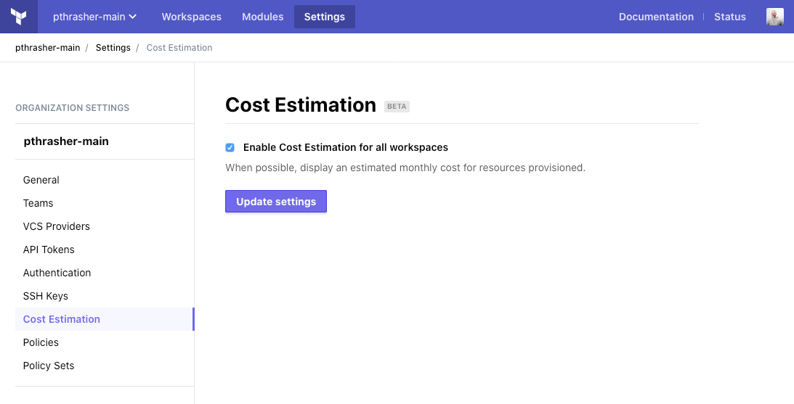
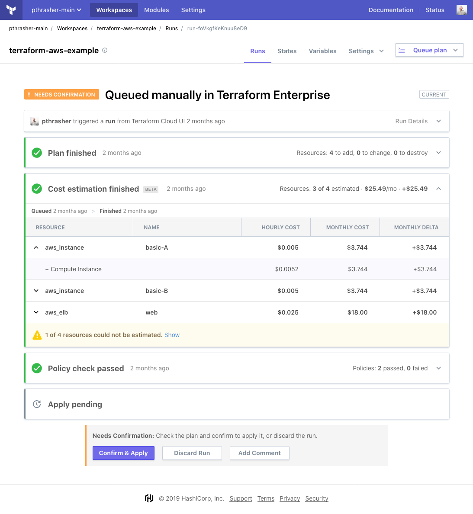

# Cost Estimation in Terraform Cloud

## About Cost Estimation in Terraform Cloud

Terraform Cloud provides cost estimates for many resources found in your Terraform configuration. For each resource an hourly and monthly cost is shown, along with the monthly delta. The total cost and delta of all estimable resources is also shown.

For more details, see the following pages:

- [Run States and Stages](../run/states.html)

## Enabling Cost Estimation

To enable Cost Estimation for your organization, check the box in your organization's settings.



## Using an estimable Terraform configuration

We'll need a valid config with cost estimable resources. Here's a very simple one. Create a new workspace with the following config in a `main.tf`. This is all you need to see cost estimation working but you'll need more to apply real resources.

```python
provider "aws" {
  region  = "us-east-1"
}

resource "aws_instance" "basic" {
  ami           = "ami-62131702"
  instance_type = "t3.nano"
}
```

AWS resources require credentials to operate against the AWS API. Add your credentials to the workspace's variables.


## Verifying costs using policies

Now you can add a new policy to validate your configuration's cost estimates. This policy simply checks that the new cost delta is no more than $100. A new `t3.nano` instance should be well below that. We'll use the `decimal` import for more accurate math when working with currency numbers.

```python
import "tfrun"
import "decimal"

delta_monthly_cost = decimal.new(tfrun.cost_estimate.delta_monthly_cost)

main = rule {
	delta_monthly_cost.less_than(100)
}
```

## Viewing a Cost Estimate

After queueing a new run, you should see your resources being estimated. The costs are found in a new phase in the run UI. You can see the list of resources with costs, their price details, and the list of unestimated resources. Costs are totalled to get a sense of the proposed overall monthly cost once the run is applied. Note that this is just an estimate; some resources don't have cost information available or have unpredictable usage-based pricing.



## Supported resources

Cost Estimation in Terraform Cloud supports terraform resources within three major cloud providers.

- [AWS](./aws.html)
- [GCP](./gcp.html)
- [Azure](./azure.html)
