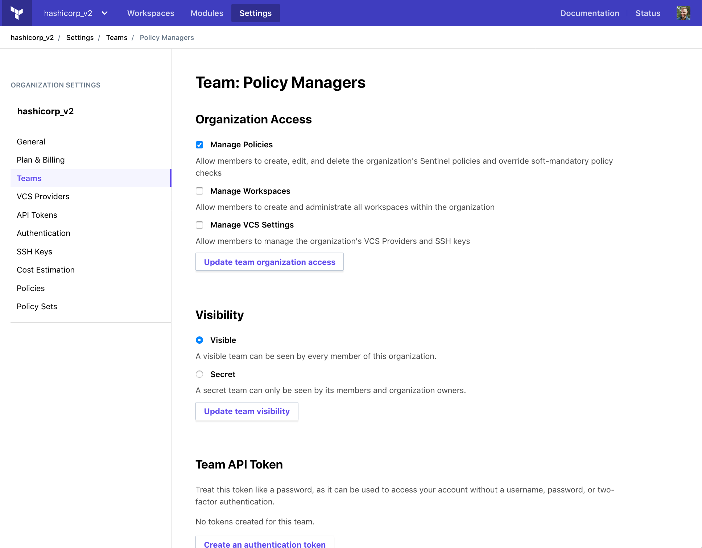

# Accessing Terraform Enterprise

To start using Terraform Enterprise (TFE), you must:

- Make sure you have a TFE account.
- Contact HashiCorp sales to request access to TFE.
- Navigate to TFE.
- Create a new organization for working with TFE.

## Creating a TFE Account

If you don't already have a TFE account, you must create one.

[Click here to request a free trial of TFE][signup], or contact HashiCorp sales to purchase a TFE subscription.

[signup]: https://www.hashicorp.com/products/terraform/?utm_source=oss&utm_medium=header-nav&utm_campaign=terraform&_ga=2.40850658.1512399790.1504740058-931972891.1498668200#terraform-contact-form

## Navigating to TFE

In your web browser, go to:

- [app.terraform.io](https://app.terraform.io) if you've registered for the SaaS version of TFE.
- The hostname of your private instance if you're using private Terraform Enterprise.

## Creating an Organization

-> **Note:** If someone else has already created a TFE organization and added you to it, you can skip this process. You'll be taken to the organization's front page when you first navigate to TFE.

After you've navigated to TFE, it will prompt you to create a new organization. Enter a name and an admin email address at the prompt:

## Adding Other Users to an Organization

To collaborate with your colleagues in TFE, you'll all need access to the same TFE organization. You can add users to an organization by creating a _team_ and adding users to it.

First, navigate to the settings page for your organization — you can reach it from the "Settings" link found at the top of every page. Once there, click the "Teams" link in the sidebar navigation.

The list of teams starts with just one team, named "owners." Don't add users to this team yet; instead, enter a new team name (like "core-infrastructure") in the text field and click the "Create team" button. This will take you to the new team's settings page:

Add as many users as you'd like by typing their TFE username in the text field and clicking "Add member". Added users won't receive a notification, but your organization will be available the next time they access TFE.

Team membership is how TFE controls access to workspaces. Later, you can create more teams and assign them different permissions on a per-workspace basis. For more information, see [Teams](../users-teams-organizations/teams.html).

## Next Steps

After you've created a TFE organization, you should [configure version control access.](./vcs.html)

