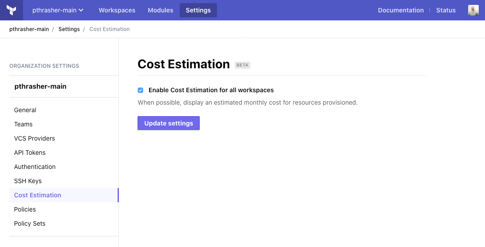
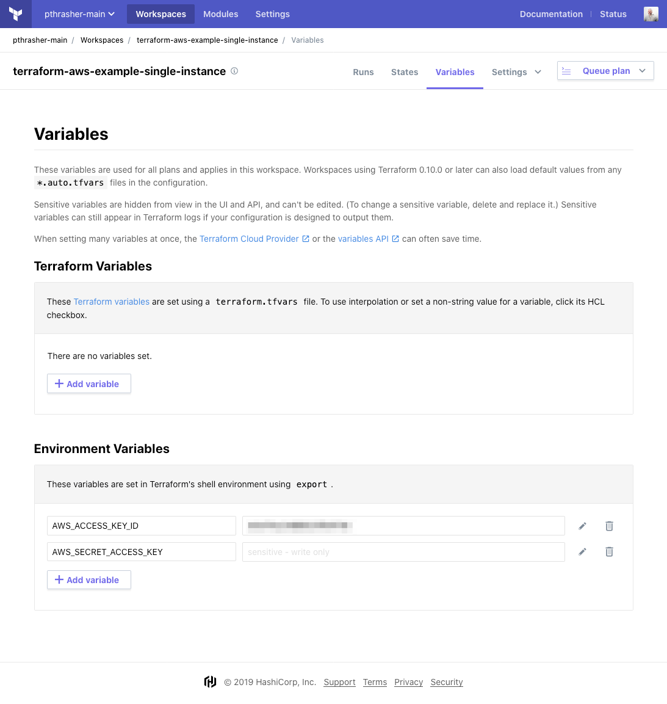
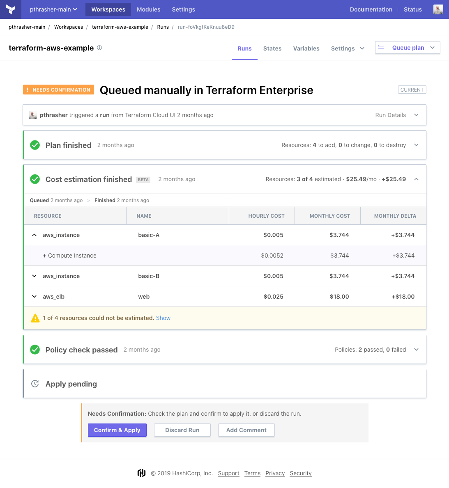

# Cost Estimation in Terraform Cloud

**Prerequisites:** Before starting this guide, make sure you've [created and configured at least one workspace](./workspaces.html) and successfully [run terraform](./runs.html) in that workspace.

Once you've created a workspace, you can estimate resource costs by planning a Terraform config in that workspace.


## About Cost Estimation in Terraform Cloud

Terraform Cloud provides cost estimates for many resources found in your Terraform configuration. For each resource an hourly and monthly cost is shown, along with the monthly delta. The total cost and delta of all estimable resources is also shown.

For more details, see the following pages:

- [Run States and Stages](../run/states.html)

## Enabling Cost Estimation

To enable Cost Estimation for your organization, check the box in your organization's settings.



## Using an estimable Terraform configuration

We'll need a valid config with cost estimable resources. Here's a very simple one.

```python
provider "aws" {
  region  = "us-east-1"
}

resource "aws_instance" "basic" {
  ami           = "ami-62131702"
  instance_type = "t3.nano"
}
```

AWS resources require credentials to operate against the AWS API.



## Verifying costs using policies

Now you can add a new policy to validate your configuration's cost estimates. This policy simply checks that each plan adds or removes cost.

```python
import "tfrun"

has_cost_delta = rule { tfrun.cost_estimate.delta_monthly_cost is not "0.00" }

main = rule {
	has_cost_delta
}
```

## Viewing a Cost Estimate

After queueing a new run, you should see your resources being estimated. The costs are found in a new phase in the run UI. You can see the list of resources with costs, their price details, and the list of unestimated resources. Costs are totalled to get a sense of the proposed overall monthly cost once the run is applied.



## Finished

You've now configured Terraform Cloud and experienced its core workflows — you know how to create new workspaces, automatically and manually trigger runs on a workspace, review and monitor runs, approve plans, add policy checks to and cost estimate your runs.
