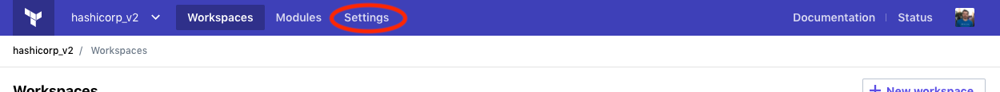
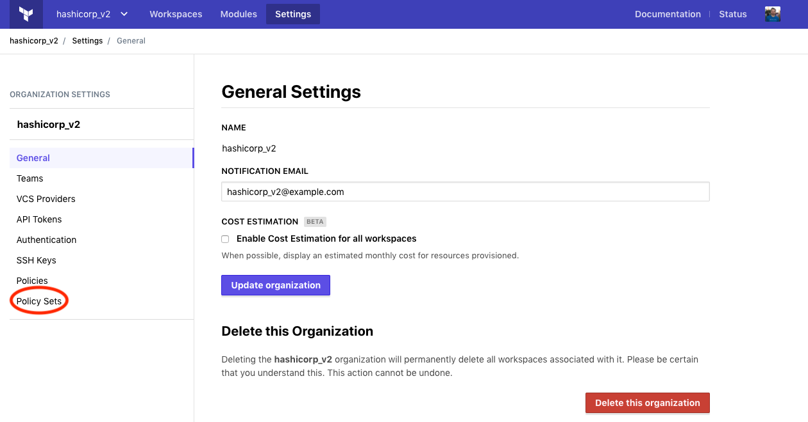
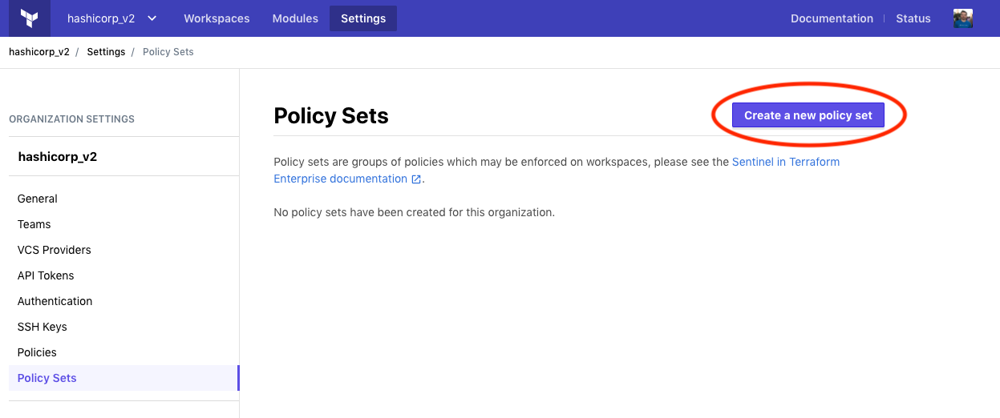
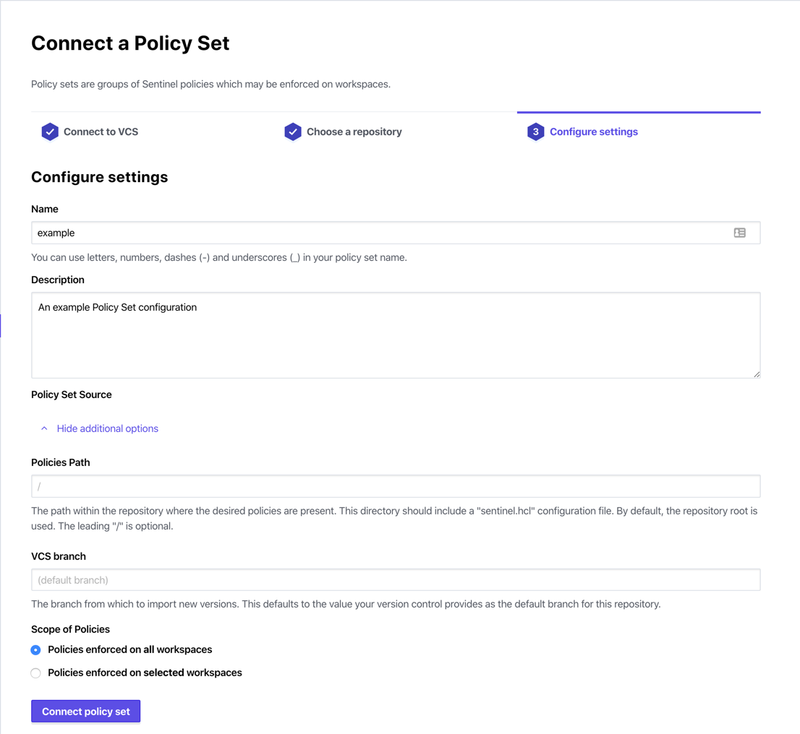
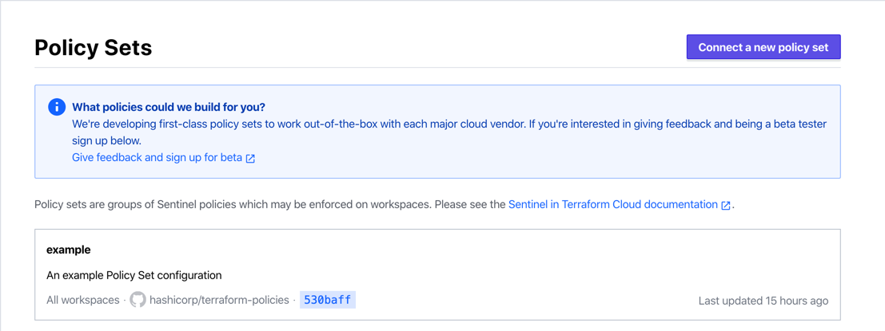
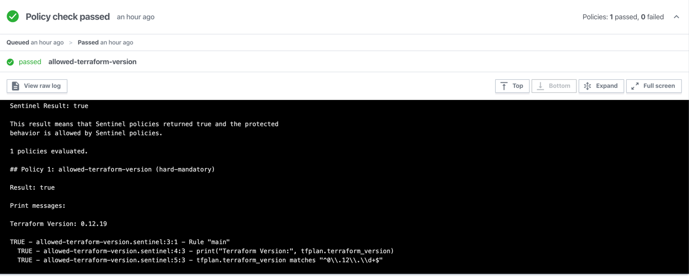

# Configuring Sentinel Policies

**Prerequisites:** Before starting this guide, make sure you've [configured VCS access](./vcs.html) and [successfully completed a run](./runs.html).

## About Sentinel Policies in Terraform Cloud

[Sentinel](https://www.hashicorp.com/sentinel) is an embedded policy-as-code framework integrated with various HashiCorp products. It enables fine-grained, logic-based policy decisions, and can be extended to use information from external sources. Terraform Cloud enables users to enforce Sentinel policies during runs.

A policy consists of:

- The Sentinel policy code
- An enforcement level that changes how a policy affects the run lifecycle

### Enforcement Levels

Enforcement levels in Sentinel are used for defining behavior when policies fail to evaluate successfully. Sentinel provides three enforcement modes:

* `hard-mandatory` requires that the policy passes. If a policy fails, the run is halted and may not be applied until the failure is resolved.
* `soft-mandatory` is much like `hard-mandatory`, but allows an administrator to override policy failures on a case-by-case basis.
* `advisory` will never interrupt the run, and instead will only surface policy failures as informational to the user.

Starting with `soft-mandatory` is a safe practice that will allow the policy author to enforce a policy without completely blocking the run workflow for users if the policy fails.

## About Policy Sets

Policy sets are a named grouping of Sentinel policies and their configuration. Each policy must belong to a policy set before it can be evaluated during a run. Each policy set may be applied to specific workspaces, or all workspaces within an organization. Policy sets are the mapping between Sentinel policies and workspaces.

## Creating a Policy Set

In this guide, we'll be using version control to create a policy set. Before you start, make sure you've [configured version control access](./vcs.html) for your organization.

To create a policy set, we'll need a VCS repository to host the code. Create a new repository in your VCS system, clone the empty repository locally, and change directory into the local copy of the repository. We'll use the `sentinel-policies` repository hosted on GitHub for this example:

```bash
git clone git@github.com:<your-org>/sentinel-policies
cd sentinel-policies
```

With the VCS repository ready to go, the next step is to start adding configuration and policy code to it.

### The `sentinel.hcl` configuration file

The first file we'll create should be named `sentinel.hcl`. This is the configuration file which identifies Sentinel policy files and provides their configuration. Edit the configuration file using your editor of choice (we'll use `vim` for this example):

```bash
vi sentinel.hcl
```

The configuration file takes a very basic structure, like this:

```hcl
policy "sunny-day" {
    enforcement_level = "soft-mandatory"
}
```

The above configuration is declaring the following:

* We have a policy named `sunny-day`. Its policy code is located in a file named `sunny-day.sentinel` in the same directory as the `sentinel.hcl` file.
* The `sunny-day` policy has a `soft-mandatory` [enforcement level](#enforcement-levels).

Multiple `policy` blocks may be defined in the `sentinel.hcl` file to configure more policies.

### Policy Code

In the example above we created a configuration file which assumes that a `sunny-day.sentinel` policy code file will be present. Sentinel code files must follow the naming convention of `<policy name>.sentinel`. Create a `sunny-day.sentinel` policy file in the same directory as the `sentinel.hcl` file:

```bash
vi sunny-day.sentinel
```

The following policy code can be used to perform the most basic check:

```python
main = rule { true }
```

This policy will always pass, as it always returns true. It is useful to experiment with policy failure scenarios by changing `true` to `false`.

### Check in the code

You've created all of the files necessary for your policy set. The directory structure should now look like this:

```bash
.
├── sentinel.hcl
└── sunny-day.sentinel
```

It's time to check the code into the Git repository and push the changes to the
VCS system:

```bash
git add .
git commit -m "Adding initial policy code"
git push origin master
```

That's it! Your policy code should now be available on GitHub. The next step is
configure Terraform Cloud to use the new policy set repository.

### Integrating with VCS

First, make sure you're viewing the organization settings. Click the "Settings" button in the top navigation bar.



The navigation bar on the left hand side lists various settings pages. Click the "Policy Sets" link.



The Policy Sets page lists all existing policy sets. The list will be empty if this is your first policy set. Click on the "Create a new policy set" button.



The policy set creation page offers a few options for creating your policy set. In this example, we'll be using a very simple VCS configuration to source the policy set from GitHub. Fill in the name (`hello-world` is used in this example), an optional description, and enter the repository identifier (`<your-org>/sentinel-policies` from the above example). Select "Policies enforced on all workspaces" (the default), and click the "Create policy set" button.



After creating the policy set, you'll be taken back to the policy sets index page. You should notice that the list now contains your new policy set. The VCS information, including the latest commit SHA, should appear within the policy set (if it's empty at first, allow a few moments and refresh).



Now that the policy set is configured and ready, navigate to a workspace and queue a new plan. You should see the policy check phase appear in the run details, and you should see the `hello-world/sunny-day` policy execute and pass in the policy check output.



## Finished

You've now configured Terraform Cloud and experienced its core workflows — you know how to create new workspaces, automatically and manually trigger runs on a workspace, review and monitor runs, approve plans, and add policy checks to your runs.
