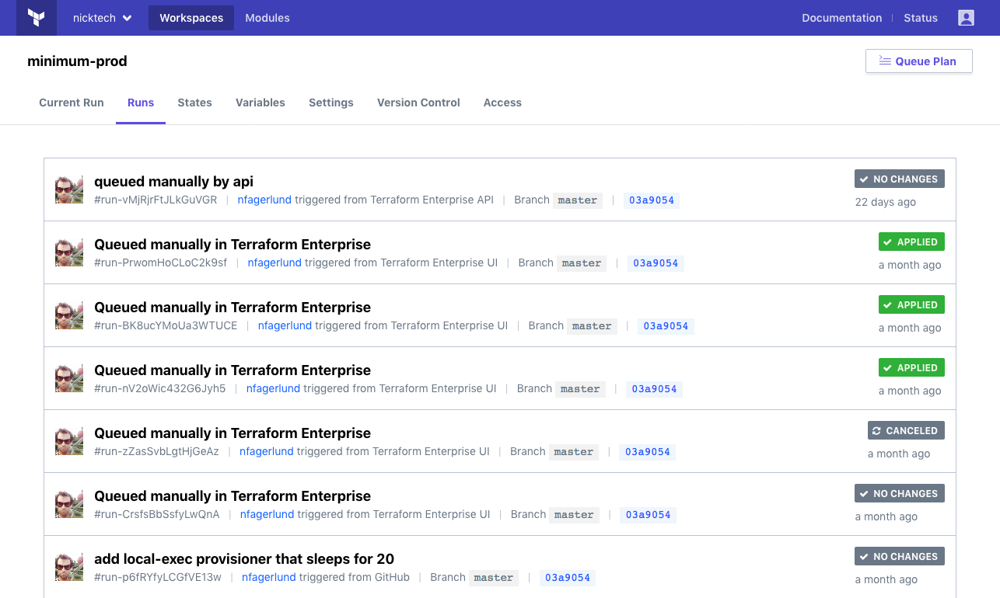
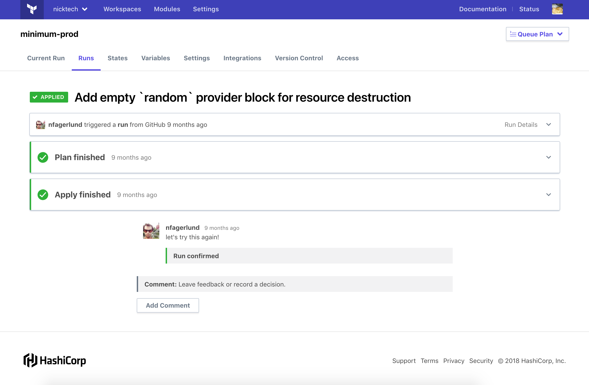

# Running Terraform in TFE

**Prerequisites:** Before starting this guide, make sure you've [created and configured at least one workspace](./workspaces.html).

Once you've created and configured a workspace, you can manage infrastructure resources by doing Terraform runs in that workspace.

## About Terraform Runs in TFE

TFE enforces Terraform's division between _plan_ and _apply_ operations, and by default it waits for user approval before applying new plans. You can enable automatic applies in a workspace's settings.

Each workspace has its own queue of runs, which are processed one at a time in order. When a run is queued, it grabs the current version of Terraform code and the current variable values, and will use those when it eventually runs; if you make more commits or modify variables before the run occurs, it will still use the data it was originally queued with.

Most runs in TFE are started automatically — whenever new commits are added to a workspace's VCS branch, it queues a new plan. You can also manually queue plans, usually after editing variables.

Note that TFE needs network access to any infrastructure providers managed by your Terraform configurations. If you're using the SaaS version of TFE and you use Terraform to manage private cloud resources, those providers must be internet accessible.

For more details, see the following pages:

- [About Terraform Runs in Terraform Enterprise](../run/index.html)
- [Run States and Stages](../run/states.html)
- [The UI- and VCS-driven Run Workflow](../run/ui.html)
- [The API-driven Run Workflow](../run/api.html)
- [CLI-driven run workflow](../run/cli.html)

## Starting a Run from Version Control

To queue a plan for your new workspace, make a new commit to the VCS branch you chose when creating the workspace. In the previous page's example, we chose the `nfagerlund/terraform-minimum` repo and left it on the default branch, so we could start a run by pushing one or more new commits to the `master` branch of that repo.

## Starting a Run from the UI

Before continuing with your first run, queue another plan using TFE's UI. You can do this with the "Queue Plan" at the upper right of the workspace page, or using the "Save & Plan" button when editing the workspace's variables.

The best way to see how TFE's run queue works is to make changes before queueing a second run. If your workspace's Terraform configuration uses variables, change one of them and queue a plan. Alternately, you could make changes to the code and push new commits to VCS, which would also put a new plan in the queue.

## Viewing the Run List

At the top of the workspace's page, click the "Runs" link, which goes to the full list of runs.

From the list of runs, you can click to view or interact with an individual run. Choose the run you started first, which will probably be in the "Pending," "Planning," or "Planned" state. Note that your second run is "Pending."

## Viewing a Run Page

An individual run page shows the progress and outcomes of each stage of the run.

Once this run has finished planning, it will ask you to confirm or discard the plan. Click the "Confirm & Apply" button to finish applying the changes from your new commits.

Note that until you apply or discard a plan, TFE can't start another run in that workspace, and your second run will stay "Pending."

After the first run has finished applying, you can go back to the runs list and see the second run starting.

## Next Steps

Now that you've completed and viewed a run, you're ready to [start applying policy checks](./policies.html).
