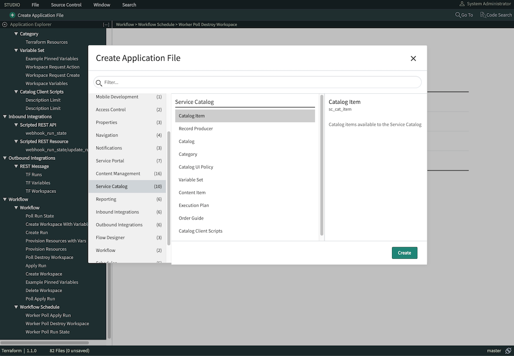
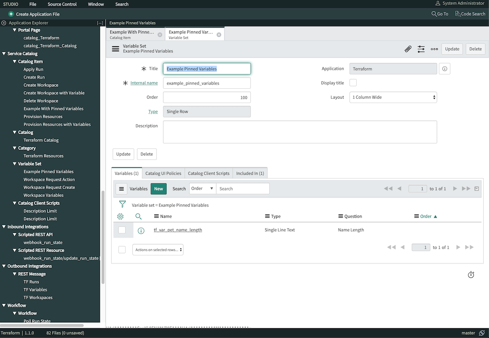

# Example Customizations

## Creating a Catalog Item with Pinned Variables

This example use case creates a Terraform catalog item for resources that limits user input to certain variables.

### Create Service Catalog Item

1. Enter the ServiceNow Studio
1. Click "Create Application File"
    - Select "Catalog Item" under "Service Catalog" > Click "Create"
1. Name the new catalog item. (The rest of this example assumes an item named `Example With Pinned Variables`.)
1. Select Catalogs: "Terraform Catalog" > Select Categories: "Terraform Resources"
1. Add any other descriptions you may want.
1. Click "Submit"



### Create Variable Set

1. Click "Create Application File"
1. Select "Variable Set" > "Service Catalog" > Click "Create"
1. Name your variable set. (The rest of this example assumes a set named `Example Pinned Variables`, with an "Internal Name" of `example_pinned_variables`.)
    - This will default "Internal Name" to `example_pinned_variables`
1. Click "Submit"
1. Under the "Variables" tab click "New"
    1. Create your variable:
    1. In this example we will create a field called `tf_var_pet_name_length` that will be for a Terraform variable that determines the number of words to use for the pet server name.
        - Question: `Pet Name Length`
        - Name: `tf_var_pet_name_length`
        - `tf_var_` tells the Terraform ServiceNow SDK that this is a Terraform Variable.
    1. Repeat variable creation as necessary for your use case.
    1. Click "Submit"



### Add Variable Set to Catalog Item

1. Go back to your Catalog Item
1. Under the "Variable Sets" tab,  click "New".
1. Search for the variable set that was created (`Example Pinned Variables`).
1. Click "Submit".

### Create Custom Workflow

We will use the "Example With Pinned Variables" example workflow for our custom workflow.

In the ServiceNow Studio:

1. Open the "Example With Pinned Variables", Workflow > Workflow > "Example With Pinned Variables"
1. Double click on the "Run Script" item
1. Copy the script code from the editor
1. Close the "Run Script" and "Workflow" window
1. Create a new custom workflow: Create Application File > Workflow
    - Name: `Example Pinned Variables` (replace with your custom workflow name)
    - Table: `Requested Item [sc_req_item]` and Click "Submit"
1. Add a "Run Script" item. Core Tab > Utilities > Run Script
1. Name: `Example Workflow Pinned Variables`
1. Script:
    - Paste in the code copied from the "Provision Resources with Variables" workflow
    - Change the following lines:

```javascript
  // ** Custom Variables **
  var VAR_SET_NAME = "example_pinned_variables";
  var VCS_REPO     = "ORG_NAME/REPO_NAME";
```

1. Click "Submit"
1. Ensure that the ServiceNow Run Script is part of the workflow. (Begin > Run Script > End)
1. Click the menu at the top left and select "Publish"

### Set The Workflow for Catalog Item

In the ServiceNow Studio:

1. Select the "Example with Pinned Variables" (Service Catalog > Catalog Item > Example With Pinned Variables)
2. Select "Process Engine" tab
3. Set the workflow field by searching for "Example Pinned Variables" workflow and Click "Update"

### Test the Catalog Item

The new item should be available in the Terraform Service Catalog. Once the new catalog item is confirmed to work, you can customize as needed.
