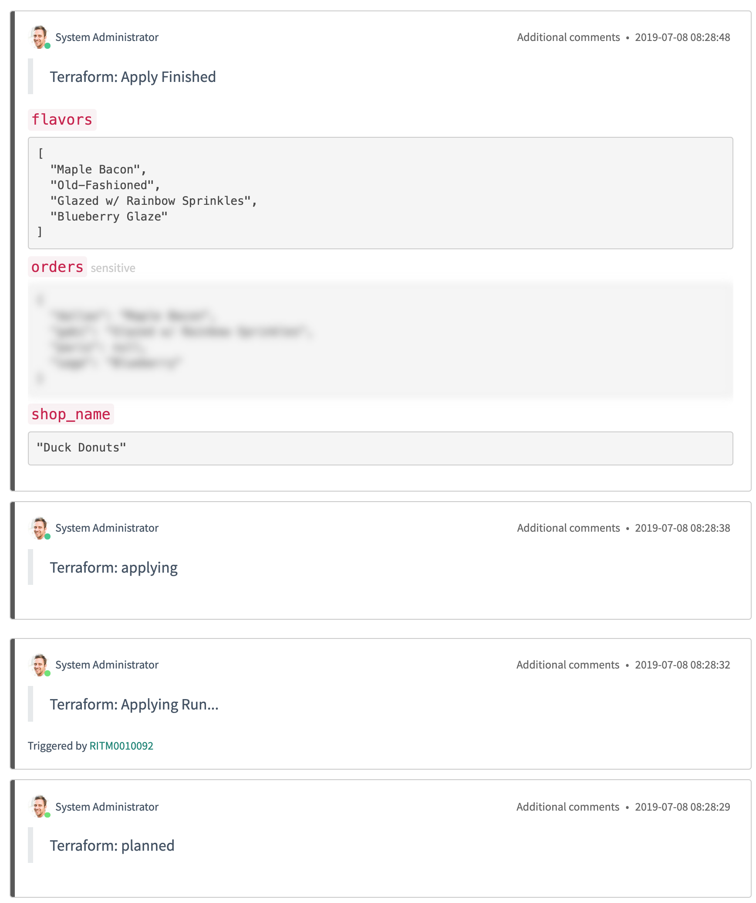

# Terraform ServiceNow Service Catalog Integration Setup Instructions

-> **Integration version:**  v2.0.0

-> **Note:** The ServiceNow Catalog integration is designed for use by Terraform Enterprise customers. We do not currently recommend using it with the SaaS version of Terraform Cloud.

The Terraform ServiceNow Service Catalog integration enables your end-users to provision self-serve infrastructure via ServiceNow. By connecting ServiceNow with Terraform Enterprise, this integration lets ServiceNow users create workspaces and perform Terraform runs, using prepared Terraform configurations hosted in VCS repositories.

Integrating ServiceNow with Terraform Enterprise involves several configuration steps. You will perform some of these steps in ServiceNow, and some of them in Terraform Enterprise.

| ServiceNow | Terraform Enterprise |
--|--
| | Prepare an organization for use with the ServiceNow Catalog. |
| | Create a team that can manage workspaces in that organization. |
| | Create a team API token so the integration can use that team's permissions. |
| | Retrieve the unique ID that Terraform Enterprise uses to identify your VCS provider. |
| Install the Terraform Application from the ServiceNow App Store | |
| Connect the integration with Terraform Enterprise, using the team API token you prepared. | |
| Add the Terraform Service Catalog to enable it for your users. | |
| Add VCS repositories with Terraform configurations as catalog items. | |

Once these steps are completed, self-serve infrastructure will be available through the ServiceNow Catalog. Terraform Enterprise will provision and manage any requested infrastructure.

## Prerequisites

To start using Terraform with ServiceNow Catalog Integration, you must already have:

- An account on a [Terraform Enterprise](https://www.hashicorp.com/products/terraform/) instance.
- A ServiceNow instance or developer instance. You can request a ServiceNow developer instance at [developer.servicenow.com](https://developer.servicenow.com/).
- A [supported version control system](../../vcs/index.html#supported-vcs-providers) (VCS) with read access to repositories with Terraform configuration.

It has been tested on the following ServiceNow server versions:

- Madrid
- New York
- Orlando

It requires the following ServiceNow Plugins as dependencies for the Terraform ServiceNow App:

- Flow Designer support for the Service Catalog
- ServiceNow IntegrationHub Action Step
- ServiceNow IntegrationHub Starter Pack

## Obtaining the ServiceNow Integration

Before beginning setup, you must obtain a copy of the Terraform ServiceNow Catalog integration software.

This can be added to your ServiceNow instance from the [ServiceNow Store](https://store.servicenow.com/).

## Terraform Enterprise Setup

Before installing the ServiceNow integration, you need to perform some setup and gather some information in Terraform Enterprise.

1. [Create an organization](../../users-teams-organizations/organizations.html) (or choose an existing organization) where ServiceNow will create new workspaces.
1. [Create a team](../../users-teams-organizations/teams.html) for that organization called "ServiceNow", and ensure that it has the organization-level ["Manage Workspaces" permission](../../users-teams-organizations/permissions.html#manage-workspaces). You do not need to add any users to this team.
1. On the "ServiceNow" team's settings page, generate a [team API token](../../users-teams-organizations/api-tokens.html#team-api-tokens). **Save this API token for later.**
1. If you haven't yet done so, [connect a VCS provider](../../vcs/index.html) for this Terraform organization.
1. On the organization's VCS provider settings page, find the "OAuth Token ID" for your VCS provider. This is an opaque ID that Terraform Enterprise uses to identify this VCS provider. **Save the OAuth Token ID for later.**

[permissions-citation]: #intentionally-unused---keep-for-maintainers

## Installing the ServiceNow Integration

#### Enable Polling Workers (Recommended)

The integration includes 3 ServiceNow Scheduled Flows to poll the Terraform Enterprise API using ServiceNow Outbound HTTP REST requests. By default, all flows schedules are set to 5 minutes. These can be customized inside the ServiceNow Server Studio:

1. Select the Worker Poll Run State Flow.
2. Adjust Repeat Intervals
3. Click "Done"
4. Click "Save"
5. Click "Activate"

##### Worker Poll Apply Run

This worker approves runs for any workspaces that have finished a Terraform plan and are ready to apply their changes. It also adds a comment on the request item for those workspaces notifying that a run has been triggered.

##### Worker Poll Destroy Workspace

This worker looks for any records in the Terraform ServiceNow table that is marked for deletion with the value `is_destroyable` set to true. It then checks the status of the workspace to ensure it is ready to be deleted. Once the destroy run has been completed, this work will send the delete request for the workspace to Terraform.

##### Worker Poll Run State

The worker synchronizes ServiceNow with the current run state of Terraform workspaces by polling the Terraform Enterprise API. On state changes, the worker adds a comment to the ServiceNow request item with the updated run state and other metadata.

## Connecting to Terraform Enterprise

-> **Roles Required:** `admin` or `x_terraform.config_user`

1. From the ServiceNow Service Management Screen.
1. Using the left-hand navigation, open the configuration table for the integration to manage the Terraform Enterprise connection.
    - Terraform > Configs
1. Click on "New" to create a new Terraform Enterprise connection:
    - Set API Team Token to the Terraform Enterprise [Team Token](../../users-teams-organizations/api-tokens.html#team-api-tokens) you created earlier.
    - Set Hostname to the hostname of your Terraform Enterprise instance. (If you're using the SaaS version of Terraform Cloud, this is app.terraform.io.)
    - Set Org Name to the name of the Terraform Enterprise organization you wish to use for new workspaces created by ServiceNow.

## Adding the Terraform Service Catalog

1. In ServiceNow, open the Service Catalog > Catalogs view by searching for "catalogs" in the left-hand navigation.
1. Click the plus sign in the top right.
1. Select Terraform and choose a place to add it.

At this point, your users can request Terraform infrastructure via ServiceNow, but there are not yet any infrastructure items available to request.

## Configuring VCS Repositories

-> **Roles Required:** `admin` or `x_terraform.vcs_repositories_user`

To make infrastructure available to your users, you must add one or more workspace templates to the Terraform service catalog. A workspace template is a VCS repository that contains a Terraform configuration; any repository that could be connected to a manually-created Terraform Enterprise workspace can also be used as a workspace template in the ServiceNow integration.

1. In ServiceNow, open the Terraform > VCS Repositories table by searching for "terraform" in the left-hand navigation.
1. Click "New" to add a VCS repository for fulfillment through the Terraform Service Catalog.
    - Name: The name for this workspace template that you want users to see.
    - OAuth Token ID: The OAuth Token ID that you copied from your Terraform Enterprise organization's VCS providers settings. This ID specifies which VCS provider hosts the desired repository.
    - Identifier: The VCS repository that contains the Terraform configuration for this workspace template. Repository identifiers are determined by your VCS provider; they typically use a format like `<ORGANIZATION>/<REPO NAME>` or `<PROJECT KEY>/<REPO NAME>`. Azure DevOps repositories use the format `<ORGANIZATION>/<PROJECT>/_git/<REPO NAME>`.
    - The remaining fields are optional.

-> **Note:** Currently, the integration defaults to creating workspaces with [auto-apply](../../workspaces/settings.html#auto-apply-and-manual-apply) enabled. Since VCS-backed workspaces [start Terraform runs when changes are merged](../../run/ui.html), changes to a workspace template repository may cause new runs in any Terraform workspaces created from it.

## Terraform Variables and ServiceNow Variable Sets

ServiceNow has the concept of a Variable Set which is a collection of ServiceNow Variables that can be referenced in a workflow from a Service Catalog item. The Terraform Integration codebase can create [Terraform Variables and Terraform Environment Variables](../../workspaces/variables.html) via the API using the `tf_variable.createVariablesFromSet()` function.

This function looks for variables following these conventions:

ServiceNow Variable Name | Terraform Enterprise Variable
--|--
`tf_var_VARIABLE_NAME` | Terraform Variable: `VARIABLE_NAME`
`tf_env_ENV_NAME` | Environment Variable: `ENV_NAME`
`sensitive_tf_var_VARIABLE_NAME` | Sensitive Terraform Variable (Write Only): `VARIABLE_NAME`
`sensitive_tf_env_ENV_NAME` | Sensitive Terraform Environment Variable (Write Only): `ENV_NAME`

This function takes the ServiceNow Variable Set and Terraform Workspace ID. It will loop through the given variable set collection and create any Terraform variables or Terraform environment variables.

## Customizing with ServiceNow "Script Includes" Libraries

The Terraform/ServiceNow Integration codebase includes [ServiceNow Script Includes Classes](https://docs.servicenow.com/bundle/madrid-application-development/page/script/server-scripting/concept/c_ScriptIncludes.html) that are used to interface with Terraform Enterprise. The codebase also includes example catalog items and workflows that implement the interface to Terraform API.

These classes and examples can be used to help create ServiceNow Catalog Items customized to your specific ServiceNow instance and requirements.

### Script Include Classes

The ServiceNow Script Include Classes can be found in the ServiceNow Studio > Server Development > Script Include.

Class Name | Description
--|--
`tf_config` | Helper to pull values from the SN Terraform Configs Table
`tf_http` | SN HTTP REST Wrapper for requests to Terraform API
`tf_run` | Resources for Terraform Run API Requests
`tf_terraform_record` | Manage ServiceNow Terraform Table Records
`tf_util` | Miscellaneous helper functions
`tf_variable` | Resources for Terraform Variable API Requests
`tf_vcs_record` | Manage ServiceNow Terraform VCS Repositories Table Records
`tf_workspace` | Resources for Terraform Workspace API Requests

### Example Service Catalog Flows and Actions

The ServiceNow Example Flows can be found in the ServiceNow Studio > Flows. By default, the Flows execute upon submitting an order request for the various catalog items. Admins can modify the Flows and Actions to wait on an approval action, include approval rules, and specify approver groups.

Flow Name | Description
--|--
Create Workspace | Creates a new Terraform Enterprise workspace from VCS repository.
Create Workspace with Vars | Creates a new Terraform Enterprise workspace from VCS repository and creates any variables provided.
Create Run | Creates/Queues a new run on the Terraform Enterprise workspace.
Apply Run | Applies a run on the Terraform Enterprise workspace.
Provision Resources | Creates a Terraform Enterprise workspace (with auto-apply), creates/queues a run, applies the run when ready.
Provision Resources with Vars | Creates a Terraform Enterprise workspace (with auto-apply), creates any variables, creates/queues a run, applies the run when ready.
Delete Workspace | Creates a destroy run plan.
Worker Poll Run State | Polls the Terraform Enterprise API for the current run state of a workspace.
Worker Poll Apply Run | Polls the Terraform Enterprise API and applies any pending Terraform runs.
Worker Poll Destroy Workspace | Queries ServiceNow Terraform Records for resources marked `is_destroyable`, applies the destroy run to destroy resources, and deletes the corresponding Terraform workspace.

## ServiceNow ACLs

Access control lists (ACLs) restrict user access to objects and operations based on permissions granted. This integration includes the following roles that can be used to manage various components.

Access Control Roles | Description
:--|--
`x_terraform.config_user` | Can manage the connection from the ServiceNow application to your Terraform Enterprise organization.
`x_terraform.terraform_user` | Can manage all of the Terraform resources created in ServiceNow.
`x_terraform.vcs_repositories_user` | Can manage the VCS repositories available for catalog items to be ordered by end-users.

For users who only need to order from the Terraform Catalog, we recommend creating another role with read-only permissions for `x_terraform_vcs_repositories` to view the available repositories for ordering infrastructure.
