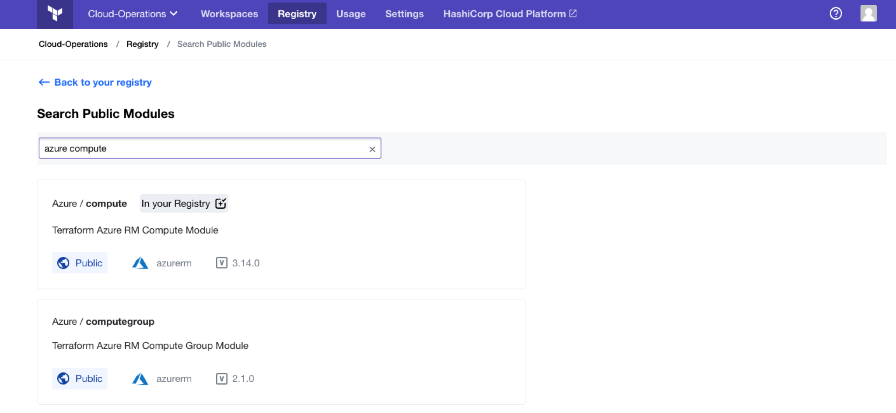

[vcs]: ../vcs/index.html

# Adding Public Modules to the Terraform Cloud Private Module Registry

> **Hands-on:** Try the [Add Public Modules to your Private Module Registry](https://learn.hashicorp.com/tutorials/terraform/module-private-registry-add?in=terraform/modules&utm_source=WEBSITE&utm_medium=WEB_IO&utm_offer=ARTICLE_PAGE&utm_content=DOCS) tutorial on HashiCorp Learn.

You can add modules from the public [Terraform Registry](/docs/registry/index.html) to your Terraform Cloud private module registry. Once added, Terraform Cloud automatically synchronizes public modules with their source on the Terraform Registry. The private module registry handles downloads and controls access with Terraform Cloud API tokens, so consumers don't need access to the module's source repository, even when they run Terraform from the command line.

All members of an organization can view and use public modules, but you need [owners team](/docs/cloud/users-teams-organizations/permissions.html#organization-owners) permissions to add them to the private module registry. Owners can add modules through the UI as shown below or through the [Registry Modules API](../api/modules.html#create-a-module-with-no-vcs-connection-).

-> **Note:** Public modules are not supported in Terraform Enterprise.
[permissions-citation]: #intentionally-unused---keep-for-maintainers

-> **API:** See the [Registry Modules API](../api/modules.html#create-a-module-with-no-vcs-connection-). If you use the API to add a public module, be sure to create a module with no VCS connection and to set the `registry_name` property to `public`.

## Adding a Public Module

To add a public module, navigate to your organization's module registry with the "Registry" button and click the "Find public modules" button in the upper right.

This brings you to the "Search Public Modules" page, which has a text field that you can use to search for public modules in the public Terraform registry.

Simply type names of namespaces, modules or providers (or all three) to find public modules. Then hover over a module and click the "+ Add" button or select a module and then click the "Add to Terraform Cloud" button to add the public module to your module registry.

## Deleting a Public Module

Each public module's details page includes a "Mange Modules for Organization" drop-down with a "Delete module" button, which can remove the module from the organization's module registry.

To delete a public module from your organization's module registry, click the "Delete module" button under the "Manage Module for Organization" drop-down, type the name of the module in the displayed dialog, and click the red "Delete" button.

-> **Note:** Deleting a public module from a private module registry does not delete it from the public Terraform registry where it really lives.
