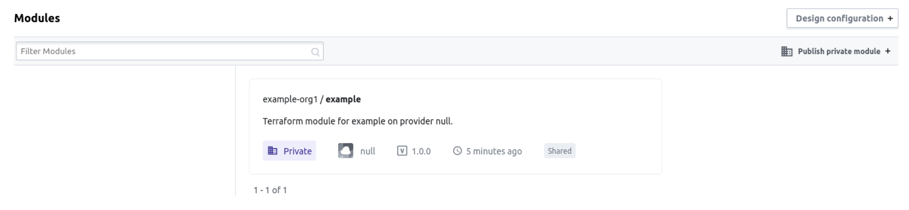
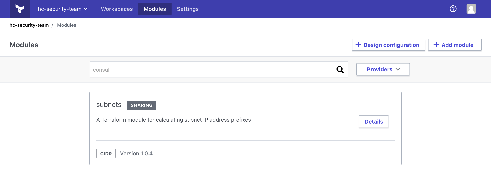
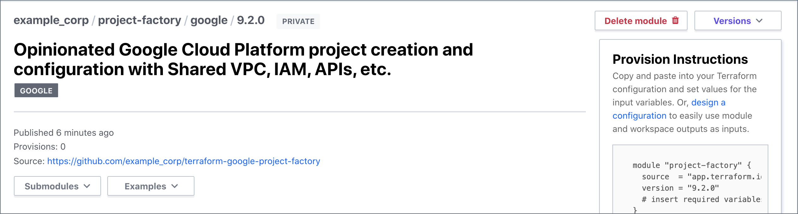
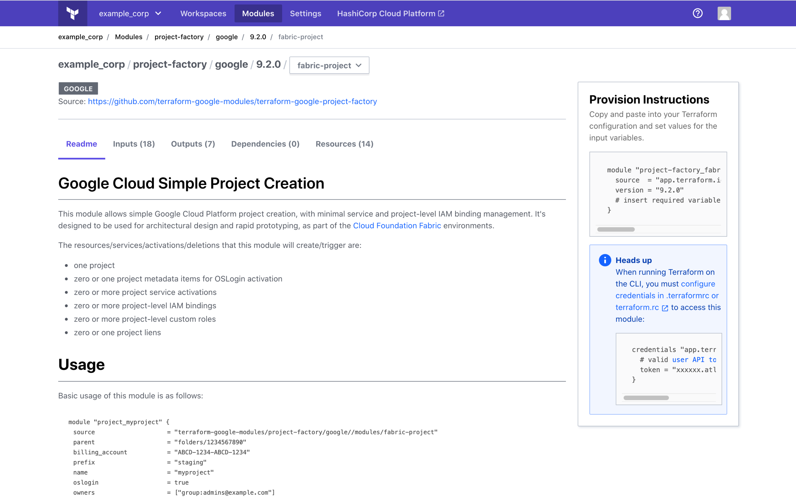
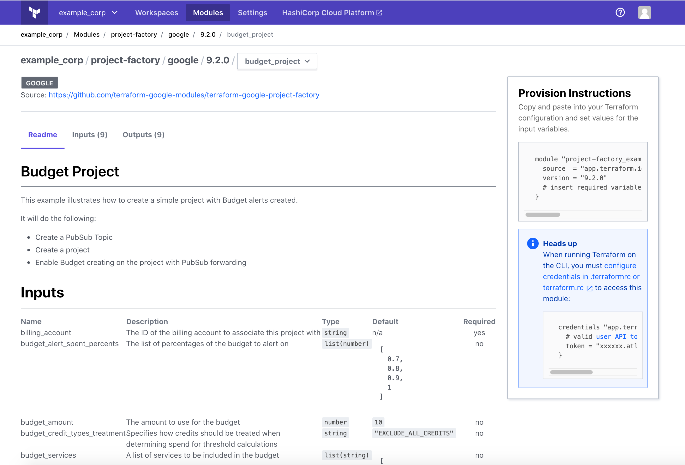

# Using Modules from the Terraform Cloud Private Module Registry

> **Hands-on:** Try the [Use Modules from the Registry](https://learn.hashicorp.com/tutorials/terraform/module-use?in=terraform/modules&utm_source=WEBSITE&utm_medium=WEB_IO&utm_offer=ARTICLE_PAGE&utm_content=DOCS) tutorial on HashiCorp Learn.
<br>

A Terraform Cloud private module registry has a few key differences from the [public Terraform Registry](/docs/registry/index.html):

- **Location:** You must use Terraform Cloud's web UI to search for modules and usage examples.
- **Module `source` strings:** Private modules use a [four-part format](/docs/cloud/registry/using.html#using-private-modules-in-configurations).
- **Authentication:** Terraform Cloud workspaces using version 0.11 and higher can automatically access your private modules during Terraform runs. But when you run Terraform on the command line, you must [configure authentication](/docs/cloud/registry/using.html#authentication) to Terraform Cloud or your Terraform enterprise instance.


## Finding Private Modules

All users in your organization can view your private module registry. To find available modules, click the "Modules" button in the Terraform Cloud main navigation bar.


The module page appears, containing a list of all available modules. You can filter with the:

- **Search field**: Shows modules with titles that contain the specified keyword. Note that it does not search READMEs or resource details.
- **"Providers" dropdown**: Shows only modules for the selected provider.


### Shared Modules - Terraform Enterprise

On Terraform Enterprise, your [module sharing](/docs/enterprise/admin/module-sharing.html) configuration may grant you access to modules outside your organization. Modules that are shared with your current organization have a "Shared" badge.



Modules in your current organization that are shared with other organizations have a badge that says "Sharing".



### Viewing Module Details and Versions

Click a module's "Details" button to view its details page. Use the "Versions" dropdown in the upper right to switch between the available versions, and use the Readme/Inputs/Outputs/Dependencies/Resources tabs to view detailed documentation and information about a version.


### Viewing Nested Modules and Examples

If a module contains nested modules following the [standard module structure](/docs/language/modules/develop/structure.html), then a "Submodules" dropdown appears below the module source information. An "Examples" dropdown also appears if there are examples.



Use the "Submodules" dropdown to navigate to nested modules and use the  Readme/Inputs/Outputs/Dependencies/Resources tabs to view detailed documentation and information about the nested module.




Use the "Examples" dropdown to navigate to example modules and use the  Readme/Inputs/Outputs tabs to view detailed documentation and information about the example module.




## Using Private Modules in Configurations

The syntax for referencing private modules in the [module block](/docs/language/modules/syntax.html) `source` argument is `<HOSTNAME>/<ORGANIZATION>/<MODULE NAME>/<PROVIDER>`.

- **Hostname:** For the SaaS version of Terraform Cloud, use `app.terraform.io`. In Terraform Enterprise, use the hostname for your instance or the [generic hostname](/docs/cloud/registry/using.html#generic-hostname-terraform-enterprise).
- **Organization:** If you are using a shared module with Terraform Enterprise, the module's organization name may be different than your organization's name. Check the source string at the top of the module's registry page to find the proper organization name.

```hcl
module "vpc" {
  source  = "app.terraform.io/example_corp/vpc/aws"
  version = "1.0.4"
}
```

To get started, you can copy and paste the usage example on the module's registry page or use the [configuration designer](./design.html) to select multiple modules and fill in their variables.

### Generic Hostname - Terraform Enterprise

You can use the generic hostname `localterraform.com` in module sources to reference modules without modifying the Terraform Enterprise instance. When you run Terraform, it automatically requests any `localterraform.com` modules from the Terraform Enterprise instance.

```hcl
module "vpc" {
  source  = "localterraform.com/example_corp/vpc/aws"
  version = "1.0.4"
}
```

~> **Important:** The generic hostname only works within a Terraform Enterprise instance.

To test configurations on a developer workstation without the remote backend configured, you must replace the generic hostname with a literal hostname in all module sources and then change them back before committing to VCS. We are working on making this workflow smoother, but we currently only recommend `localterraform.com` for large organizations that use multiple Terraform Enterprise instances.

### Module Availability

A workspace can only use private modules from its own organization's registry. When using modules from multiple organizations in the same configuration, we recommend:

- **Terraform Cloud:** [Add modules to the registry](./publish.html#sharing-modules-across-organizations) for each organization that requires access.  

- **Terraform Enterprise:** Check your site's [module sharing](../../enterprise/admin/module-sharing.html) configuration. Note that in Terraform Enterprise v202012-1 or higher, workspaces can also use private modules from organizations that are sharing modules with the workspace's organization.

## Running Configurations with Private Modules

### Version Requirements

Terraform 0.11 or later is required to:

- Use private modules in Terraform Cloud workspaces with no extra setup.
- Use the CLI to apply configurations with private modules.

### Authentication

You can use either a [user token](/docs/cloud/users-teams-organizations/users.html#api-tokens) or a [team token](/docs/cloud/users-teams-organizations/api-tokens.html#team-api-tokens) for authentication, but the type of token you choose may grant different permissions.

- **User Token**: Allows you to access modules from any organization in which you are a member. You are a member of an organization if you belong to any team in that organization. In Terraform Enterprise v202012-1 or higher, you can also access modules from any organization that is sharing modules with any of your organizations.

    -> **Note** When SAML SSO is enabled, there is a [session timeout for user API tokens] (/docs/enterprise/saml/login.html#api-token-expiration), requiring you to periodically re-authenticate through the web UI. Expired tokens produce a _401 Unauthorized_ error. A SAML SSO account with [IsServiceAccount](https://www.terraform.io/docs/enterprise/saml/attributes.html#isserviceaccount) is treated as a service account and will not have the session timeout.

- **Team Token**: Allows you to access the private module registry from that team's organization and modules from any organizations that are sharing a private module registry with that team's organization.

<br/>
_Permissions Example_

A user belongs to three organizations (1, 2, and 3), and organizations 1 and 2 share private module access with each other. In this case, the user's token gives them access to the private module registries for all of the organizations they belong to: 1, 2, and 3. However, a team token from a team in organization 1 only gives the user access the private modules in organizations 1 and 2.

#### Configure Authentication

To configure authentication to Terraform Cloud or your Terraform Enterprise instance, you can:

- (Terraform 0.12.21 or later) Use the [`terraform login`](/docs/cli/commands/login.html) command to obtain and save a user API token.
- Create a token and [manually configure credentials in the CLI config file][cli-credentials].

Make sure the hostname matches the hostname you use in module sources because if the same Terraform Cloud server is available at two hostnames, Terraform will not know that they are the same. To support multiple hostnames for module sources, use the `terraform login` command multiple times, and specify a different hostname each time.


[user-token]: ../users-teams-organizations/users.html#api-tokens
[cli-credentials]: /docs/cli/config/config-file.html#credentials
[permissions-citation]: #intentionally-unused---keep-for-maintainers
