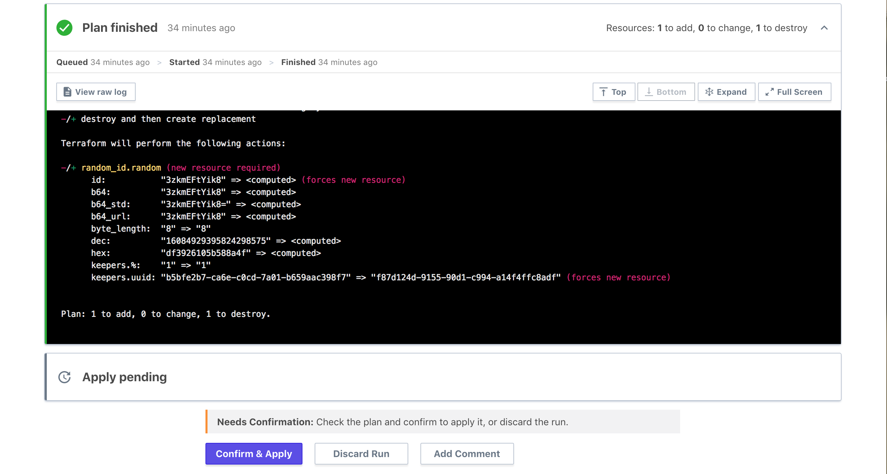

# The UI- and VCS-driven Run Workflow

Terraform Cloud has three workflows for managing Terraform runs.

- The UI/VCS-driven run workflow described below, which is the primary mode of operation.
- The [API-driven run workflow](./api.html), which is more flexible but requires you to create some tooling.
- The [CLI-driven run workflow](./cli.html), which uses Terraform's standard CLI tools to execute runs in Terraform Cloud.

## Summary

In the UI and VCS workflow, every workspace is associated with a specific branch of a VCS repo of Terraform configurations. Terraform Cloud registers webhooks with your VCS provider when you create a workspace, then automatically queues a Terraform run whenever new commits are merged to that branch of workspace's linked repository.

Terraform Cloud also performs a [speculative plan][] when a pull request is opened against that branch. Terraform Cloud posts a link to the plan in the pull request, and re-runs the plan if the pull request is updated.

[speculative plan]: ./index.html#speculative-plans

The Terraform code for a normal run always comes from version control, and is always associated with a specific commit.

## Automatically Starting Runs

In a workspace linked to a VCS repo, runs start automatically when you merge or commit changes to version control.

A workspace is linked to one branch of its repository, and ignores changes to other branches. Workspaces can also ignore some changes within their branch: if a Terraform working directory is configured, Terraform Cloud assumes that only some of the content in the repository is relevant to Terraform, and ignores changes outside of that content. (This behavior can be configured; for details, see [Settings: Automatic Run Triggering](../workspaces/vcs.html#automatic-run-triggering).)

## Manually Starting Runs

When you initially set up the workspace and add variables, or when the code in version control hasn't changed but you've modified some variables, you can manually queue a plan from the UI. Each workspace has a "Queue Plan" button for this purpose. Manually queueing a plan requires write or admin access.

If the workspace has a plan that is still in the [plan stage](./states.html#2-the-plan-stage) when a new plan is queued, you can either wait for it to complete, or visit the "Current Run" page and click "Run this plan now". Be aware that this will terminate the current plan and unlock the workspace, which can lead to anomalies in behavior, but can be useful if the plans are long-running and the current plan is known not to have all the desired changes.

## Confirming or Discarding Plans

By default, run plans require confirmation before Terraform Cloud will apply them. Users with write access on a workspace can navigate to a run that has finished planning and click the "Confirm & Apply" or "Discard Plan" button to finish or cancel a run. If necessary, use the "View Plan" button for more details about what the run will change.

Users can also leave comments if there's something unusual involved in a run.

Note that once the plan stage is completed, until you apply or discard a plan, Terraform Cloud can't start another run in that workspace.

### Auto apply

If you would rather automatically apply plans that don't have errors, you can [enable auto apply](../workspaces/settings.html#auto-apply-and-manual-apply) on the workspace's "General Settings" page. (Some plans can't be auto-applied, like plans queued by [run triggers](../workspaces/run-triggers.html) or by users without write permissions.)

[plan permissions](../users-teams-organizations/permissions.html#plan)

## Speculative Plans on Pull Requests

When branch in a linked repo receives a pull request (PR) from another branch in that repo, Terraform Cloud runs a [speculative plan][] in every workspace linked to the destination branch. Links to those plans appear in the PR, and members of your organization with read access to those workspaces can view the plan results when reviewing PRs.

Speculative plans are re-run if the code in a pull request is updated.

Speculative plans for PRs are based on the contents of the head branch (the branch that the PR proposes to merge into the destination branch), and they compare against the workspace's current state at the time the plan was run. This means that if the destination branch changes significantly after the head branch is created, the speculative plan might not accurately show the results of accepting the PR. To get a more accurate view, you can rebase the head branch onto a more recent commit, or merge the destination branch into the head branch.

-> **Note:** To avoid executing malicious code or exposing sensitive information, Terraform Cloud doesn't run speculative plans for pull requests that originate from other forks of a repository. 

On Terraform Enterprise versions v202005-1 or later, the ability to perform speculative plans on pull requests that originate from forks can be enabled by an administrator. To learn more about this setting, refer to the [general settings documentation](/docs/enterprise/admin/general.html#allow-speculative-plans-on-pull-requests-from-forks)

## Speculative Plans During Development

You can also run speculative plans on demand before making a pull request, using the remote backend and the `terraform plan` command. For more information, see [the CLI-driven run workflow](./cli.html).
