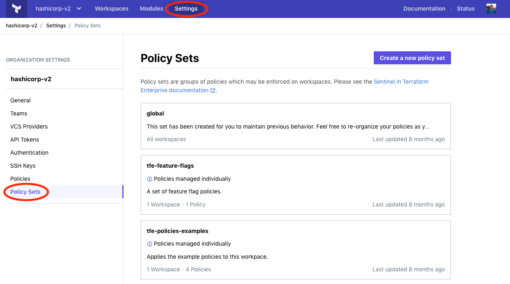

# Managing Sentinel Policies

-> **API:** See the [Policy Sets API](../api/policy-sets.html).<br/>
**Terraform:** See the `tfe` provider's [`tfe_policy_set` resource](/docs/providers/tfe/r/policy_set.html).

Sentinel Policies are rules which are enforced on Terraform runs to validate that the plan and corresponding resources are in compliance with company policies.

## Policies and Policy Sets

[teams]: ../users-teams-organizations/teams.html
[users]: ../users-teams-organizations/users.html
[workspaces]: ../workspaces/index.html

**Policies** consist of a Sentinel policy file and an enforcement level.

**Policy sets** are groups of policies that can be enforced on [workspaces][]. A policy set can be enforced on designated workspaces, or to all workspaces in the organization.

After the plan stage of a Terraform run, Terraform Cloud checks every Sentinel policy that should be enforced on the run's workspace. This includes policies from global policy sets, and from any policy sets that are explicitly assigned to the workspace.

Policy sets are managed at an organization level, and only [organization owners](../users-teams-organizations/teams.html#the-owners-team) can create, edit or delete them.

## Enforcement Levels

Enforcement levels in Sentinel are used for defining behavior when policies fail to evaluate successfully. Sentinel provides three enforcement modes:

* `hard-mandatory` requires that the policy passes. If a policy fails, the run is halted and may not be applied until the failure is resolved.
* `soft-mandatory` is much like `hard-mandatory`, but allows an administrator to override policy failures on a case-by-case basis.
* `advisory` will never interrupt the run, and instead will only surface policy failures as informational to the user.

## Constructing a policy set

In order to use Sentinel in Terraform Cloud, you'll first need to create a policy set. A policy set is simply a directory structure containing a Sentinel configuration file and some policy files. We recommend that these files and configurations be treated like any other code and be checked in to a source control system. An added benefit to this is Terraform Cloud's VCS integration for Sentinel policies. See the [managing policy sets](#managing-policy-sets) section for details.

### The `sentinel.hcl` configuration file

Every policy set requires a configuration file named `sentinel.hcl`. This configuration file defines:

* Each policy that should be checked in the set
* The [enforcement level](#enforcement-levels) of each policy in the set.

The `sentinel.hcl` configuration file may contain any number of entries which look like this:

```python
policy "sunny-day" {
    enforcement_level = "hard-mandatory"
}
```

In the above, a policy named `sunny-day` is defined with a `hard-mandatory` [enforcement level](#enforcement-levels).

### Sentinel policy code files

Sentinel policies themselves are defined in individual files (one per policy) in the same directory as the `sentinel.hcl` file. These files must match the name of the policy from the configuration file and carry the `.sentinel` suffix. Using the configuration example above, a policy file named `sunny-day.sentinel` should also exist alongside the `sentinel.hcl` file to complete the policy set.

## Managing Policy Sets

To manage policy sets, go to the "Policy Sets" section on the organization settings page.



Policy sets enforced on all workspaces are marked "All workspaces" in this list; other policy sets show how many workspaces they are enforced on. You may also notice policy sets with an informational tag that reads "Policies managed individually", which indicates that the policy set is not versioned and uses policy relationships (deprecated). These policy sets will need to be [migrated](#migrating-individually-managed-policies-to-versioned-policy-sets) in the future.

To create a new policy set, click the "Create a new policy set" button; to edit an existing set, click its entry in the list. Click the "Create policy set" or "Update policy set" button when finished.

When creating or editing a policy set, the following fields are available:

- **Name**: The name of the policy set, which is used in the UI. Must be unique to your organization. Accepts letters, numbers, `-`, and `_`.
- **Description**: A description of the policy set's purpose. The description can be any length and supports Markdown rendering.
- **Scope of policies:** Whether the set should be enforced on all workspaces, or only on a chosen list of workspaces.
- **VCS repo or "Upload via API"**: This area allows selecting a VCS repository from an existing OAuth client connection. Choosing "Upload via API" will not configure VCS integration, and instead tarballs of policy sets may be uploaded via the API. See the [policy set versions](../api/policy-sets.html#create-a-policy-set-version) for more information on uploading policy sets using the API.
- **VCS Branch**: This field allows specifying the branch within a VCS repository from which to import new versions of policies. If left blank, the value your version control provides as the default branch of the VCS repository is used.
- **Policies Path**: This field allows specifying a sub-directory within a VCS repository for the policy set files. This allows maintaining multiple policy sets within a single repository. The value of this field should be the path to the directory containing the `sentinel.hcl` configuration file of the policy set you wish to configure. Any files in the repository which are not within this path will not be included when the policy set is cloned. Commits to the repository which do not match the specified directory will be ignored. If left blank, the root of the repository is used. A leading `/` may be used, but is optional (relative paths are assumed to originate from the root of the repository).
- **Workspaces:** Which workspaces the policy set should be enforced on. This is only shown when the scope of policies is set to "Policies enforced on selected workspaces." Use the drop-down menu and "Add workspace" button to add workspaces, and the trash can (🗑) button to remove them.
- **Parameters:** A list of key/value parameters that will be sent to the Sentinel runtime when a policy check is being performed for the policy set. If the value can be parsed as JSON, it will be sent to Sentinel as the corresponding type (string, boolean, integer, map or list). If it fails JSON validation, it will be sent as a string. For more information on parameters, see the [Sentinel parameter documentation](https://docs.hashicorp.com/sentinel/language/parameters/).

## Migrating individually managed policies to versioned policy sets

Individually managed policies were a proof-of-concept feature in Terraform Cloud which allowed editing policy code directly in the UI and combining these policies into policy sets. This workflow is deprecated and is being replaced by versioned policy sets, which are managed as an immutable, atomic, and versioned unit, using VCS or directly uploading entire policy sets through the API.

If you already have policy sets defined which reference individually managed policies directly, you can quickly and easily migrate them to versioned policy sets.

### Migration Utility

We've created a simple migration utility which you can run on the command line to mirror all of your policy sets to local disk. This is the first step in moving to versioned policy sets. You can [view the documentation and source][migrate-source] of the migration utility or [download a release][migrate-binary] to get started quickly.

[migrate-source]: https://github.com/hashicorp/tfc-policy-sets-migration
[migrate-binary]: https://github.com/hashicorp/tfc-policy-sets-migration/releases

The goal of the migration utility is only to copy your policy sets and configuration from Terraform Cloud onto your local disk in a directory structure ready to be uploaded or checked in to version control. From there, follow the steps in the [managing policy sets](#managing-policy-sets) section to create new policy sets. You'll be able to leverage VCS or direct API uploads using the migrated source files.
