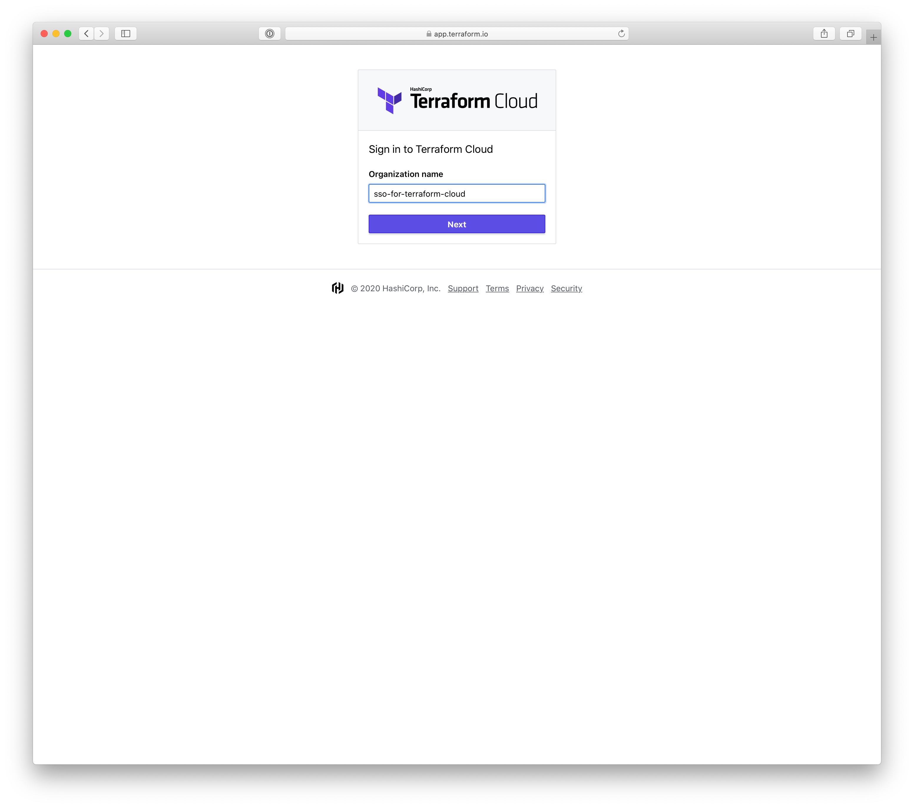
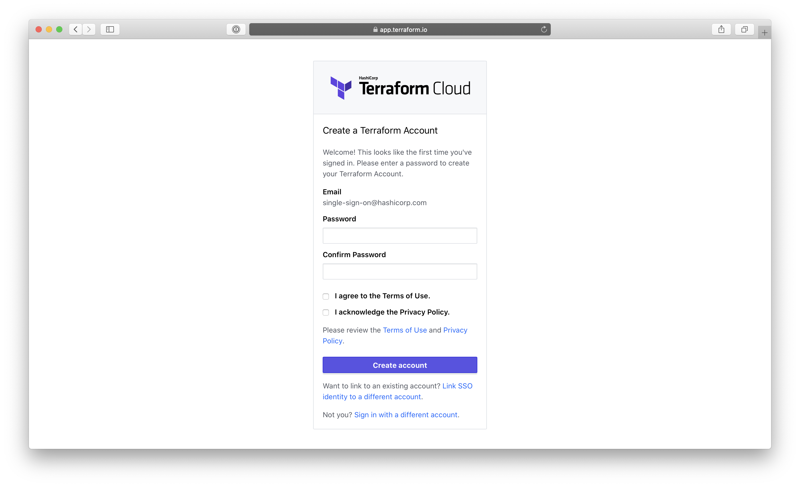
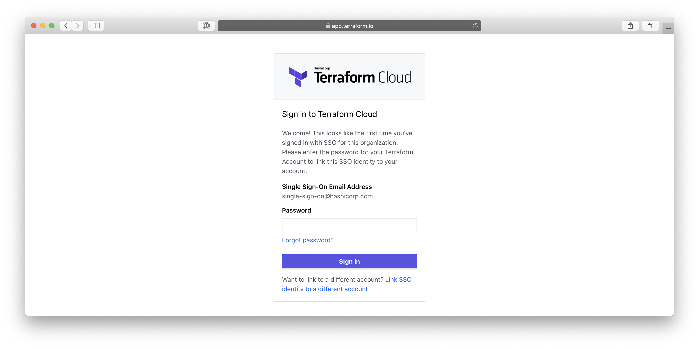
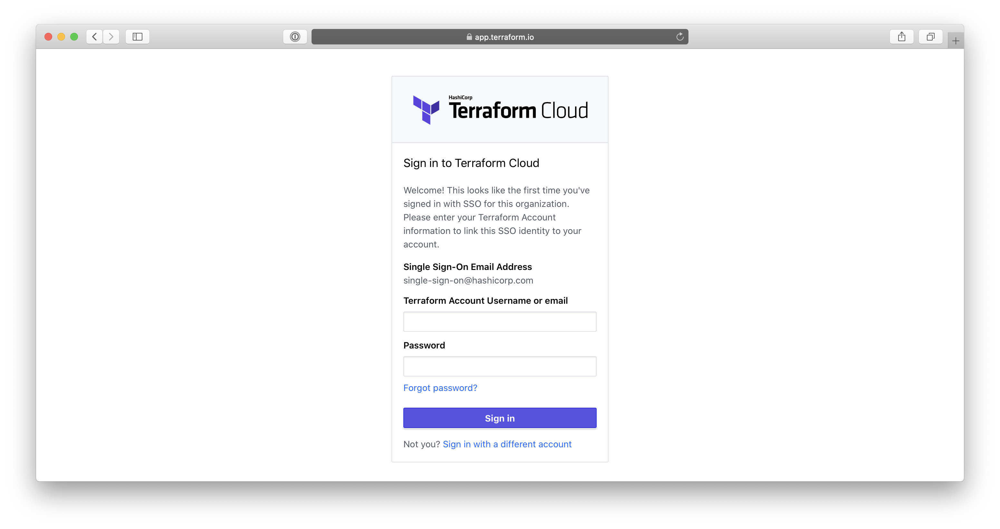

# Single Sign-on

-> **Note:** Single sign-on is a paid feature, available as part of the **Business** upgrade package. [Learn more about Terraform Cloud pricing here](https://www.hashicorp.com/products/terraform/pricing/).

~> **Important:** This page is about configuring single sign-on in Terraform Cloud. Terraform Enterprise's single sign-on is configured differently. If you administer a Terraform Enterprise instance, see [Terraform Enterprise: SAML Configuration](/docs/enterprise/saml/configuration.html).

Terraform Cloud allows organizations to configure support for SAML 2.0 single sign-on (SSO), an alternative to traditional [user](./users.html) management. By using SSO, your organization can centralize management of users for Terraform Cloud and other Software-as-a-Service (SaaS) vendors, providing greater accountability and security for an organization's identity and user management.

Current users of Terraform Cloud can link their SSO identity to their existing account, providing a smooth transition when an organization enables SSO.

## Supported Identity Providers (IdPs)

Select your preferred provider to learn more about what is supported for that provider and how to configure SSO for it.

* [Okta](./single-sign-on/okta.html)
* [SAML](./single-sign-on/saml.html)
* [Azure AD](./single-sign-on/azure.html)

## How SSO Works

Organization owners can enable SSO for their organization and configure an identity provider to connect to.

Once SSO is enabled for an organization, all non-owner members must sign in through SSO in order to access the organization. (Owners of an SSO-enabled organization can still access the organization through username and password, to enable fixing problems with SSO.)

### SSO Identities and Terraform Cloud User Accounts

SSO does not automatically provision Terraform Cloud user accounts. A user signing in for the first time with SSO must either provide a password to create a new Terraform Cloud user account (using their SSO email address as their username), or must link their SSO identity to an existing Terraform Cloud user account.

The accounts of SSO users are normal Terraform Cloud user accounts. If logged in with username and password, these accounts can create, join, and interact with other Terraform Cloud organizations. However, they cannot interact with the SSO-enabled organization without signing in via SSO unless they belong to its owners team.

If an organization's owners disable SSO (or downgrade the organization's account from the Business tier), all members can continue to access the organization using their Terraform Cloud usernames and passwords.

## Signing in with SSO

1. Visit https://app.terraform.io and sign out if you're signed in.

2. Click "Sign in via SSO".

3. Provide your organization name and click "Next".

    

4. If you've signed in to Terraform Cloud with SSO before, proceed to the next step.

    If you're signing in for the first time under this account or for the first time accessing this organization, you'll be required to create a new account or link to an existing account. Use the links below the account creation form if you want to link your SSO identity to an existing account, then fill out and submit the relevant form.

    

    

    

5. You will be redirected to your SSO identity provider. Authenticate your account as necessary.

6. You are now signed in to Terraform Cloud.

## Managing Team Membership Through SSO

Terraform Cloud can automatically add users to teams based on their SAML assertion, so you can manage team membership in your directory service. To do this, you must specify the `MemberOf` SAML attribute, and make sure the AttributeStatement in the SAMLResponse contains a list of AttributeValue items in the correct format (i.e., comma-separated list of team names).

If the SAML assertion includes a `MemberOf` attribute, users logging in via SSO are automatically added to the teams included in their assertion and removed from any teams that *aren't* included in their assertion. This overrides any manually set team memberships; whenever the user logs in, their team membership is adjusted to match their SAML assertion.

Any team names that don't match existing teams are ignored; Terraform Cloud will not automatically create new teams. Terraform Cloud expects the team names in the `MemberOf` SAML attribute to exactly match its own team names. This match is case sensitive. It is not possible to assign users to the `owners` team through this attribute.

If the `MemberOf` attribute is not provided, users are assigned to a default team named `sso` and are not removed from any existing teams. 

## NameID Format

Terraform Cloud requires that the NameID format in the SAML response be set to `urn:oasis:names:tc:SAML:1.1:nameid-format:emailAddress` with a valid email address being provided as the value for this attribute.
