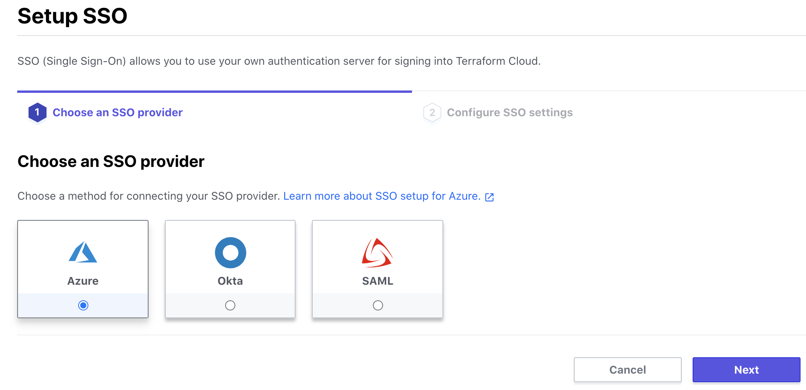
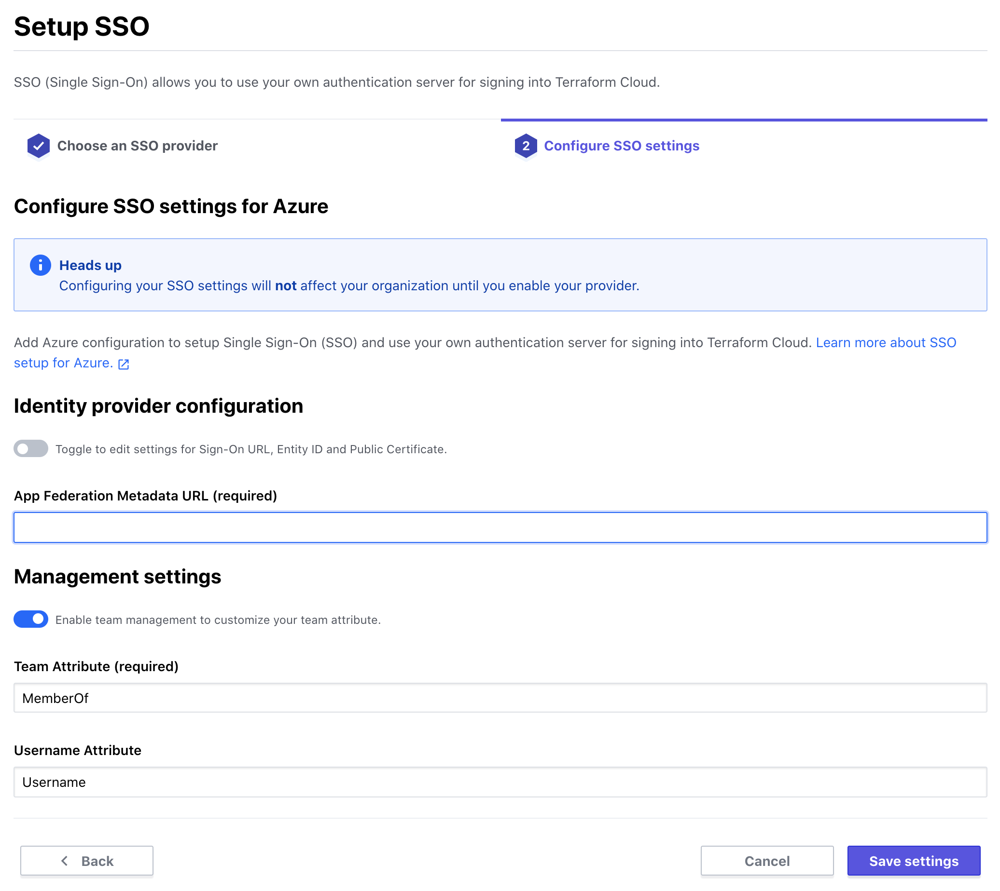
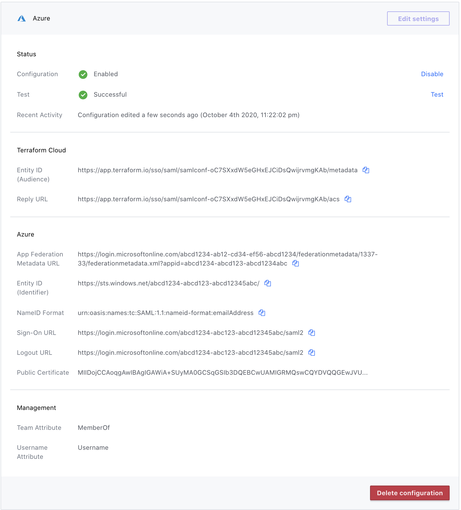

-> **Note:** Single sign-on is a paid feature, available as part of the **Business** upgrade package. [Learn more about Terraform Cloud pricing here](https://www.hashicorp.com/products/terraform/pricing/).

# Single Sign-on: Azure

The Azure SSO integration currently supports the following SAML features:

- Service Provider (SP)-initiated SSO
- Identity Provider (IdP)-initiated SSO
- Just-in-Time Provisioning

## Configuration (Azure ) Part 1:a

-> **Note:** Azure is rolling out a new interface for setting up Enterprise Applications. If you are using the new Azure UI, see the section below, headed as `Configuration (Azure ) 1:b`

1. In your desired Azure AD Directory, navigate to the Enterprise Applications page and create a "+ New Application".
2. Select the non-gallery application option.
3. Give your application a name and click "Add."

## Configuration (Azure) Part 1:b

1. In your desired Azure AD Directory, navigate to the Enterprise Applications page and create a "+ New Application".
2. locate and select the "+ Create your own appliction" option.
3. In the resulting sidebar, name your application, and select the option, "Integrate any other application you don't find in the gallery" and click "Create" at the bottom of the page.

## Configuration (Azure) Part 2

1. Under the "Getting Started" section, select "Set up single sign on."
2. Select the SAML option
3. You should now see a 5 part set up list. Ignore step 1 for now, we will come back to that.
4. Edit step 2, "User Attributes & Claims"
    1. Select the required Name ID claim.  Ensure that its name identifier format is "Email address".
    * If you plan on using Terraform Clouds SAML team management, add a new claim.
    1. There is a lot of freedom on how you name and source the value of this claim.
    1. We recomoned naming it "MemberOF", leaving the namespace blank, and potentially sourcing `user.assignedroles` as an easy starting point.
    * If you plan to make use of SAML to set usernames, add a new claim.
    1. Again, the options here are numerous, flexible, and fairly arbitrary.
    1. We recomend naming the claim "Username", leaving the namespace blank, and sourcing something like `user.displayname` or `user.mailnickname`.
5. Select "Add a certificate", located in item 3 of the list.
    1. Import or create a certificate.
    1. If the certificate is not listed as active, use the meatball menu to its right to set it to active.
    1. Set Signing option to Sign SAML response and assertion.
    1. Set Signing Algorithm to SHA-256
    1. Save this.
6. After saveing certificate settings you should now see a copyable field in step 3 labeled "App Federation Metadata Url".  Copy that!  You're ready to head over to your organization in Terraform Cloud.

## Configuration (Terraform Cloud) Part 1

1. Visit your organization settings page and click "SSO".

2. Click "Setup SSO".

    

3. Select "Azure" and click "Next".

    

4. Provide your App Federation Metadata URL.

    

5. If you are planning to use the Username or Team Managment feature, be sure to set your attribute names to match the claims you configured in Azure. If you followed the recomended claims configuration in Azure, you shouldn't need to change anything here.
    * If you did use a different claim name or added a namespace, change the related attribute name to match the form `<claim_namespace/claim_name>`.

6. Save, and you should see a completed Terraform Cloud SAML configuration.

7. Copy Entity ID and Assertion Consumer Service URL.

## Configuration (Azure) Part 3

Returning to the SAML configuration page for your custom enterprise application in Azure:

1. Edit step 1, "Basic SAML Configuration"
2. Provide the copied Entity ID  and Asserion Consumer Service URL from Terraform Cloud.
3. Save.

You should now be ready to test and enable your configuration in Terraform Cloud.

## Testing (Terraform Cloud)

In an effort to protect users from enabling faulty SAML configurations Terraform Cloud requires a succesful test SSO attempt before enabling is possible.

To test simply click the test link in the setting/SSO page.
* This will attempt to initiate SSO sign-in with Azure.
* You will be redirected briefly to Azure. You may need to reauthenticate depending on your session context.
* Finally you should be redirected back to the Terraform Cloud settings SSO page with a message about a successful test and the "enable" action should now be accessible.

* Click "Enable".  Your Azure SSO configuration is complete and ready to [use](../single-sign-on.html#using-sso).

    
