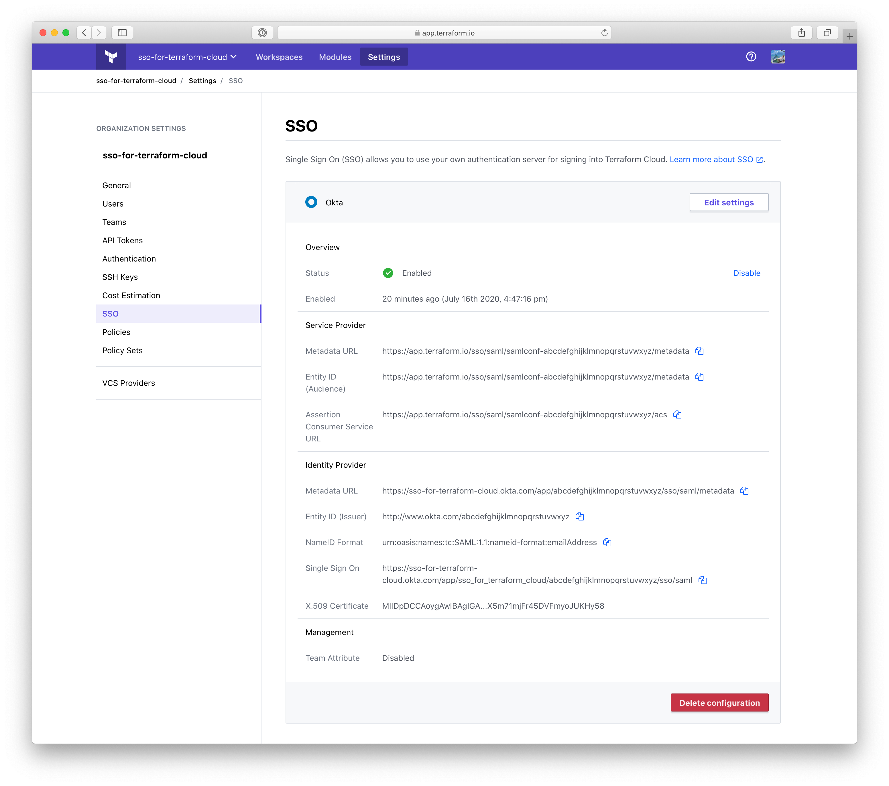

-> **Note:** Single sign-on is a paid feature, available as part of the **Business** upgrade package. [Learn more about Terraform Cloud pricing here](https://www.hashicorp.com/products/terraform/pricing/).

# Single Sign-on: Okta

The Okta SSO integration currently supports the following SAML features:

- Service Provider (SP)-initiated SSO
- Identity Provider (IdP)-initiaited SSO
- Just-in-Time Provisioning

For more information on the listed features, visit the [Okta Glossary](https://help.okta.com/en/prod/Content/Topics/Reference/glossary.htm).

## Configuration (Okta)

1. From your Okta Admin Dashboard, click the "Add Applications" shortcut.
2. Search for "Terraform Cloud" and select it.
3. Click "Add" on the application's page.
4. Choose a label for your application or keep the default, "Terraform Cloud".
5. Click "Done".
6. Visit the "Sign On" tab in the application.
7. Copy the "Identity Provider Metadata" URL.

## Configuration (Terraform Cloud)

Be sure to copy the metadata URL (from the final step of configuring Okta) before proceeding with the following steps.

1. Visit your organization settings page and click "SSO".

2. Provide your metadata URL and click the "Add settings" button.

   

3. Verify your settings and click `Enable`.

4. Your Okta SSO configuration is complete and ready to [use](../single-sign-on.html#using-sso).

   
