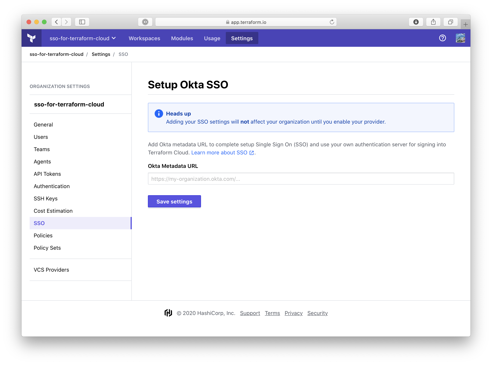
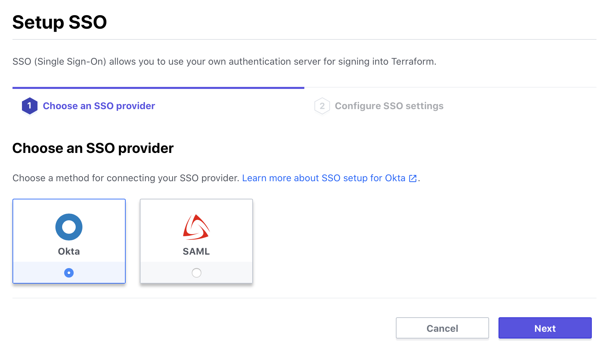
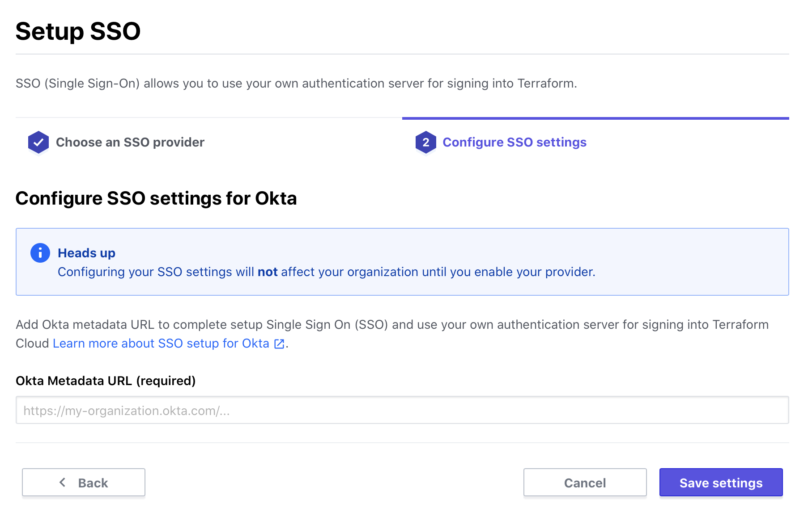
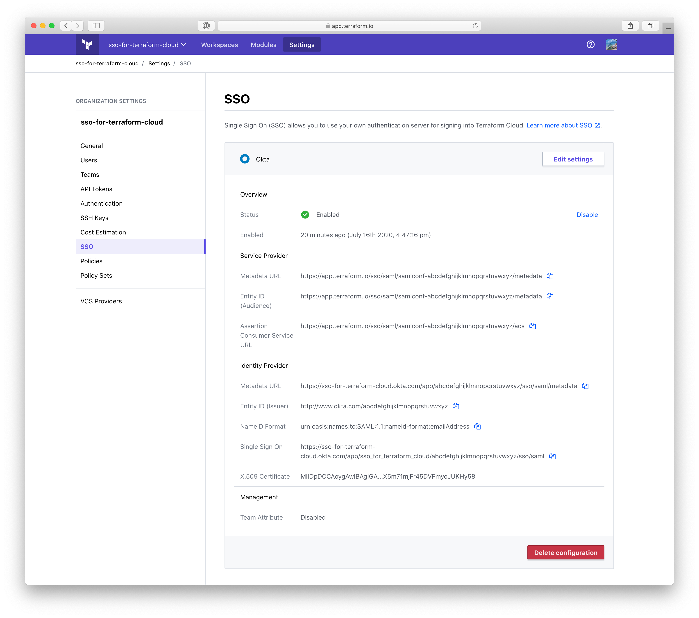

-> **Note:** Single sign-on is a paid feature, available as part of the **Business** upgrade package. [Learn more about Terraform Cloud pricing here](https://www.hashicorp.com/products/terraform/pricing/).

# Single Sign-on: Okta

The Okta SSO integration currently supports the following SAML features:

- Service Provider (SP)-initiated SSO
- Identity Provider (IdP)-initiaited SSO
- Just-in-Time Provisioning

For more information on the listed features, visit the [Okta Glossary](https://help.okta.com/en/prod/Content/Topics/Reference/glossary.htm).

## Configuration (Okta)

1. From your Okta Admin Dashboard, click the "Add Applications" shortcut.
2. Search for "Terraform Cloud" and select it.
3. Click "Add" on the application's page.
4. Choose a label for your application or keep the default, "Terraform Cloud".
5. Click "Done".
6. Visit the "Sign On" tab in the application.
7. Copy the "Identity Provider Metadata" URL.

## Configuration (Terraform Cloud)

Be sure to copy the metadata URL (from the final step of configuring Okta) before proceeding with the following steps.

1. Visit your organization settings page and click "SSO".

2. Click "Setup SSO".

    

3. Select "Okta" and click "Next".

    

4. Provide your Okta metadata URL and click the "Save settings" button.

    

5. Click "Test".
    * This will attempt to initiate SSO sign-in with Okta.
    * You will be redirected briefly to Okta. You may need to reauthenticate depending on your session context.
    * Finally you should be redirected back to the Terraform Cloud settings SSO page with a message about a successful test and the "enable" action should now be accessible.

6. Click "Enable".

7. Your Okta SSO configuration is complete and ready to [use](../single-sign-on.html#using-sso).

    
