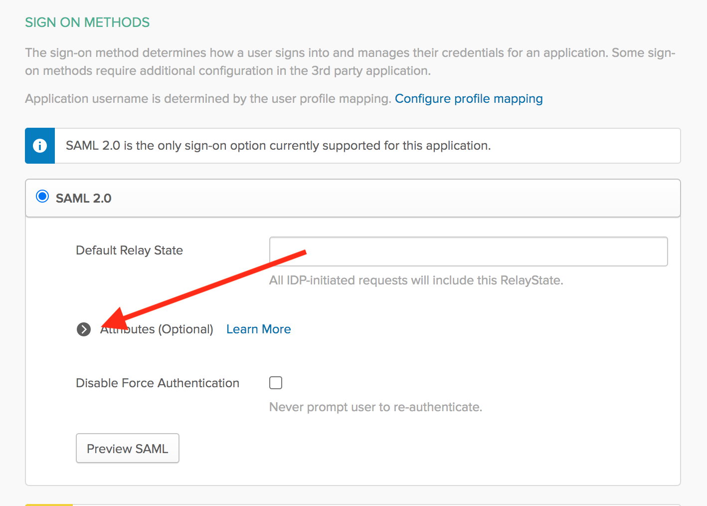
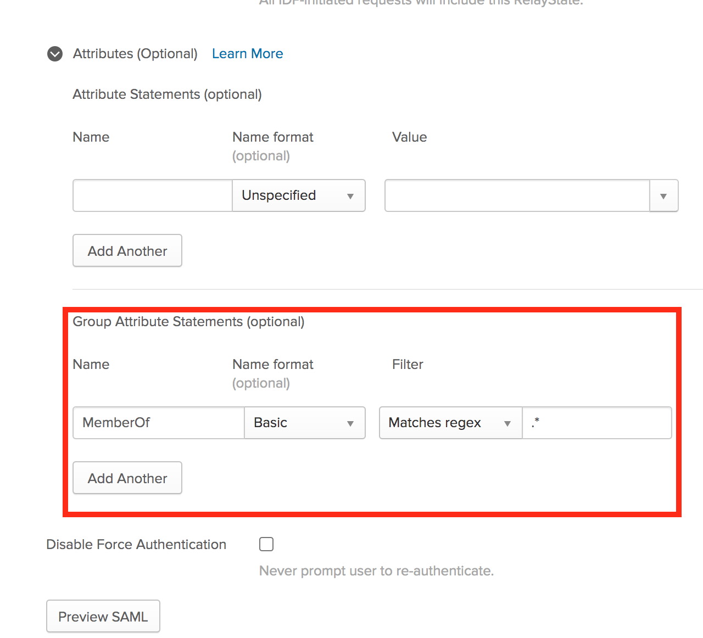
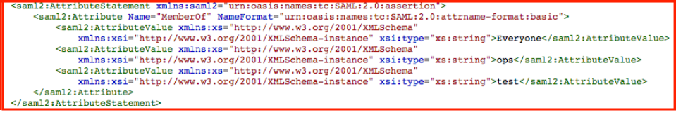

-> **Note:** Single sign-on is a paid feature, available as part of the **Business** upgrade package. [Learn more about Terraform Cloud pricing here](https://www.hashicorp.com/products/terraform/pricing/).

# Single Sign-on: Okta

The Okta SSO integration currently supports the following SAML features:

- Service Provider (SP)-initiated SSO
- Identity Provider (IdP)-initiaited SSO
- Just-in-Time Provisioning

For more information on the listed features, visit the [Okta Glossary](https://help.okta.com/en/prod/Content/Topics/Reference/glossary.htm).

## Configuration (Okta)

1. From your Okta Admin Dashboard, click the "Add Applications" shortcut.
2. Search for "Terraform Cloud" and select it.
3. Click "Add" on the application's page.
4. Choose a label for your application or keep the default, "Terraform Cloud".
5. Click "Done".
6. Visit the "Sign On" tab in the application.
7. Copy the "Identity Provider Metadata" URL.

For information on configuring automated team mapping using Okta group membership, please see the [Team Mapping Configuration (Okta)](#team-mapping-configuration-okta-) section below.

## Configuration (Terraform Cloud)

Be sure to copy the metadata URL (from the final step of configuring Okta) before proceeding with the following steps.

1. Visit your organization settings page and click "SSO".

2. Click "Setup SSO".

    

3. Select "Okta" and click "Next".

    

4. Provide your Okta metadata URL and click the "Save settings" button.

    

5. [Verify](./testing.html) your settings and click "Enable".

6. Your Okta SSO configuration is complete and ready to [use](../single-sign-on.html#signing-in-with-sso).

    

## Team Mapping Configuration (Okta)

Terraform Cloud can automatically add users to teams based on their SAML assertion, so you can manage team membership in your directory service. To do this, you must specify the `MemberOf` SAML attribute, and make sure the AttributeStatement in the SAML Response contains a list of AttributeValue items in the correct format (i.e., comma-separated list of team names). For additional details on this and other SSO concepts within the context of Terraform Cloud, please refer to [this](../single-sign-on.html) overview page.

If you haven't yet completed all steps outlined in the [Configuration (Okta)](#configuration-okta-) section above, please do so before proceeding.

To enable this automated team mapping functionality, edit your Terraform Cloud Okta Application and complete the following steps:

1. Expand the "Attributes" section of the Application configuration (under the "Sign On" tab):

    

2. Set the "Group Attribute Statements" to the following:
    * Name: `MemberOf`
    * Name format: `Basic`
    * Filter: `Matches regex`
    * Filter value: `.*`

    

Once these configuration steps have been completed, **all** Okta groups to which a given user belongs will be passed in the SAML assertion upon login to Terraform Cloud, which means that user will get added automatically to any teams within Terraform Cloud for which there’s an **exact** name match.  Importantly, please note that those users will also be removed from any teams that *aren't* included in their assertion. This overrides any manually set team memberships, so whenever a user logs in via SSO, their team membership is adjusted to match their SAML assertion.

Using the above SAML assertion as an example, the user in question would get added to the `Everyone`, `ops`, and `test` teams in Terraform Cloud if those teams exist in the target Organization, but those values will simply be ignored if no matching team name is found.
