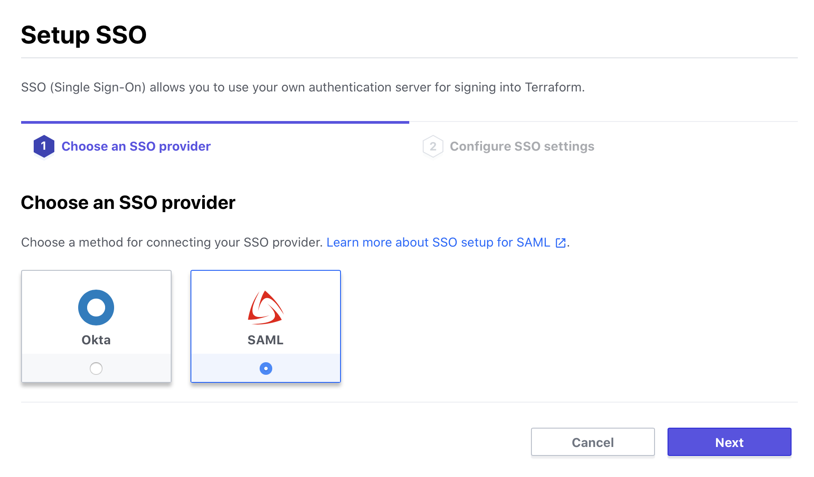
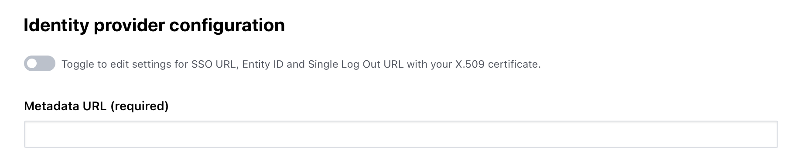
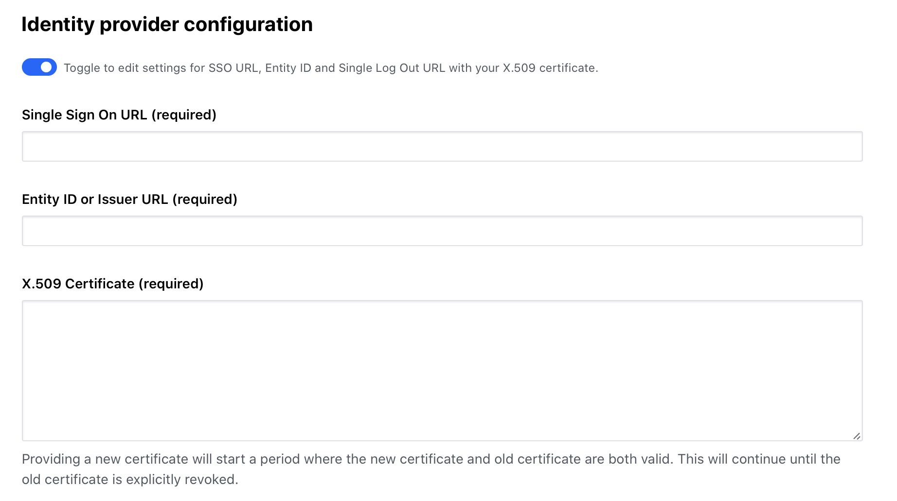
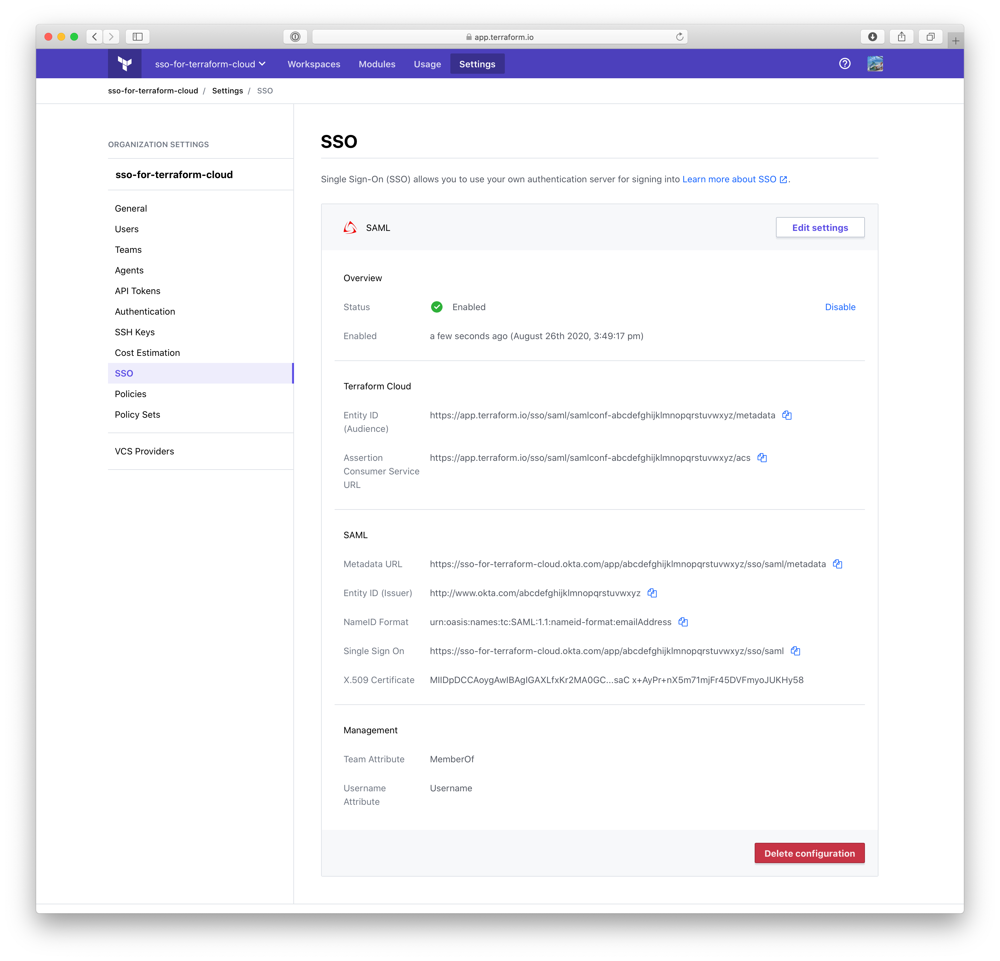

--- layout: "cloud"
page_title: "SAML - Single Sign-on - Terraform Cloud and Terraform Enterprise"
---

-> **Note:** Single sign-on is a paid feature, available as part of the **Business** upgrade package. [Learn more about Terraform Cloud pricing here](https://www.hashicorp.com/products/terraform/pricing/).

# Single Sign-on: SAML

The SAML SSO integration currently supports the following features of SAML 2.0:

- Service Provider (SP)-initiated SSO
- Identity Provider (IdP)-initiaited SSO
- Just-in-Time Provisioning

The SAML SSO integration can be configured by providing a metadata URL or manually with the Single Sign-on URL, Entity ID, and X.509 Certificate.

## Configuration (Terraform Cloud)

1. Visit your organization settings page and click "SSO".

2. Click "Setup SSO".

    

3. Select "SAML" and click "Next".

    

4. Configure using the IdP's metadata URL or manually with the Single Sign-On URL, Entity ID, and X.509 Certificate.

    

    

5. Click "Save settings".

6. Click "Test".
    * This will attempt to initiate SSO sign-in with the IdP.
    * You will be redirected briefly to the IdP. You may need to reauthenticate depending on your session context.
    * Finally you should be redirected back to the Terraform Cloud settings SSO page with a message about a successful test and the "enable" action should now be accessible.

7. Click "Enable".

8. Your SAML SSO configuration is complete and ready to [use](../single-sign-on.html#using-sso).

    
