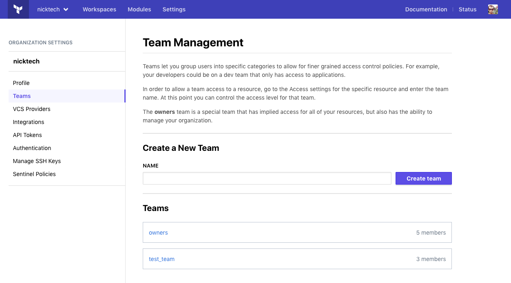
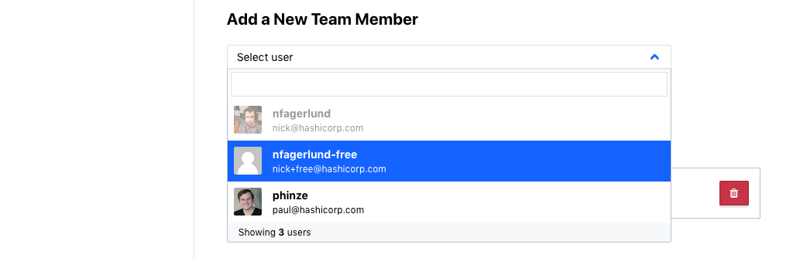

[organizations]: ./organizations.html
[organization settings]: ./organizations.html#organization-settings
[users]: ./users.html

# Teams

-> **Note:** Team management is a paid feature, available as part of the **Team** upgrade package. Free organizations only include an owners team, which can include up to five members. [Learn more about Terraform Cloud pricing here](https://www.hashicorp.com/products/terraform/pricing/).

> For a hands-on tutorial, try the [Manage Permissions in Terraform Cloud](https://learn.hashicorp.com/terraform/tfc/tfc_permissions?utm_source=WEBSITE&utm_medium=WEB_IO&utm_offer=ARTICLE_PAGE&utm_content=DOCS) guide on HashiCorp Learn.

Teams are groups of Terraform Cloud [users][] within an [organization][organizations]. To delegate provisioning work, the organization can grant workspace permissions to specific teams.

Teams can only have permissions on workspaces within their organization, although any user in a team can belong to teams in other organizations.

If a user belongs to at least one team in an organization, they are considered a member of that organization.

-> **API:** See the [Teams API](../api/teams.html), [Team Members API](../api/team-members.html), [Team Tokens API](../api/team-tokens.html), and [Team Access API](../api/team-access.html). 
**Terraform:** See the `tfe` provider's [`tfe_team`](/docs/providers/tfe/r/team.html), [`tfe_team_members`](/docs/providers/tfe/r/team_members.html), and [`tfe_team_access`](/docs/providers/tfe/r/team_access.html) resources.

## The Owners Team

Every organization has a team named "owners", whose members have special permissions. In Terraform Cloud's documentation and UI, members of the owners team are sometimes called organization owners.

An organization's creator is the first member of its owners team; other members can be added or removed in the same way as other teams. Unlike other teams, the owners team can't be deleted and can't be empty; if there is only one member, you must add another before removing the current member.

Members of the owners team have full access to every workspace in the organization. Additionally, the following tasks can only be performed by organization owners:

- Creating and deleting teams
- Inviting users to the organization
- Managing team membership and organization-level permissions granted to teams
- Viewing the full list of teams, both visible and secret
- Managing [organization settings][]

([More about permissions.](/docs/cloud/users-teams-organizations/permissions.html))

[permissions-citation]: #intentionally-unused---keep-for-maintainers

In free organizations, the owners team is limited to five members. In paid organizations, the size of the owners team is not limited.

## Managing Teams

Teams are managed in the [organization settings][]. Click the "Settings" link in the top navigation bar, then click the "Teams" link in the left sidebar.

The teams page includes a list of the organization's teams. Clicking a team in the list loads its team settings page, which manages its membership and other settings:

The team settings page lists the team's current members, with badges to indicate which users have [two-factor authentication](./2fa.html) enabled.

Only organization owners can manage teams or view the full list of teams. Other users can view any teams marked as visible within the organization, plus any secret teams they
are members of. See [Team Visibility](./teams.html#team-visibility) for more information.

[permissions-citation]: #intentionally-unused---keep-for-maintainers

### Creating and Deleting Teams

Organization owners can create new teams from the teams page, using the controls under the "Create a New Team" header.

[permissions-citation]: #intentionally-unused---keep-for-maintainers

To create a new team, provide a name (unique within the organization) and click the "Create team" button. Team names can include numbers, letters, underscores (`_`), and hyphens (`-`).

To delete a team, go to the target team's settings page and click the "Delete TEAM NAME" button.

### Managing Team Membership

Organization owners can use a team's settings page to add and remove users from the team.

[permissions-citation]: #intentionally-unused---keep-for-maintainers

To add a user to a team, choose an existing organization member from the "Select user" drop-down menu, under the "Add a New Team Member" header. If the list of organization members is large, you can use the drop-down's text field to filter the list by username or email.

To add a teammate who doesn't yet belong to the organization, [invite them to join the organization](./organizations.html#users) and include a list of teams they should belong to in the invitation. Once the user accepts their invitation, they will be automatically added to those teams.

To remove a user from a team, click the "🗑" (trash can) button by their entry in the member list.

Typically, your team structure will mirror your company's group structure. The [Terraform Recommended Practices guide](/docs/cloud/guides/recommended-practices/index.html) offers more in-depth discussion of how team structure interacts with the structure of your Terraform configurations and the IT infrastructure they manage.

### Team Visibility

Team visibility controls who can see a team within the organization.

* When a team is set to "Visible", every user in the organization can see the
team and its membership on the Teams page. Non-members have read-only access;
they cannot generate a team API token, for instance.
* When a team is set to "Secret", only team members and organization owners can
read a team and its membership. This is the default setting.

[permissions-citation]: #intentionally-unused---keep-for-maintainers

To simplify workspace administration, we recommend making most (or all) teams visible. Secret teams should only have
[organization-level permissions](./permissions.html#organization-level-permissions), since workspace admins can't manage permissions for teams they can't view.

### API Tokens

Each team can have a special API token that is not associated with a specific user. You can manage this API token from the team's settings page. See [API Tokens](./api-tokens.html) for more information.

## Managing Workspace Access

A team can be given various permissions on one or more workspaces.

- Use any workspace's "Access" tab to manage team permissions on that workspace. For full instructions, see [Managing Access to Workspaces](../workspaces/access.html).
- For detailed information about the available permissions levels, see [Permissions](./permissions.html#workspace-level-permissions).

When determining whether a user can take an action on a resource, Terraform Cloud uses the highest permission level from that user's teams. For example, if a user belongs to a team that only has permission to read runs for a workspace and another team with admin access to that workspace, that user has admin access.

[permissions-citation]: #intentionally-unused---keep-for-maintainers

Organization-level permissions (see [Managing Organization Access](./teams.html#managing-organization-access), below) can also supersede lower workspace permissions. For example, if a team only has permission to read runs for a given workspace but also has permission to manage workspaces for the organization, members of that team have admin access to the workspace. Conversely, if the team has permission to manage policies for the organization (which gives permission to read runs for all workspaces in order to enforce policy sets) and also has admin access to the workspace, the higher admin permission level is granted to the workspace.

[permissions-citation]: #intentionally-unused---keep-for-maintainers

## Managing Organization Access

A team can be granted permissions to manage policies, workspaces, and/or VCS settings across an organization.

[permissions-citation]: #intentionally-unused---keep-for-maintainers

- Organization owners can manage a team's organization-level permissions on the team's settings page under "Organization Access".
- For detailed information about the available permissions, see [Permissions](./permissions.html#organization-level-permissions).
