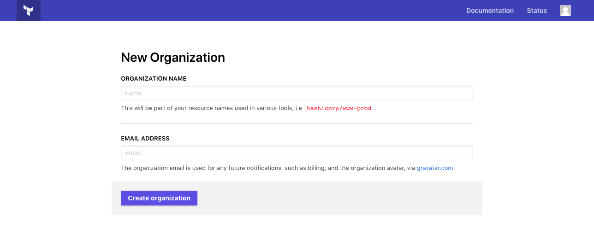
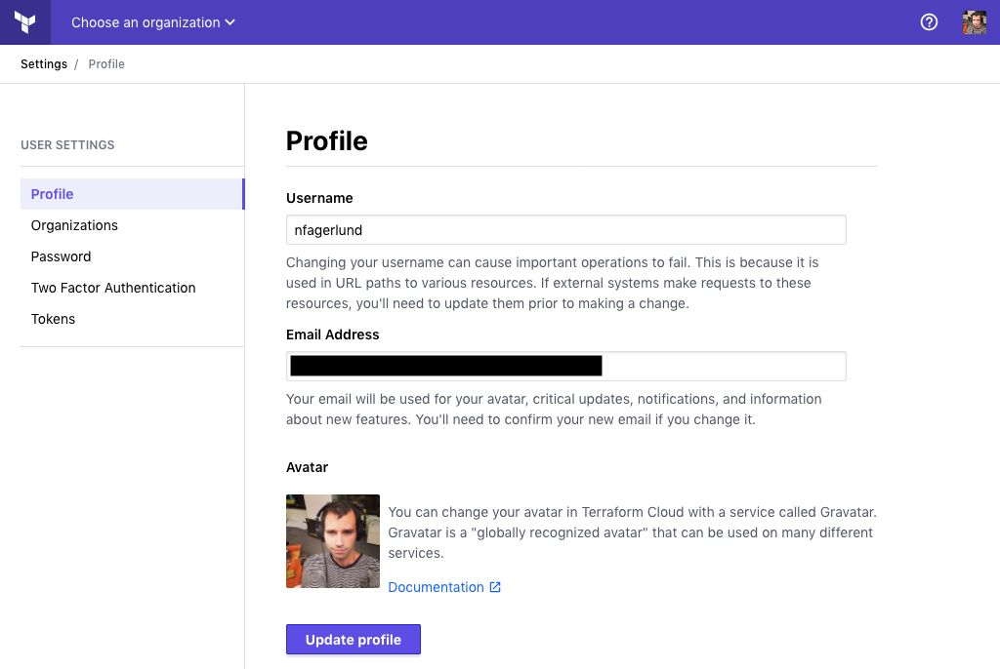
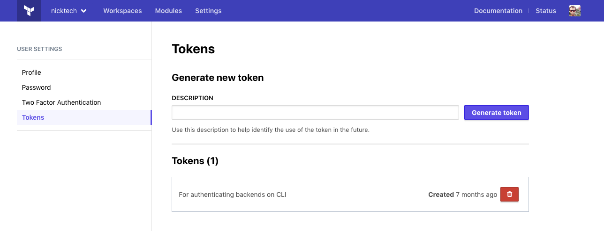

[organizations]: ./organizations.html
[teams]: ./teams.html
[invite]: ./organizations.html#users
[owners]: ./teams.html#the-owners-team

# Users

User accounts belong to individual people. A user can be a member of multiple [organizations][].

-> **API:** See the [Account API](../api/account.html).

## Creating an Account

Users must create an account in Terraform Cloud before they can use any of Terraform Cloud's features. Creating an account requires a username, an email address, and a password.

If someone invited you to join an existing organization, the invitation email should include a sign-up link.

Alternately, you can create an account from Terraform Cloud's sign-up page. Navigate to the sign-up page via the link on the login page, or go directly to its URL:

- For the SaaS version of Terraform Cloud, create a new account at [https://app.terraform.io/signup/account](https://app.terraform.io/signup/account).
- For Terraform Enterprise, go to `https://<TFE HOSTNAME>/signup/account`.

### After Creating an Account

If you used an invitation link to create your account, you will automatically join that organization and can start using Terraform Cloud's features right away.

If you created your account without an invitation, you will not initially belong to any organizations, and Terraform Cloud will display a page where you can create a new organization.

- If you are the first Terraform Cloud user in your organization, use this page to create your Terraform Cloud organization. See [Organizations][] for more information.
- If you intend to join an existing organization, do not create a new one; instead, send your email address to one of your organization's owners and ask them to invite you. Once you receive and accept the emailed invitation, you can reload the page to begin using Terraform Cloud.

## Team and Organization Membership

To join an organization, you must be invited by an owner of that organization. In order to have any permissions with that organization, an owner will need to add you to one or more teams. For more information, see [Organization Settings: Users][invite] and [Managing Team Membership](./teams.html#managing-team-membership).

User invitations are sent by email. If the invited email address matches an existing Terraform Cloud account, the invitee can join the organization with that account; if not, they must create a new account for working with that organization.

## Site Admin Permissions

On Terraform Enterprise instances, some user accounts have a special "site admin" permission that allows administration of the entire instance.

Admin permissions are distinct from normal organization-level permissions, and they apply to a different set of UI controls and API endpoints. Although admin users can administer any resource across the instance when using the site admin pages or the [admin API](../api/admin/index.html), they have a normal user's permissions (with access determined by the teams they belong to) when using an organization's standard UI controls and API endpoints.

For more information, see [Administering Terraform Enterprise](/docs/enterprise/admin/index.html).

## User Settings

Terraform Cloud users can manage many of their own account details, including email address, password, API tokens, and two-factor authentication.

To reach your user settings page, click the user icon in the upper right corner and choose "User Settings" from the menu.

Once on this page, can use the navigation on the left to choose which settings to manage.

### Profile

Terraform Cloud user profiles are very small, consisting only of a username and an email address. You can change either of these from the "Profile" page of the user settings.

~> **Important:** Changing your username can cause important operations to fail. This is because it is used in URL paths to various resources. If external systems make requests to these resources, you'll need to update them prior to making a change.

Additionally, Terraform Cloud uses [Gravatar](http://en.gravatar.com) to display a user icon if you have associated one with your email address. For details about changing your user icon, see [Gravatar's documentation](http://en.gravatar.com/support/).

### Organizations

The "Organizations" settings page lists all of the organizations you belong to. Organizations where you are on [the owners team][owners] are indicated with an "OWNER" badge.

Organization membership is voluntary, and you can leave an organization without permission from its owners. Use the "..." (ellipsis) button next to an organization to reveal the "Leave organization" link.

-> **Note:** You can't leave an organization if you are the last member of its owners team. You can either add a new owner and then leave, or you can [delete the organization](./organizations.html#general).

### Password

The "Password" settings page allows you to change your password. You'll need to confirm your current password, and enter your new password twice.

Password management isn't available if your Terraform Enterprise instance uses [SAML single sign on](/docs/enterprise/saml/index.html).

### Two-Factor Authentication

For additional security, you can enable two-factor authentication, using a TOTP-compliant application or an SMS-capable phone number. Depending on your organization's policies, you might be required to enable two-factor authentication.

For more details, see [Two-Factor Authentication](./2fa.html).

### API Tokens

Users can create any number of API tokens, and can revoke existing tokens at any time. To manage API tokens, click the "Tokens" page of the user settings.

API tokens are necessary for:

- Authenticating with the [Terraform Cloud API](../api/index.html). API calls require an `Authorization: Bearer <TOKEN>` HTTP header.
- Authenticating with the [Terraform `remote` backend](/docs/backends/types/remote.html), which requires a token in the CLI config file or in the backend configuration.
- Using [private modules](../registry/using.html) in command-line Terraform runs on local machines requires [a token in the CLI config file](../registry/using.html#configuration).

Terraform Cloud has three kinds of API tokens: user, team, and organization. For more information about team and organization tokens, see [API Tokens](./api-tokens.html).

Protect your tokens carefully, because they can do anything your user account can. For example, if you belong to a team with write access to a workspace, your API token can edit variables in that workspace. (See [Permissions](./permissions.html) for details about workspace permissions.)

Since users can be members of multiple organizations, user tokens work with any organization their user belongs to.

- To create a new token, enter a comment to identify it and click the "Generate token" button.

    A token is only displayed once, at the time of creation; if you lose it, you will need to revoke the old token and create a new one. Make sure your description includes enough information so you know which token to revoke later.
- To revoke a token, click the "🗑" (trash can) icon button next to the token's description. That token will no longer be able to authenticate as your user account.

-> **Note**: When SAML SSO is enabled there is a session timeout for user API tokens, forcing users to periodically reauthenticate through the web UI in order to keep their tokens active. See the [API Token Expiration](/docs/enterprise/saml/login.html#api-token-expiration) section in the SAML SSO documentation for more details.
