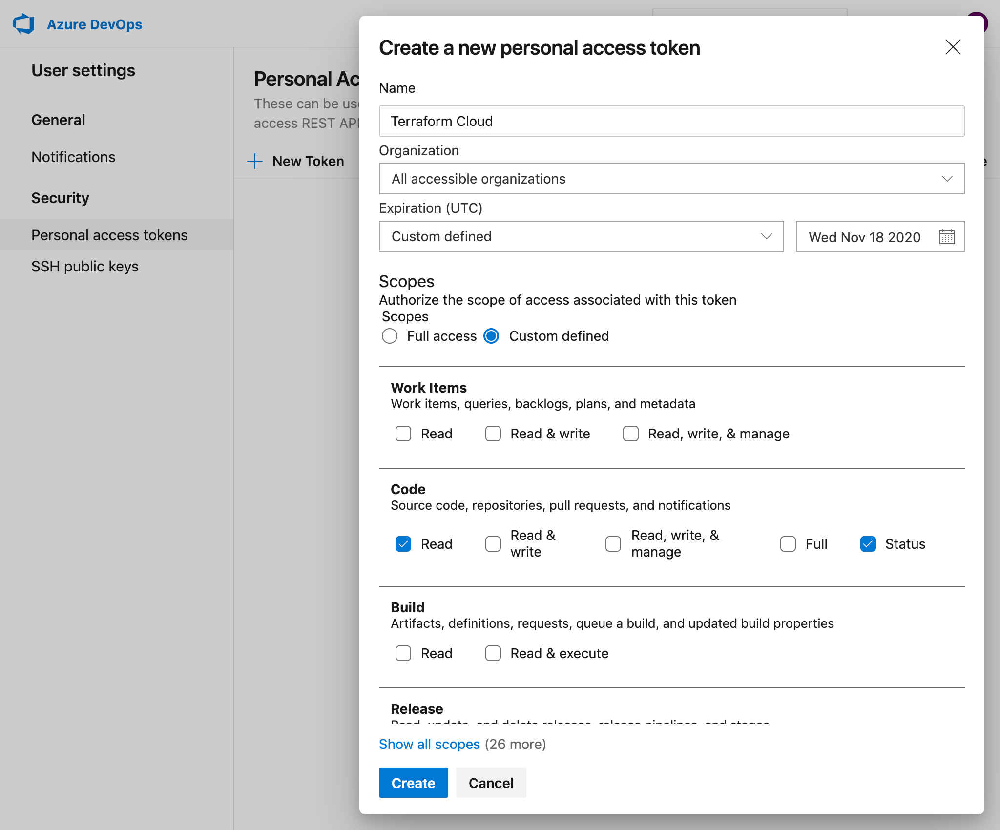
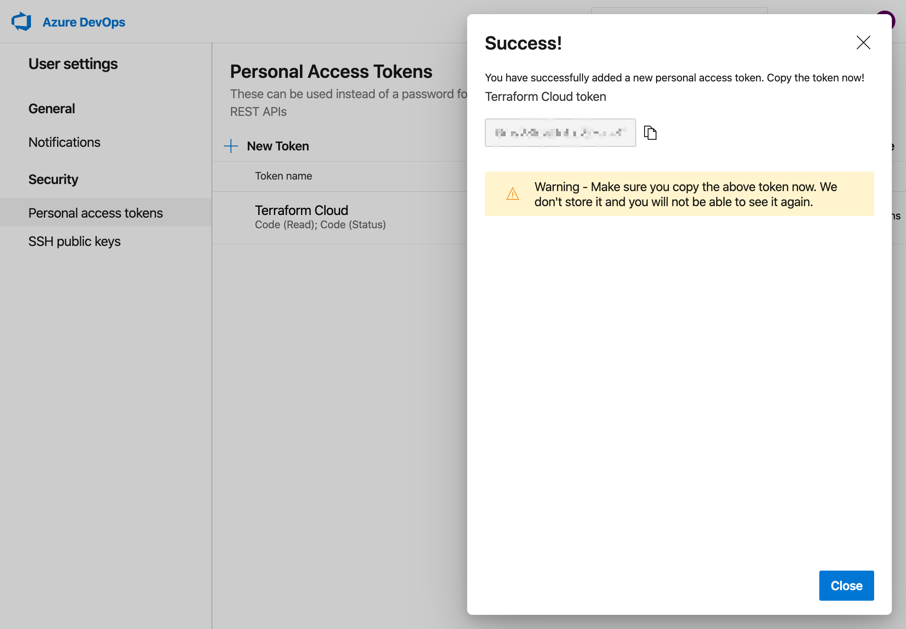
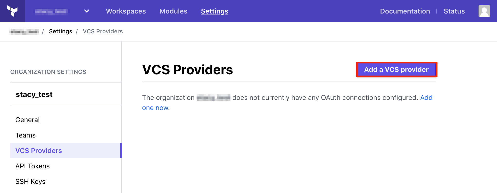
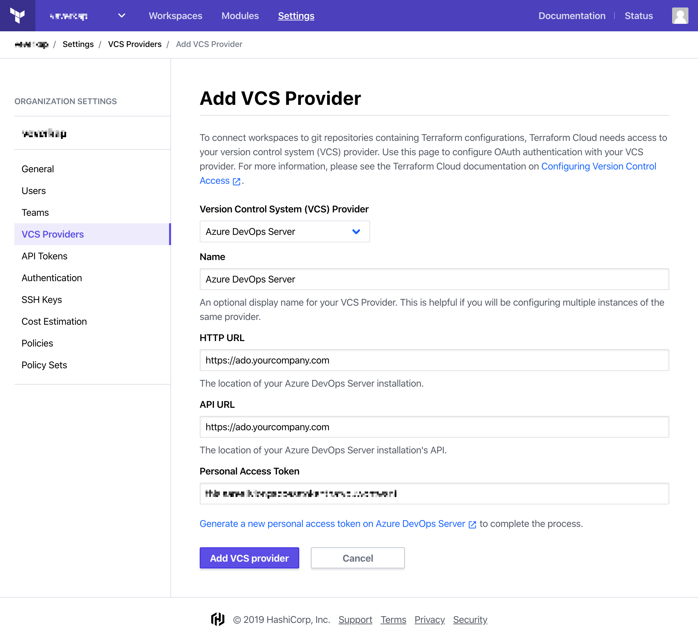
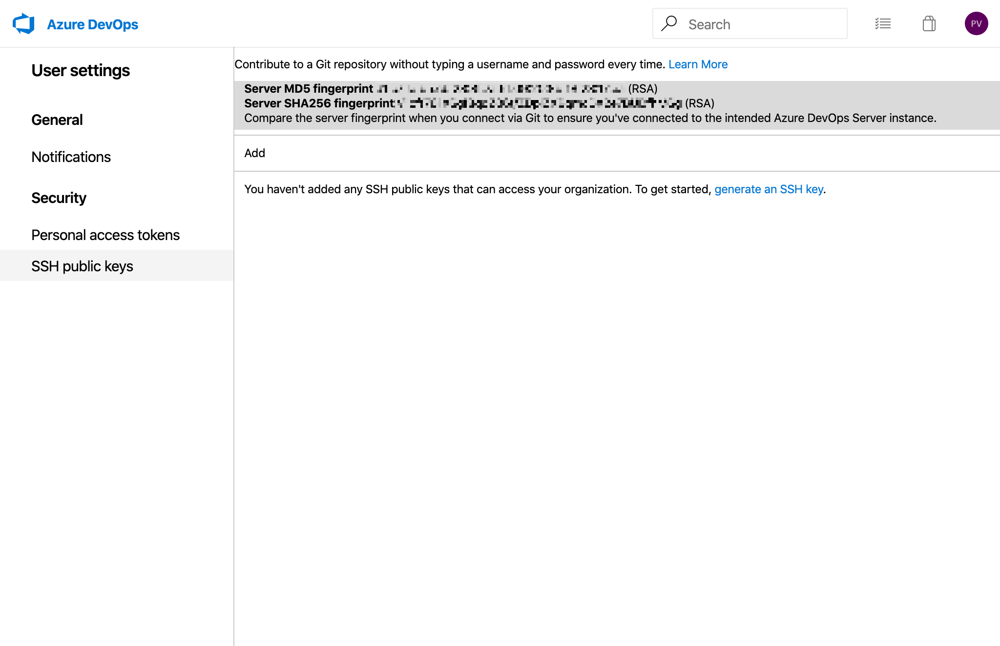
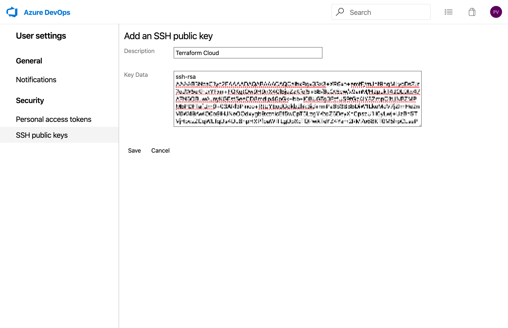
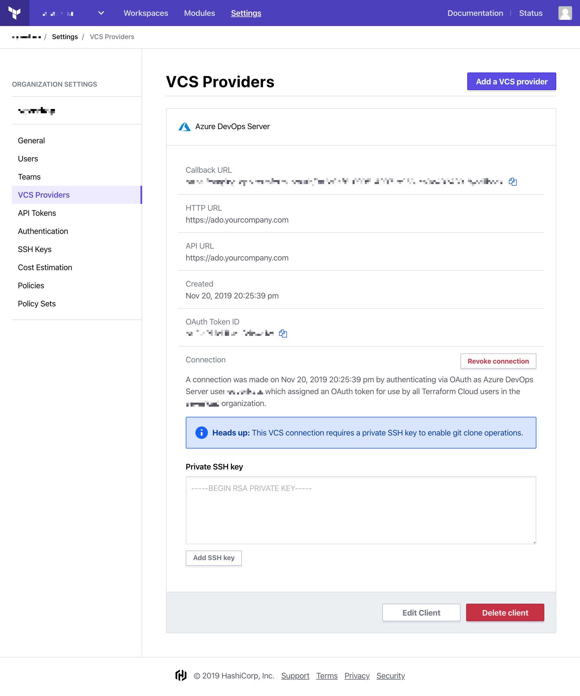

# Configuring Azure DevOps Server Access

These instructions are for using an on-premises installation of Azure DevOps Server 2019 for Terraform Cloud's VCS features. [Azure DevOps Services has separate instructions,](./azure-devops-services.html) as do the [other supported VCS providers.](./index.html)

~> **Important:** Using personal access tokens on Azure DevOps Server requires that [IIS Basic Authentication be disabled.](https://docs.microsoft.com/en-us/azure/devops/integrate/get-started/authentication/iis-basic-auth?view=azure-devops)

## Step 1: On Azure DevOps Server, Create a New Personal Access Token

1. Log in as whichever account you want Terraform Cloud to act as. For most organizations this should be a dedicated service user, but a personal account will also work.

    ~> **Important:** The account you use for connecting Terraform Cloud **must have Project Collection Administrator access** to any projects containing repositories of Terraform configurations, since creating webhooks requires these permissions.

2. Navigate to User settings -> Security -> Personal access tokens on your Azure DevOps Server instance.
3. Click the "New Token" button to generate a new personal access token with "Code (Read)" and "Code (Status)" scopes. (We recommend also granting access to "All accessible organizations.")

    ~> **Important:** This expiration date of this token is set on the Azure DevOps Server. Either you will need to update the expiration date before the token expires or reconnect Terraform Cloud if the token expires.

    

4. Copy the generated token to your clipboard; you’ll paste it in the next step. Leave this page open in a browser tab.

    

## Step 2: On Terraform Cloud, Add a New VCS Provider

1. Open Terraform Cloud in your browser and navigate to the Settings > VCS Providers page for your organization. Click the “Add VCS Provider” button.

    If you just created your organization, you might already be on this page. Otherwise:

    1. Click the upper-left organization menu, making sure it currently shows your organization
    1. Click the “Settings” link at the top of the page (or within the &#9776; menu)
    1. On the next page, click “VCS Providers” in the left sidebar
    1. Click the “Add a VCS Provider” button

    

2. The next page has a drop-down and several text fields. Select "Azure DevOps Server" from the drop-down.

3. (Optional) Enter a display name for your Azure DevOps Server VCS Provider.

4. Enter your Azure DevOps Server **personal access token**. This can be found in your user profile, which should still be open in the browser tab from Step 1.

5. Enter the instance URL for your Azure DevOps Server in HTTP URL and API URL textboxes.

5. Verify the information entered on this page and then click "Create VCS provider." This will take you back to the VCS Providers page which now includes your new Azure DevOps Services provider.

    

## Step 3: On Workstation: Create an SSH Key for Terraform Cloud

On a secure workstation, create an SSH keypair that Terraform Cloud can use to connect to Azure DevOps Server. The exact command depends on your OS, but is usually something like `ssh-keygen -t rsa -f "/Users/<NAME>/.ssh/service_terraform" -C "service_terraform_enterprise"`. This creates a `service_terraform` file with the private key, and a `service_terraform.pub` file with the public key.

This SSH key **must have an empty passphrase.** Terraform Cloud cannot use SSH keys that require a passphrase.

### Important Notes

- Do not use your personal SSH key to connect Terraform Cloud and Azure DevOps Server; generate a new one or use an existing key reserved for service access.
- In the following steps, you must provide Terraform Cloud with the private key. Although Terraform Cloud does not display the text of the key to users after it is entered, it retains it and will use it for authenticating to Azure DevOps Server.
- **Protect this private key carefully.** It can read code to the repositories you use to manage your infrastructure. Take note of your organization's policies for protecting important credentials and be sure to follow them.

## Step 4: On Azure Devops Server, Add SSH Public Key

1. Navigate to User settings -> Security -> SSH public keys on your Azure DevOps Server instance.

    

2. Click the "Add" button. Paste the text of the **SSH public key** you created in step 3 (from the `.pub` file) into the text field, then click the "Add key" button to confirm.

    

## Step 5: On Terraform Cloud, Add SSH Private Key

1. Go back to your Terraform Cloud browser tab and paste the text of the **SSH private key** you created in step 3 into the text field and click the "Add SSH key" button.

    

At this point, Azure DevOps Server access for Terraform Cloud is fully configured, and you can create Terraform workspaces based on your organization’s repositories.
