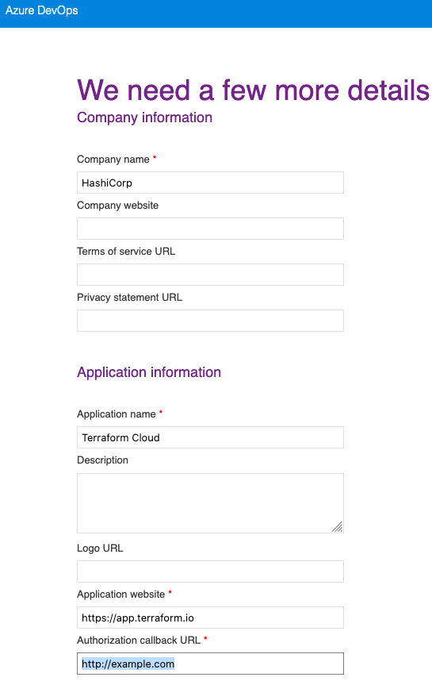
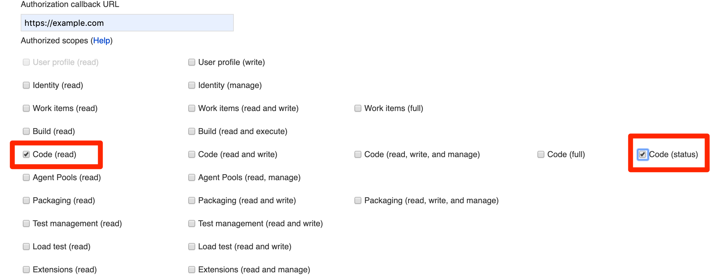
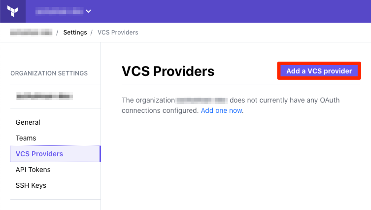
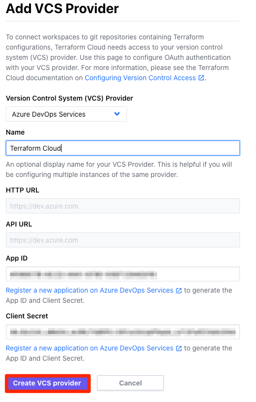
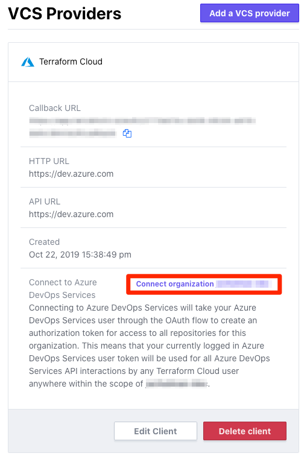
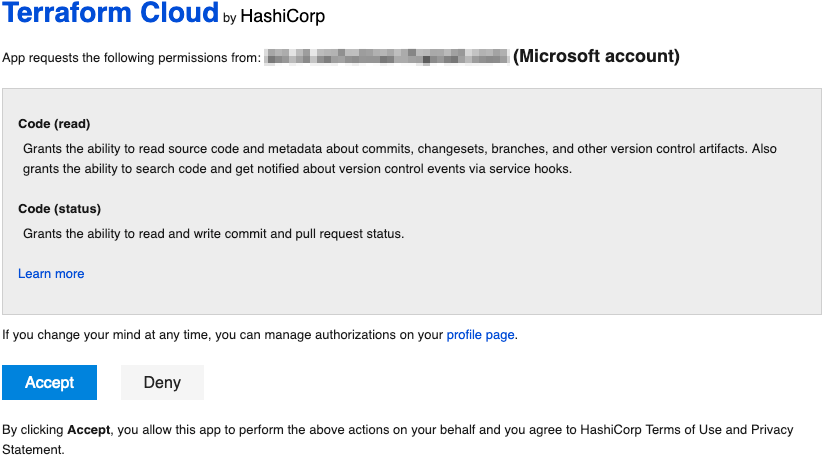

# Configuring Azure DevOps Services Access

These instructions are for using dev.azure.com for Terraform Cloud’s VCS features. [Other supported VCS providers](./index.html) have separate instructions.

Connecting Terraform Cloud to your Azure DevOps Services VCS involves four steps:

On your VCS | On Terraform Cloud
--|--
Register your Terraform Cloud organization as a new app. Get ID and key. | &nbsp;
&nbsp; | Tell Terraform Cloud how to reach VCS, and provide ID and key. Get callback URL.
Provide callback URL. | &nbsp;
&nbsp; | Connect your Terraform Cloud organization to your Azure DevOps Services project.

The rest of the page explains these steps in more detail.

## Step 1: From your Azure DevOps Services Profile, Create a New Application

1. Open your [Azure DevOps Services Profile](https://aex.dev.azure.com) in a browser tab; log in to your Azure DevOps Services account if necessary.

2. Click the “Create new application” link at the bottom of the left column under the “Applications and services” header. The next page is a form asking for your company and application information. At the minimum, you’ll need to provide your company name, application name (Terraform Cloud), application website (`https://app.terraform.io` or the URL of your Terraform Enterprise instance), and authorization callback URL.
    
    The authorization callback URL can be a placeholder, as you’ll update it with the actual callback value in Step 2.

    

3. In the "Authorized scopes" section, select only “Code (read)” and “Code (status)” and then click “Create Application.”

    

    ~> **Important:** These authorized scopes cannot be updated after the application is created. If you add additional scopes, your application may not work.

4. After creating the application, the next page displays its details. Leave this page open in a browser tab. In the next step, you will copy and paste the unique **App ID** and **Client Secret** from this page, and in a later step you will update the application's callback URL.

    If you accidentally close this details page and need to find it later, you can reach it from the "Applications and Services" links at the bottom left of your profile.

## Step 2: On Terraform Cloud, Add a New VCS Provider

1. Open Terraform Cloud in your browser and navigate to the “Settings > VCS Providers” page for your organization. Click the “Add VCS Provider” button.

    If you just created your organization, you might already be on this page. Otherwise:
    - Click the upper-left organization menu, making sure it currently shows your organization
    - Click the “Settings” link at the top of the page (or within the &#9776; menu)
    - On the next page, click “VCS Providers” in the left sidebar
    - Click the “Add a VCS Provider” button

    

2. The next page has a drop-down and several text fields. Select "Azure DevOps Services" from the drop-down.

3. (Optional) Enter a display name for your Azure DevOps Services VCS Provider.

4. Enter your Azure DevOps Services application's **App ID** and **Client Secret.** These can be found in the application's details, which should still be open in the browser tab from Step 1.

5. Verify the information entered on this page, and then click “Create VCS provider.” This will take you back to the VCS Provider page which now includes your new Azure DevOps Services client.

    

6. Locate the new client’s “Callback URL” and copy it to your clipboard; you’ll paste it in the next step. Leave this page open in a browser tab.

## Step 3: Within your Azure DevOps Services Application, Update your Callback URL

1. Open your Azure DevOps Services Profile browser tab from Step 1. If you accidentally closed it, you can reach it by navigating to [your Azure DevOps Services Profile](https://aex.dev.azure.com), logging in, and finding your application settings in the bottom of the left column.

2. Edit your application. 

3. Paste the callback URL you received from Step 2 in the Authorization callback URL entry. 

4. Save the updated application settings. You will not need this browser tab open anymore, so feel free to close it.

## Step 4: On Terraform Cloud, Connect Organization

1. Go back to your Terraform Cloud browser tab and click the “Connect organization `<NAME>`” button on the VCS Provider page.

    This takes you to a page on Azure DevOps Services asking whether you want to authorize the app. 

    

2. Click the "Accept" button at the bottom of the authorization page. This returns you to Terraform Cloud’s VCS Provider page, where the Azure DevOps Services client’s information has been updated.

    

    ~> **Note:** If you receive a 404 error from Azure DevOps Services, it likely means your callback URL has not been configured correctly.

## Finished

At this point, Azure DevOps Services access for Terraform Cloud is fully configured, and you can create Terraform workspaces based on your organization’s repositories.
