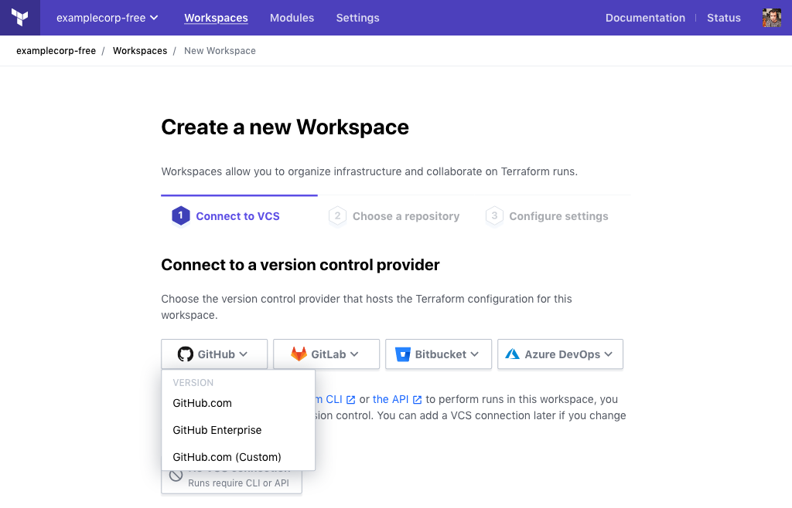
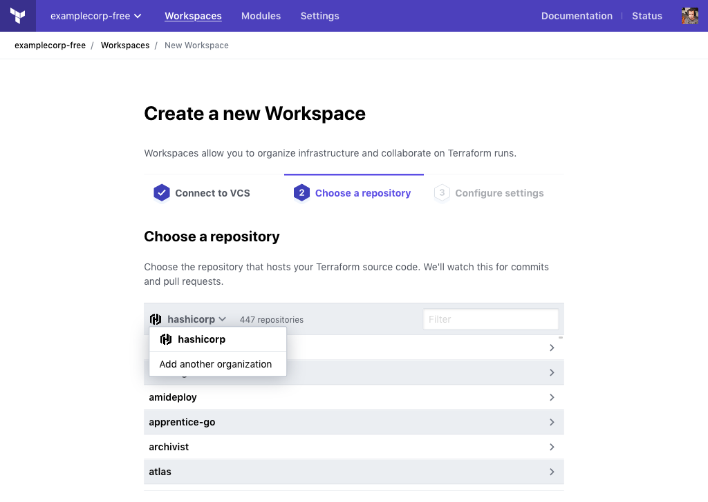
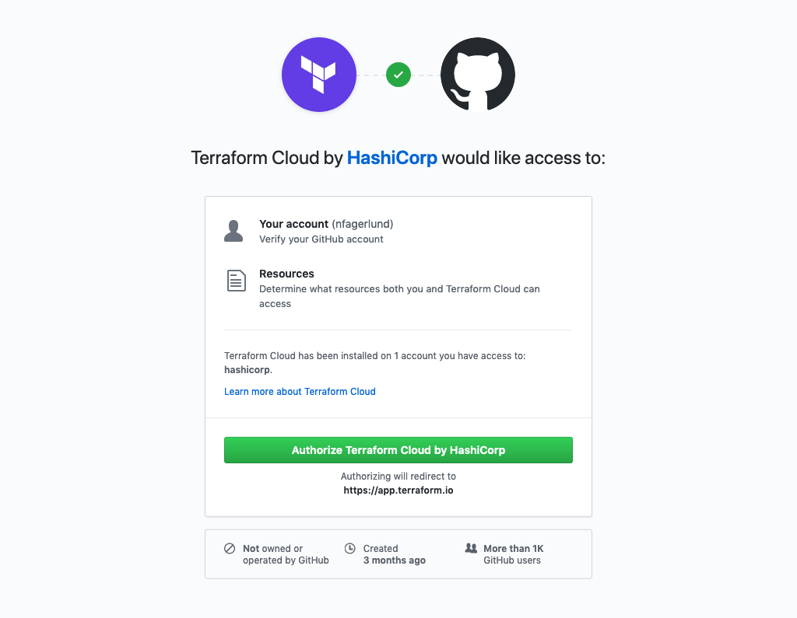
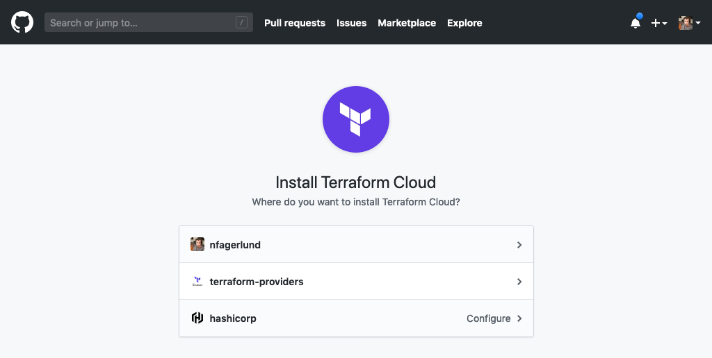

[private module registry]: ../registry/index.html
[policy sets]: ../sentinel/manage-policies.html
[vcs settings]: ../workspaces/vcs.html
[create]: ../workspaces/creating.html
[owners]: ../users-teams-organizations/teams.html#the-owners-team

# Configuration-Free GitHub Usage

These instructions are for using repositories from GitHub.com with Terraform Cloud workspaces, without configuring an OAuth connection.

Using GitHub this way does not require any action from an [organization owner][owners]; anyone who can create workspaces or administer existing workspaces can connect GitHub repositories.

This method uses a preconfigured GitHub App, and only works with GitHub.com. There are separate instructions for connecting to [GitHub.com via OAuth](./github.html), connecting to [GitHub Enterprise](./github-enterprise.html), and connecting to [other supported VCS providers.](./index.html)

## Using GitHub Repositories

You can connect GitHub repositories to Terraform Cloud workspaces without changing any organization settings.

To do so, choose "GitHub.com" on the "Connect to a version control provider" screen, which is shown when [creating a new workspace][create] or [changing a workspace's VCS connection][vcs settings]. Authorize access to GitHub if necessary. On the next screen, select a GitHub account or organization from the drop-down menu (or add a new organization) and choose a repository from the list.

The controls on the "Connect to a version control provider" screen can vary, depending on your permissions and your organization's settings:

- In organizations with no VCS connections configured:
    - [Owners][] will see several drop-down menus, sorted by product family. Choose "GitHub.com" (_not_ "GitHub.com (Custom)") from the GitHub menu.
    - Non-owners will see a "GitHub" button.
- In organizations with an existing VCS connection, only the connected providers are shown. Click the "Connect to a different VCS" link to reveal the provider menus (owners) or the GitHub button (non-owners).

## GitHub Permissions

Unlike OAuth connections, the Terraform Cloud GitHub App does not configure a Terraform Cloud organization to always act as one particular GitHub user. Instead, each Terraform Cloud user authenticates individually, and can use GitHub resources within Terraform Cloud according to their own GitHub organization memberships and access permissions.

To enable this, Terraform Cloud requests two kinds of permissions:

- **Per user:** Each Terraform Cloud user must _authorize_ Terraform Cloud for their own GitHub account. This lets Terraform Cloud determine which organizations and repositories you have access to.
- **Per GitHub organization:** Each GitHub organization (or personal account) must _install_ the Terraform Cloud app, either globally or for specific repositories. This allows Terraform Cloud to access repository contents and events.

Individual Terraform Cloud users can access GitHub repositories where both of the following are true:

- The user has at least read access to that repository on GitHub.
- The repository's owner has installed the Terraform Cloud app and allowed it to access that repository.

This means that different Terraform Cloud users within the same organization can see different sets of repositories available for their workspaces.

### Authorizing

Terraform Cloud requests GitHub authorization from each user, displaying a pop-up window the first time they choose GitHub on the "Connect to a version control provider" screen.

Once you authorize the app, you can use GitHub in any of your Terraform Cloud organizations without needing to re-authorize.

Authorization doesn't grant Terraform Cloud any repository permissions; the app must also be installed in at least one of the GitHub organizations or accounts you have access to.

#### Deauthorizing

You can use GitHub's web interface to deauthorize Terraform Cloud for your GitHub account.

Open your GitHub personal settings, then go to the "Applications" section and the "Authorized GitHub Apps" tab. (Or, browse directly to `https://github.com/settings/apps/authorizations`.) Click the "Revoke" button for Terraform Cloud to deauthorize it.

After deauthorizing, you won't be able to connect GitHub repositories to Terraform Cloud workspaces until you authorize again. Existing connections will still work.

### Installing

Terraform Cloud requests installation when a user chooses "Add another organization" from the repository list's organization menu.

The installation interface is a pop-up GitHub window, which lists your personal account and the organizations you can access. Note that installing an app for a GitHub organization requires appropriate organization permissions; see [GitHub's permissions documentation](https://help.github.com/en/github/setting-up-and-managing-organizations-and-teams/permission-levels-for-an-organization#github-app-managers) for details.

For a given organization or account, the app can be installed globally or only for specific repositories.

Once Terraform Cloud is installed for an organization (or a subset of its repositories), its members can select any affected repositories they have access to when using Terraform Cloud.

Access is not restricted to a specific Terraform Cloud organization; members of a GitHub organization can use its repositories in any Terraform Cloud organization they belong to.

#### Configuring and Uninstalling

You can use GitHub's web interface to configure or uninstall Terraform Cloud for an organization or account.

Open your GitHub personal settings or organization settings, then go to the "Applications" section and the "Installed GitHub Apps" tab. Click the "Configure" button for Terraform Cloud to change its settings.

In the app's settings you can change which repositories Terraform Cloud has access to, or uninstall it entirely.

If you disallow access to a repository that is currently connected to any Terraform Cloud workspaces, those workspaces will be unable to retrieve configuration versions until you change their VCS settings and connect them to an allowed repository.

## Feature Limitations

The Terraform Cloud GitHub App is designed for creating workspaces from the Terraform Cloud UI. It currently does not support:

- The [private module registry][]
- [Policy sets][]
- Creation of workspaces via the API or the `tfe` Terraform provider

Once you decide to start using these other features, an organization owner can configure [GitHub OAuth access](./github.html) for your organization.

