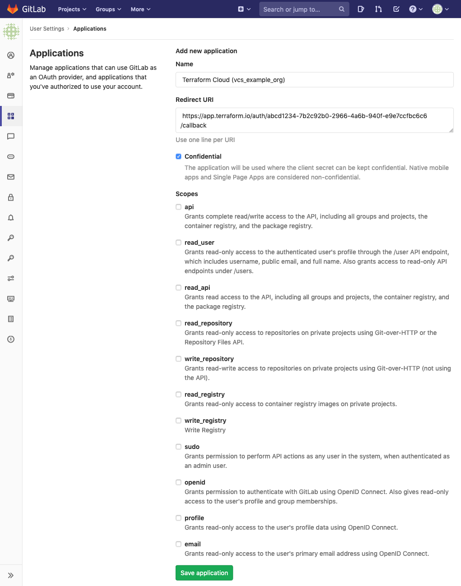
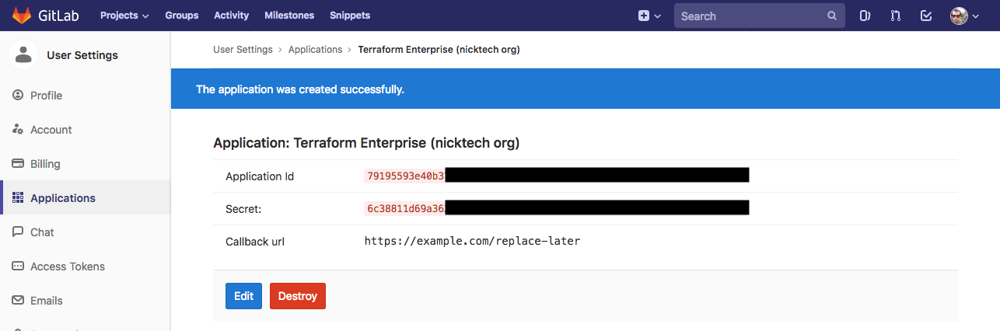
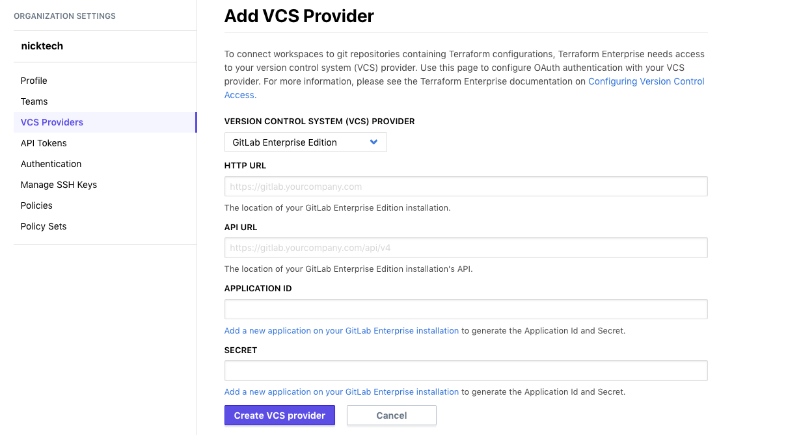
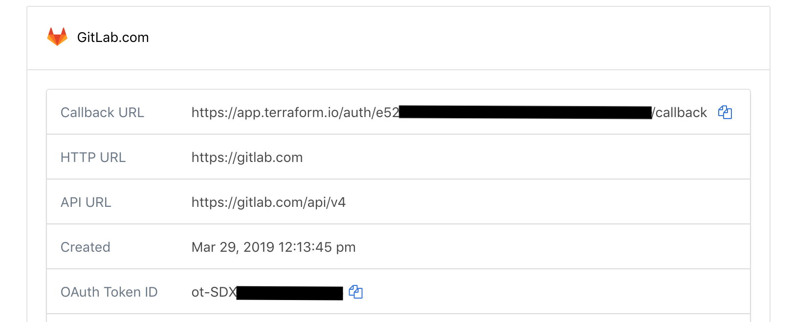
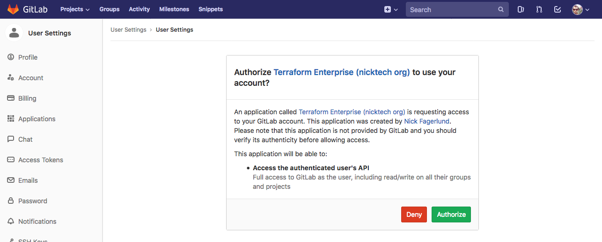

# Configuring GitLab EE and CE Access

These instructions are for using an on-premise installation of GitLab Enterprise Edition (EE) or GitLab Community Edition (CE) for Terraform Cloud's VCS features. [GitLab.com has separate instructions,](./gitlab-com.html) as do the [other supported VCS providers.](./index.html)

Connecting Terraform Cloud to your VCS involves five steps:

On your VCS | On Terraform Cloud
--|--
Register your Terraform Cloud organization as a new app. Get ID and key. | &nbsp;
&nbsp; | Tell Terraform Cloud how to reach VCS, and provide ID and key. Get callback URL.
Provide callback URL. | &nbsp;
&nbsp; | Request VCS access.
Approve access request. | &nbsp;

The rest of this page explains the on-premise GitLab versions of these steps.

~> **Important:** Terraform Cloud needs to contact your GitLab instance during setup and during normal operation. For the SaaS version of Terraform Cloud, this means GitLab must be internet-accessible; for Terraform Enterprise, you must have network connectivity between your Terraform Enterprise and GitLab instances.

-> **Note:** Alternately, you can skip the OAuth configuration process and authenticate with a personal access token. This requires using Terraform Cloud's API. For details, see [the OAuth Clients API page](../api/oauth-clients.html).

-> **Version Note:** Terraform Cloud supports GitLab versions 9.0 and newer. HashiCorp does not test older versions of GitLab with Terraform Cloud, and they might not work as expected. Also note that, although we do not deliberately remove support for versions that have reached end of life (per the [GitLab Support End of Life Policy](https://docs.gitlab.com/ee/policy/maintenance.html#patch-releases)), our ability to resolve customer issues with end of life versions might be limited.

## Step 1: On GitLab, Create a New Application

1. Open your GitLab instance in your browser and log in as whichever account you want Terraform Cloud to act as. For most organizations this should be a dedicated service user, but a personal account will also work.

    ~> **Important:** The account you use for connecting Terraform Cloud **must have admin (master) access** to any shared repositories of Terraform configurations, since creating webhooks requires admin permissions. Do not create the application as an administrative application not owned by a user; Terraform Cloud needs user access to repositories to create webhooks and ingress configurations.

    ~> **Important**: In GitLab CE or EE 10.6 and up, you may also need to enable **Allow requests to the local network from hooks and services** on the "Outbound requests" section inside the Admin area under Settings (`/admin/application_settings`). Refer to [the GitLab documentation](https://docs.gitlab.com/ee/security/webhooks.html) for details.

2. Navigate to GitLab's "User Settings > Applications" page.

    This page is located at `https://<GITLAB INSTANCE HOSTNAME>/profile/applications`. You can also reach it through GitLab's menus:
    - In the upper right corner, click your profile picture and choose "Settings."
    - In the navigation sidebar, click "Applications."

3. This page has a list of applications and a form for adding new ones. The form has two text fields and some checkboxes.

    

    Fill out the form as follows:

    Field            | Value
    -----------------|--------------------------------------------------
    (all checkboxes) | (empty)
    Name             | Terraform Cloud (`<YOUR ORGANIZATION NAME>`)
    Redirect URI     | `https://example.com/replace-this-later` (or any placeholder; the correct URI doesn't exist until the next step.)

4. Click the "Save application" button, which creates the application and takes you to its page.

5. Leave this page open in a browser tab. In the next step, you will copy and paste the unique **Application ID** and **Secret.**

    

## Step 2: On Terraform Cloud, Add a VCS Provider

1. Open Terraform Cloud in your browser and navigate to the "VCS Provider" settings for your organization. Click the "Add VCS Provider" button.

    If you just created your organization, you might already be on this page. Otherwise:

    1. Click the upper-left organization menu, making sure it currently shows your organization.
    1. Click the "Settings" link at the top of the page (or within the &#9776; menu)
    1. On the next page, click "VCS Provider" in the left sidebar.
    1. Click the "Add VCS Provider" button.

2. The next page has a drop-down and four text fields. Select "GitLab Enterprise Edition" or "GitLab Community Edition" from the drop-down, and fill in all four text fields as follows:

    Field          | Value
    ---------------|--------------------------------------------
    HTTP URL       | `https://<GITLAB INSTANCE HOSTNAME>`
    API URL        | `https://<GITLAB INSTANCE HOSTNAME>/api/v4`
    Application ID | (paste value from previous step)
    Secret         | (paste value from previous step)

    

    Note that Terraform Cloud uses GitLab's v4 API.

3. Click "Create connection." This will take you back to the VCS Provider page, which now includes your new GitLab client.

4. Locate the new client's "Callback URL," and copy it to your clipboard; you'll paste it in the next step. Leave this page open in a browser tab.

    

## Step 3: On GitLab, Update the Callback URL

1. Go back to your GitLab browser tab. (If you accidentally closed it, you can reach your OAuth app page through the menus: use the upper right menu > Settings > Applications > "Terraform Cloud (`<YOUR ORG NAME>`)".)

2. Click the "Edit" button.

3. In the "Redirect URI" field, paste the callback URL from Terraform Cloud's VCS Provider page, replacing the "example.com" placeholder you entered earlier.

4. Click the "Save application" button. A banner saying the update succeeded should appear at the top of the page.

## Step 4: On Terraform Cloud, Request Access

1. Go back to your Terraform Cloud browser tab and click the "Connect organization `<NAME>`" button on the VCS Provider page.

    

    This takes you to a page on GitLab, asking whether you want to authorize the app.

    

2. Click the green "Authorize" button at the bottom of the authorization page. This returns you to Terraform Cloud's VCS Provider page, where the GitLab client's information has been updated.

    If this results in a 500 error, it usually means Terraform Cloud was unable to reach your GitLab instance.

## Finished

At this point, GitLab access for Terraform Cloud is fully configured, and you can create Terraform workspaces based on your organization's shared repositories.

