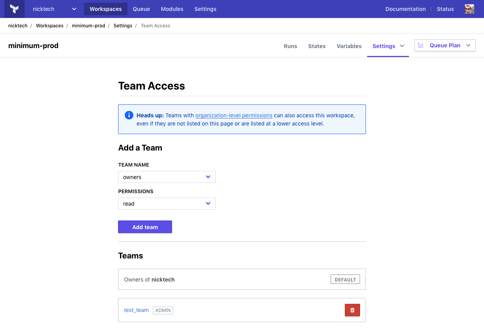

# Managing Access to Workspaces

Terraform Enterprise (TFE) workspaces can only be accessed by users with the correct permissions. You can manage permissions for a workspace on a per-team basis.

Workspace access should be managed by [organization owners](../users-teams-organizations/teams.html#the-owners-team). (Users with [admin privileges](../users-teams-organizations/permissions.html) on a workspace can make minor adjustments to its permissions, but only owners can manage permissions for any team in the organization.)

## Background

TFE manages workspace permissions with teams, and uses four levels of permissions (read, plan, write, and admin). Additionally, the organization-level "manage workspaces" permission can grant a team admin permissions on every workspace.

For more information see:

- [Users, Teams and Organizations](../users-teams-organizations/index.html)
- [Permissions](../users-teams-organizations/permissions.html)

## Managing Workspace Access Permissions

-> **API:** See the [Team Access APIs](../api/team-access.html).  
**Terraform:** See the `tfe` provider's [`tfe_team_access` resource](/docs/providers/tfe/r/team_access.html).

When a workspace is created, only [the owners team](../users-teams-organizations/teams.html#the-owners-team) and teams with the "manage workspaces" permission can access it, with full admin permissions. These teams' access can't be removed from a workspace.

To manage other teams' access, select "Team Access" from a workspace's "Settings" menu.

This page has a pair of drop-downs for adding new teams, and a list of teams that already have access.

To add a team, select it from the first dropdown and use the second dropdown to choose which permissions it should have (read, write, plan, or admin), then click the "Add team" button.

To remove a team's permissions on the workspace, click the "🗑" (trash can) button next to that team's entry in the teams list.

To change a team's permissions on the workspace, you must remove the team and re-add it.
