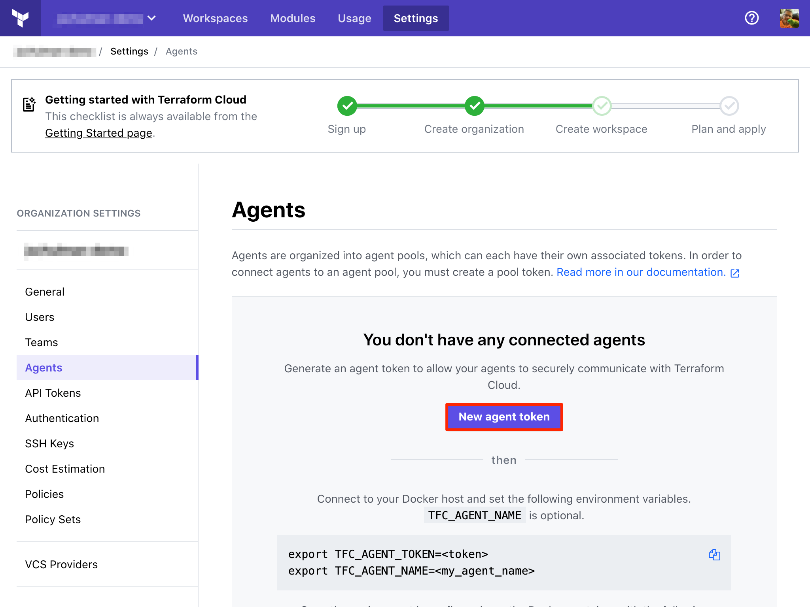
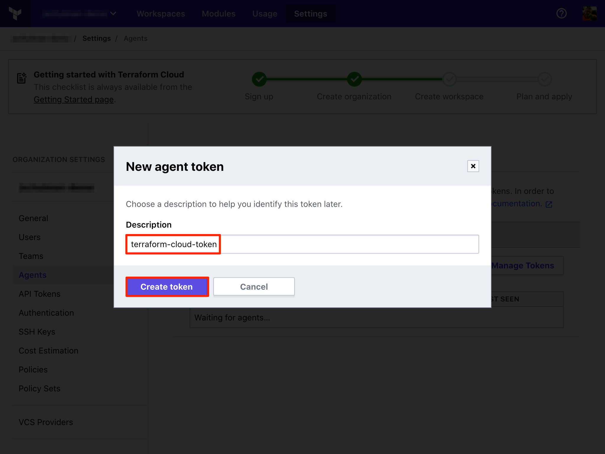
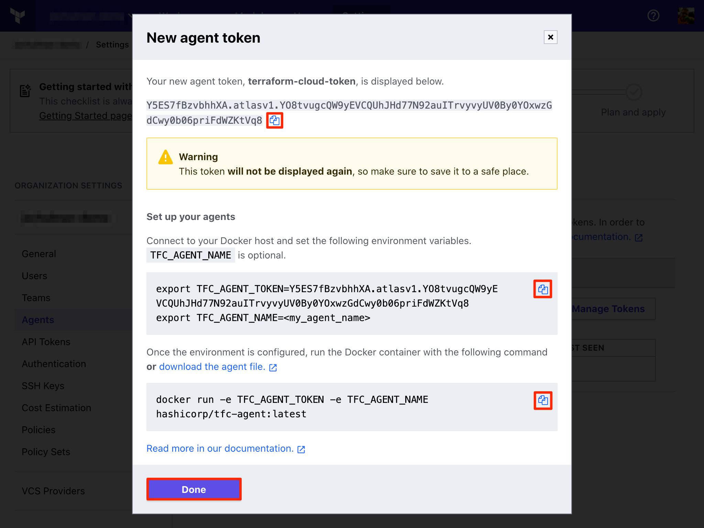
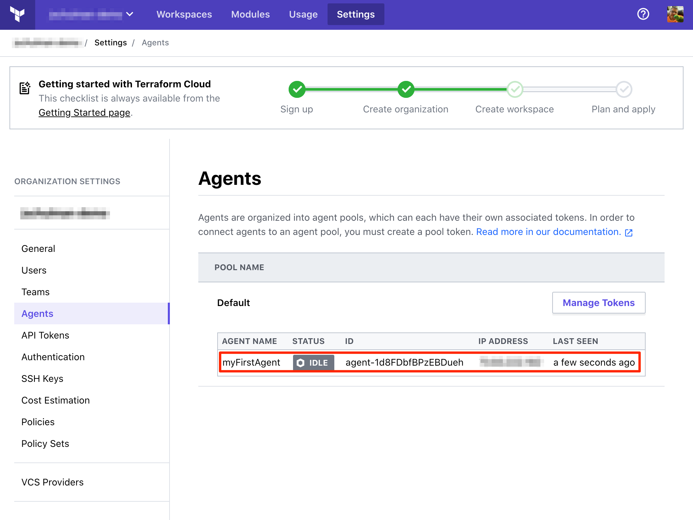
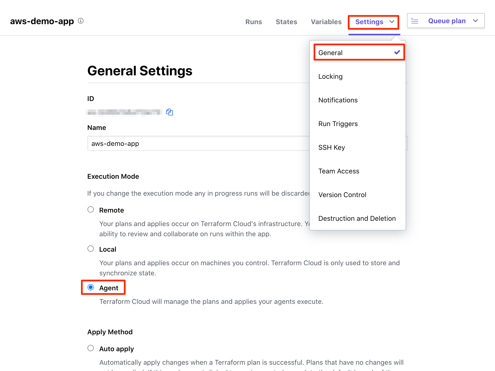
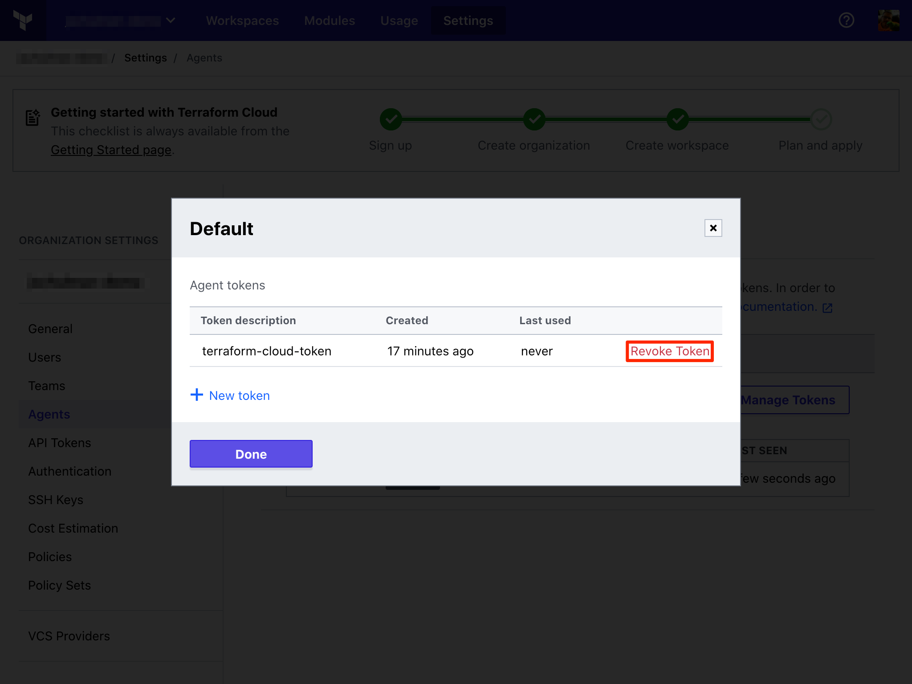
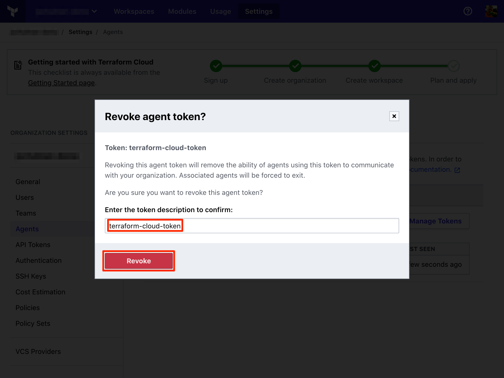
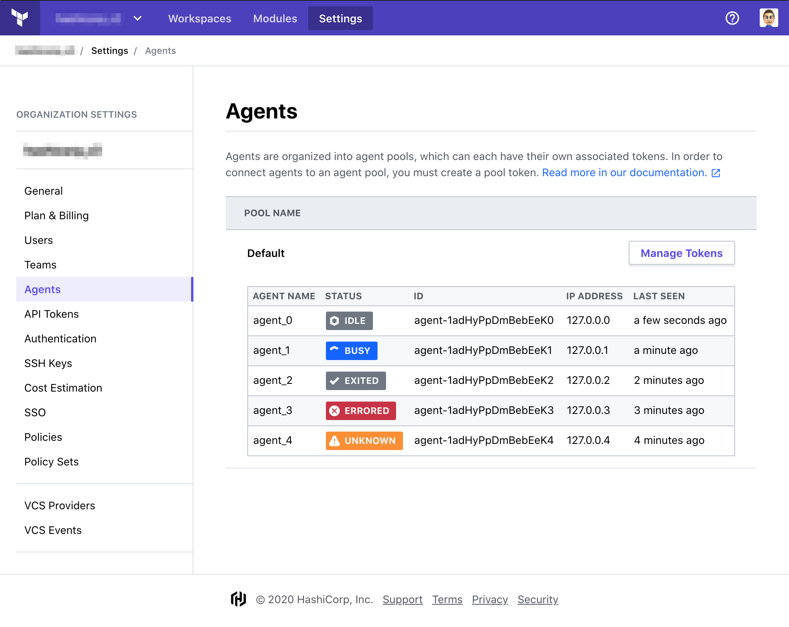

# Terraform Cloud Agents

-> **Note:** Terraform Cloud Agents are a paid feature, available as part of the **Terraform Cloud for Business** upgrade package. [Learn more about Terraform Cloud pricing here](https://www.hashicorp.com/products/terraform/pricing/).

Terraform Cloud Agents are a solution to allow Terraform Cloud to communicate with isolated, private, or on-premises infrastructure. By deploying the lightweight agent within a specific network segment, you can establish a simple connection between your environment and Terraform Cloud which allows for provisioning operations and management. This is useful for on-premises infrastructure types such as vSphere, Nutanix, OpenStack, enterprise networking providers, and anything you might have in a protected enclave.

The agent architecture is pull-based, so no inbound connectivity is required. Any agent you provision will poll Terraform Cloud for work and carry out execution of that work locally.

## Before Install

### Supported Operating Systems

[Agents](https://releases.hashicorp.com/tfc-agent) currently only support 64 bit Linux operating systems. You can also run the agent within Docker using our official [Terraform Agent Docker container](https://hub.docker.com/r/hashicorp/tfc-agent).

### Supported Terraform Versions

Agents support Terraform versions 0.12 and above. Workspaces configured to use Terraform versions below 0.12 will not be able to select the agent-based execution mode.

### Networking Requirements

In order for an agent to function properly, it must be able to make outbound requests over HTTPS (port 443) to the Terraform Cloud application APIs. This may require perimeter networking as well as container host networking changes, depending on your environment. The IP ranges are documented in the [Terraform Cloud IP Ranges documentation](https://www.terraform.io/docs/cloud/architectural-details/ip-ranges.html).

Additionally, the agent must also be able to communicate with any services required by the Terraform code it is executing. This includes the Terraform releases distribution service, [releases.hashicorp.com](https://releases.hashicorp.com) (supported by [Fastly](https://api.fastly.com/public-ip-list)), as well as any provider APIs. The services which run on these IP ranges are described in the table below.

Hostname | Port/Protocol | Directionality | Purpose
--|--|--|--
app.terraform.io | tcp/443, HTTPS | Outbound | Polling for new workloads and providing status updates
releases.hashicorp.com | tcp/443, HTTPS | Outbound | Updating agent components and downloading Terraform binaries
archivist.terraform.io | tcp/443, HTTPS | Outbound | Blob Storage

### Operational Considerations

The agent is distributed as a standalone binary which can be run on any supported system. By default, the agent will run in the foreground as a long-running process that will continuously poll for workloads from Terraform Cloud. We strongly recommend pairing the agent with a process supervisor to ensure that it is automatically restarted in case of an error.

Agents do not guarantee a clean working environment per Terraform execution. Each execution is performed in its own temporary directory with a clean environment, but references to absolute file paths or other machine state may cause interference between Terraform executions. We strongly recommend that you write your Terraform code to be stateless and idempotent. You may also want to consider using [single-execution mode](#optional-configuration-single-execution-mode) to ensure your agent only runs a single workload.

### Updating

The agent will automatically receive updates for the agent only. Administrators are required to update the host operating system and all other software.

### Security Considerations

Agents should be considered a global resource within an organization. Once configured, any workspace owner may configure their workspace to target the organization's agents. This may allow a malicious workspace to access state files, variables, or code from other workspaces targeting the same agent, or access sensitive data on the host running the agent. For this reason, we recommend carefully considering the implications of enabling agents within an organization, and restricting access to your organization to only trusted parties.

### Limitations

Agents are designed to allow you to run Terraform operations from a Terraform Cloud workspace on your private infrastructure. The following use cases are not supported by agents:

- Connecting to private infrastructure from Sentinel policies using the [`http` import](https://docs.hashicorp.com/sentinel/imports/http/)
- Connecting Terraform Cloud workspaces to private VCS repositories

For these use cases, we recommend you leverage the information provided by the [IP Ranges documentation](https://www.terraform.io/docs/cloud/architectural-details/ip-ranges.html) to permit direct communication from the appropriate Terraform Cloud service to your internal infrastructure.

## Configuration

-> **Note:** You must be a member of the “Owners” team within your organization in order to manage an organization's agents in Terraform Cloud. ([More about permissions.](/docs/cloud/users-teams-organizations/permissions.html))

[permissions-citation]: #intentionally-unused---keep-for-maintainers

### Installing the Agent

#### Create a new Agent Token



1. Navigate to **Organization Settings > Agents**, click “New Agent Token”
    1. If you have already completed the first-time token creation process, you will instead see a button called “Manage Tokens.” Click this, then “Add Token.”



2. Give your token a name (optional). This name is for your reference only.



3. Copy the generated agent token and store it securely. Note that this token will only be displayed once.

Installation commands will automatically be generated for you that contain the new token. You can copy these for use directly in a terminal window if you like.

#### Download and Install the Agent

1. Download the latest [agent release](https://releases.hashicorp.com/tfc-agent), the associated checksum file (.SHA256sums), and the checksum signature (.sig).
1. Verify the integrity of the downloaded archive, as well as the signature of the `SHA256SUMS` file using the instructions available on [HashiCorp's security page](https://www.hashicorp.com/security).
1. Extract the release archive. The `unzip` utility is available on most Linux distributions and may be invoked as `unzip <archive file>`. Two individual binaries will be extracted (`tfc-agent` and `tfc-agent-core`). These binaries _must_ reside in the same directory for the agent to function properly.

#### Start the Agent

Using the Agent token you copied earlier, set the `TFC_AGENT_TOKEN` and `TFC_AGENT_NAME` environment variables.

```
export TFC_AGENT_TOKEN=your-token
export TFC_AGENT_NAME=your-agent-name
./tfc-agent
```

-> **Note:** The `TFC_AGENT_NAME` variable is optional. If you do not specify a name here, one will not be displayed. These names are for your reference only, and the agent ID is what will appear in logs and API requests.

Once complete, your agent will appear on the Agents page and display its current status.



##### Optional Configuration: Running an Agent using Docker

Alternatively, you can use our official agent Docker container to run the Agent.

```
docker pull hashicorp/tfc-agent:latest
docker run -e TFC_AGENT_TOKEN=your-token -e
TFC_AGENT_NAME=your-agent-name hashicorp/tfc-agent
```

##### Optional Configuration: Single-execution mode

The Agent can also be configured to run in single-execution mode, which will ensure that the Agent only runs a single workload, then terminates. This can be used in combination with Docker and a process supervisor to ensure a clean working environment for every Terraform run.

To use single-execution mode, start the agent with the `-single` command line argument.

### Configuring Workspaces to use the Agent

-> **Note:** You must have “Admin” access to the workspace you are configuring to change the [execution mode](/docs/cloud/workspaces/settings.html#execution-mode). ([More about permissions.](/docs/cloud/users-teams-organizations/permissions.html))

[permissions-citation]: #intentionally-unused---keep-for-maintainers

~> **Important:** Changing your workspace's [execution mode](/docs/cloud/workspaces/settings.html#execution-mode) after a run has already been planned will cause the run to error when it is applied.
To minimize the number runs that error, you should disable [auto-apply](/docs/cloud/workspaces/settings.html#auto-apply-and-manual-apply),
complete any runs that are no longer in the [pending stage](/docs/cloud/run/states.html#1-the-pending-stage),
and [lock](/docs/cloud/workspaces/settings.html#locking) your workspace before changing the execution mode.

To configure a workspace to execute runs using an agent:

1. Open the workspace from the main "Workspaces" view, then navigate to "Settings > General" from the dropdown menu.
1. Select Agent as the [execution mode](/docs/cloud/workspaces/settings.html#execution-mode).
1. Click "Save Settings" at the bottom of the page.



#### Running Multiple Agents

You may choose to run multiple agents within your network for improved resiliency. If there are multiple agents available within an organization, Terraform Cloud will select the first available agent.

#### Revoking an Agent Token

You may revoke an issued token from your agents at any time.

Revoking a token will cause the agents using it to become unable to process work until they are reinitialized with a new token. Under normal circumstances, it may be desirable to generate a new token first, initialize the agents using it, then revoke the old token once no agents are using it. Agent tokens display information about the last time they were used to help you decide whether they are safe to revoke.



1. Navigate to **Organization Settings > Agents**, then click on **Manage Tokens**.



2. Enter the token description to confirm that you wish to revoke the token.

## Troubleshooting

### Viewing Agent Statuses



Agent status appear on the **Organization Settings > Agents** page and will contain one of these values:

- **Idle**: The agent is running normally and waiting for jobs to be available.
- **Busy**: The agent is running normally and currently executing a job.
- **Unknown**: The agent has not reported any status for an unexpected period of time. The agent may yet recover if the agent's situation is temporary, such as a short-lived network partition.
- **Errored**: The agent encountered an unrecoverable error or has been in an Unknown state for long enough that Terraform Cloud considers it errored. This may indicate that the agent process was interrupted, has crashed, a _permanent_ network partition exists, etc. If the agent was in the process of running an operation (such as a plan or apply), that operation has been marked as errored. If the current agent process does manage to recover, it will be instructed to exit immediately.
- **Exited**: The agent exited normally, and has successfully informed Terraform of it doing so.

### Viewing Agent Logs

Output from the Terraform execution will be visible on the run’s page within Terraform Cloud. For more in-depth debugging, you may wish to view the agent’s logs, which are sent to `stdout` and configurable via the `-log-level` command line argument. By default, these logs are not persisted in any way. It is the responsibility of the operator to collect and store these logs if they are needed.
