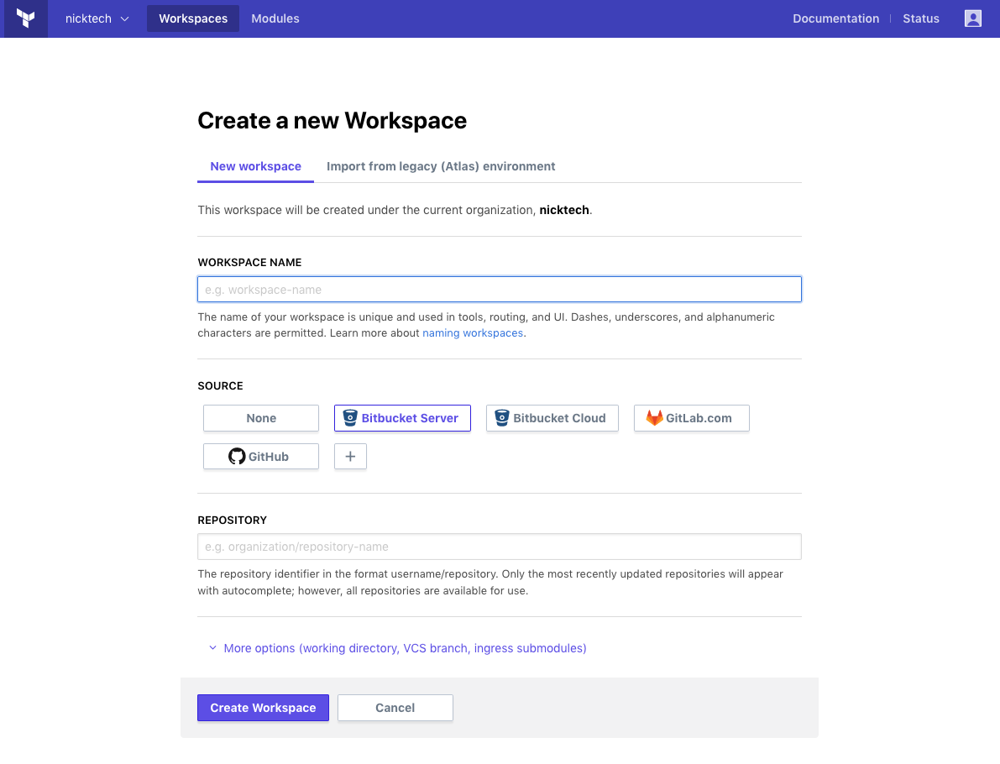
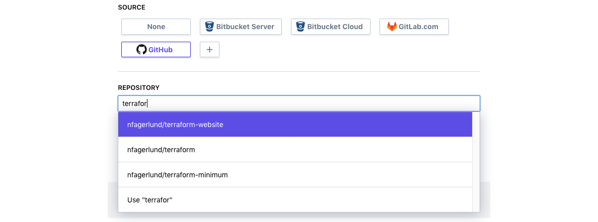
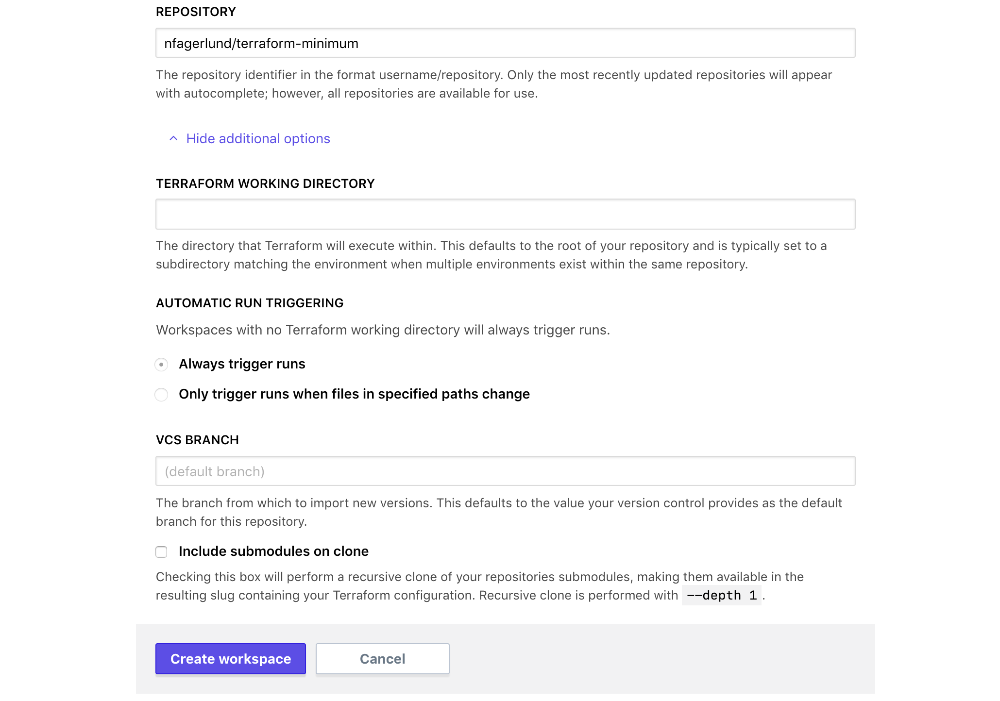
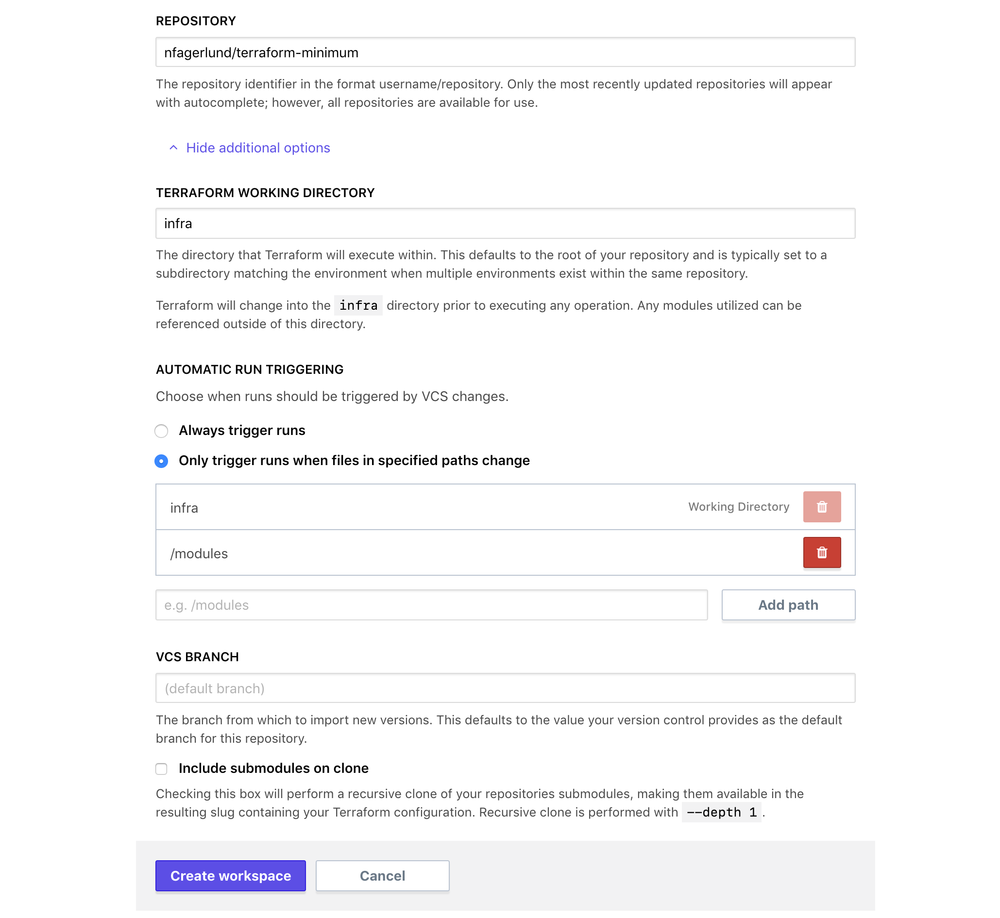

# Creating Workspaces

~> **Important:** Only [organization owners](../users-teams-organizations/teams.html#the-owners-team) can create new workspaces.

-> **API:** See the [Create a Workspace endpoint](../api/workspaces.html#create-a-workspace) (`POST /organizations/:organization/workspaces`).  
**Terraform:** See the `tfe` provider's [`tfe_workspace` resource](/docs/providers/tfe/r/workspace.html).

Create new Terraform Enterprise (TFE) workspaces with the "+ New Workspace" button, which appears on the list of workspaces. If you're not already viewing the workspace list, you can get there with the "Workspaces" button in the top navigation bar.

## Configuring a New Workspace

You must fill out several fields to configure your new workspace:

- **Workspace name** (required) — A name for the workspace, which must be unique in the organization. Names can include letters, numbers, `_`, and `-`. [See more advice about workspace names here](./naming.html).
- **Source** (required; list of buttons) — Which [connected VCS provider](../vcs/index.html) the workspace should pull configurations from. If you've configured multiple VCS providers, there is a button for each of them.

  If you select "None," the workspace cannot pull configurations automatically, but you can upload configurations with [the remote backend](../run/cli.html) or [the run API](../run/api.html).

- **Repository** — The VCS repository that contains the Terraform configuration for this workspace. This field is hidden when creating a workspace without a VCS source.

  Repository identifiers are determined by your VCS provider, and use a format like `<ORGANIZATION>/<REPO NAME>` or `<PROJECT KEY>/<REPO NAME>`.

  This field supports autocompletion of your most recently used repositories. If you need to specify a repository that isn't included in the autocomplete list, you can enter the full name manually.

  If necessary, you can change a workspace's VCS repository after creating it.

VCS-backed workspaces support several optional fields, which you can reveal by clicking the "More options" link. These fields are hidden when creating a workspace without a VCS source.

- **Terraform working directory** — The directory where Terraform will execute, specified as a relative path from the root of the repo. This is useful when working with VCS repos that contain multiple Terraform configurations. Defaults to the root of the repo.

- **Automatic run triggering** — If you specify a working directory, TFE will by default only queue a plan for changes to the repository inside that working directory. You can override this behaviour with these settings. See [Automatic Run Triggering](../workspaces/settings.html#automatic-run-triggering) settings for more details.

- **VCS branch** — Which branch of the repository to use. If left blank, TFE will use the repository's default branch.
- **Include submodules on clone** (checkbox) — Whether to recursively clone all of the repository's Git submodules when fetching a configuration.

  -> **Note:** The [SSH key for cloning Git submodules](../vcs/index.html#ssh-keys) is set in the VCS provider settings for the organization, and is not necessarily related to the SSH key set in the workspace's settings.

## After Creating a Workspace

When you create a new workspace, a few things happen:

- TFE _doesn't_ immediately queue a plan for the workspace. Instead, it presents a dialog with shortcut links to either queue a plan or edit variables. If you don't need to edit variables, manually queuing a plan confirms to TFE that the workspace is ready to run.
- If you selected a VCS provider and repository, TFE automatically registers a webhook. The next time new commits appear in the selected branch of that repo or a PR is opened to that branch, TFE will automatically queue a Terraform plan for the workspace. More at [VCS Connection webhooks](../vcs/index.html#webhooks).

A workspace with no runs will not accept new runs via VCS webhook; at least one run must be manually queued to confirm that the workspace is ready for further runs.

Most of the time, you'll want to do one or more of the following after creating a workspace:

- [Edit variables](./variables.html)
- [Edit workspace settings](./settings.html)
- [Work with runs](../run/index.html)
