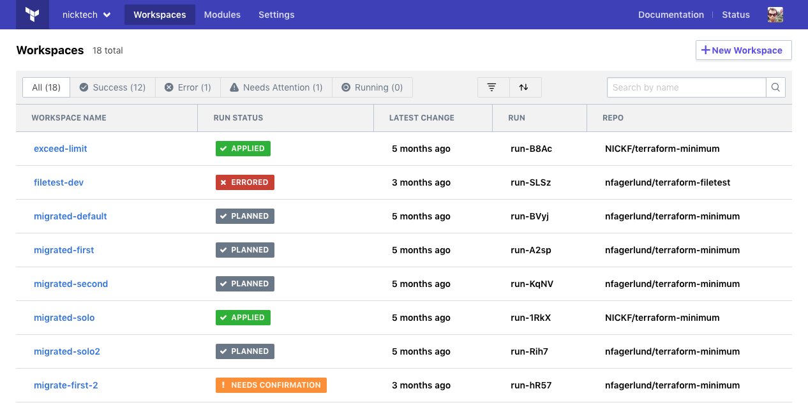

# Workspaces

Workspaces are how Terraform Cloud organizes infrastructure.

## Workspaces are Collections of Infrastructure

Working with Terraform involves _managing collections of infrastructure resources,_ and most organizations manage many different collections.

When run locally, Terraform manages each collection of infrastructure with a _persistent working directory,_ which contains a configuration, state data, and variables. Terraform CLI uses content from the directory it runs in; by using separate directories, it's easy to organize infrastructure resources into meaningful groups.

Terraform Cloud manages infrastructure collections with _workspaces_ instead of directories. A workspace contains everything Terraform needs to manage a given collection of infrastructure.

-> **Note:** Terraform Cloud and Terraform CLI both have features called "workspaces," but they're slightly different. CLI workspaces are alternate state files in the same working directory; they're a convenience feature for using one configuration to manage multiple similar groups of resources. Terraform Cloud workspaces function like completely separate working directories.

### Workspace Contents

Terraform Cloud workspaces and local working directories serve the same purpose, but they store their data slightly differently:

Component | Local Terraform | Terraform Cloud
--|--|--
Terraform configuration | On disk | In linked version control repository, or periodically uploaded via API/CLI (see also: [Terraform Configurations](./configurations.html))
Variable values | As `.tfvars` files, as CLI arguments, or in shell environment | In workspace (see also: [Variables](./variables.html))
State | On disk or in remote backend | In workspace (see also: [State](./state.html))
Credentials and secrets | In shell environment or entered at prompts | In workspace, stored as sensitive variables (see also: [Variables](./variables.html))

In addition to the basic Terraform content, Terraform Cloud keeps some additional data for each workspace:

- **State versions:** Each workspace retains backups of its previous state files. Although only the current state is necessary for managing resources, the state history can be useful for tracking changes over time or recovering from problems. (See also: [State](./state.html).)
- **Run history:** When Terraform Cloud manages a workspace's Terraform runs, it retains a record of all run activity, including summaries, logs, a reference to the changes that caused the run, and user comments. (See also: [Viewing and Managing Runs](../run/manage.html).)

### Terraform Runs

For workspaces with [remote operations](../run/index.html) enabled (the default), Terraform Cloud performs Terraform runs on its own disposable virtual machines, using that workspace's configuration, variables, and state.

For more information, see [Terraform Runs and Remote Operations](../run/index.html).

## Listing and Filtering Workspaces

-> **API:** See the [Workspaces API](../api/workspaces.html).

Terraform Cloud's top navigation bar includes a "Workspaces" link, which takes you to the list of workspaces in the current organization.

This list only includes workspaces where your user account has at least [read permissions](../users-teams-organizations/permissions.html).

If the list is large, you can use the filter tools at the top of the list to find the workspaces you're interested in.

The following filters are available:

- **Status filters:** These filters sort workspaces by the status of their current run. There are four quick filter buttons that collect the most commonly used groups of statuses (success, error, needs attention, and running), and a custom filter button (with a funnel icon) where you can select any number of statuses from a menu.

    When you choose a status filter, the list will only include workspaces whose current runs match the selected statuses. You can remove the status filter by clicking the "All" button, or by unchecking everything in the custom filter menu.
- **List order:** The list order button is marked with two arrows, pointing up and down. You can choose to order the list by time or by name, in forward or reverse order.
- **Name filter:** The search field at the far right of the filter bar lets you filter workspaces by name. If you enter a string in this field and press enter, only workspaces whose names contain that string will be shown.

    The name filter can combine with a status filter, to narrow the list down further.

## Planning and Organizing Workspaces

We recommend that organizations break down large monolithic Terraform configurations into smaller ones, then assign each one to its own workspace and delegate permissions and responsibilities for them. Terraform Cloud can manage monolithic configurations just fine, but managing smaller infrastructure components like this is the best way to take full advantage of Terraform Cloud's governance and delegation features.

For example, the code that manages your production environment's infrastructure could be split into a networking configuration, the main application's configuration, and a monitoring configuration. After splitting the code, you would create "networking-prod", "app1-prod", "monitoring-prod" workspaces, and assign separate teams to manage them.

Much like splitting monolithic applications into smaller microservices, this enables teams to make changes in parallel. In addition, it makes it easier to re-use configurations to manage other environments of infrastructure ("app1-dev," etc.).

