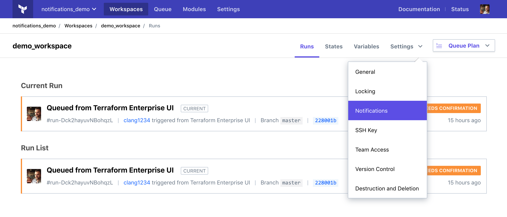
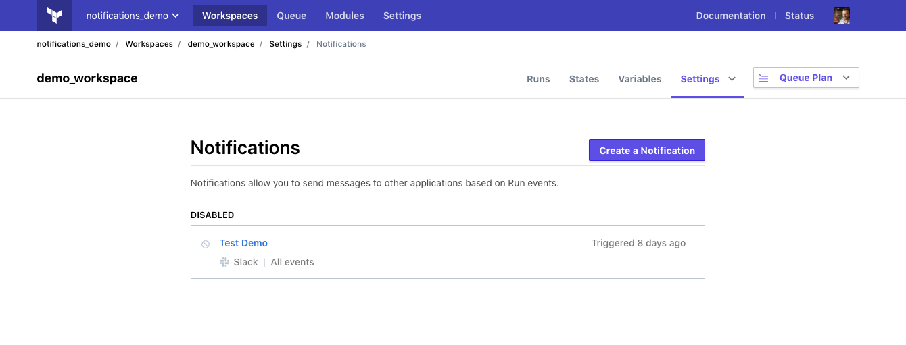
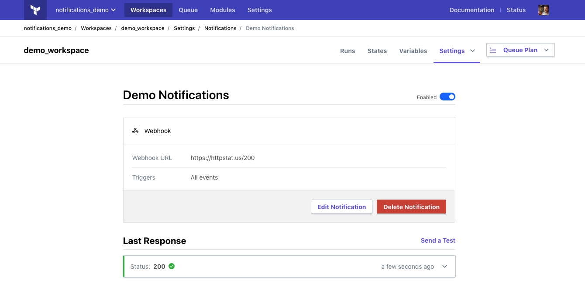
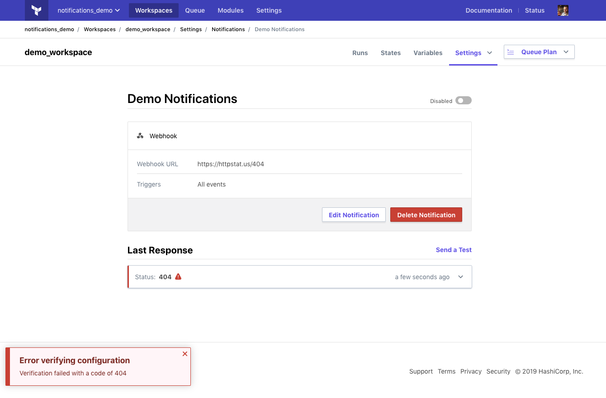
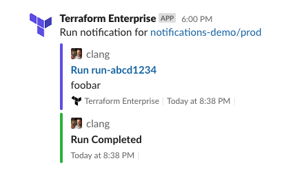

# Run Notifications

Terraform Enterprise (TFE) can use webhooks to notify external systems about the progress of runs.

Each workspace has its own notification settings, and can notify up to 20 destinations.

## Viewing and Managing Notification Settings

To add, edit, or delete notifications for a workspace, navigate to the desired workspace and choose "Notifications" from the "Settings" menu:

This takes you to the notifications settings, which shows any existing notification configurations and includes a button for creating new ones.

## Creating a Notification Configuration

-> **API:** See the [Notification Configuration APIs](../api/notification-configurations.html).

A notification configuration specifies a destination URL, a payload type, and the specific run events you want notifications for.

To start receiving notifications for a workspace's runs:

1. Create a new notification configuration.
2. After saving the configuration, enable it.

Go to the workspace's notifications settings and press the "Add Notification" button. This loads a form for creating a new notification configuration:

Fill in the following fields to configure your notifications:

- **Destination:** TFE can deliver either a generic payload or a payload formatted specifically for Slack. Choose which type you want from the drop-down. Payload contents are [documented below][inpage-payload].
- **Name:** An arbitrary display name to use for this notification configuration.
- **Webhook URL:** The destination URL to send the webhook payload to. This URL must accept HTTP or HTTPS `POST` requests, and should be able to do something useful with the chosen payload type.
    - If you are sending notifications to Slack, see Slack's documentation on [how to create an incoming webhook](https://api.slack.com/incoming-webhooks#create_a_webhook).
- **Token** _(optional; only available for generic webhooks):_ An arbitrary secret string, which TFE will use to sign its notification webhooks. ([See "Notification Authenticity" below][inpage-hmac].) This setting is encrypted for storage, and cannot be viewed after it is saved.
- **Triggers:** Whether to notify this destination for all events, or only for selected events. The following specific events are available:
    - **Created**: When a run is created and enters the "Pending" state.
    - **Planning**: When a run acquires the lock and starts to execute.
    - **Needs Attention**: Human decision required. When a plan has changes and is not auto-applied, or requires a policy override.
    - **Applying**: When a run begins the apply stage, after a plan is confirmed or auto-applied.
    - **Completed**: When a run has completed on a happy path and can't go any further.
    - **Errored**: When a run has terminated early due to error or cancelation.

When finished, click the "Create configuration" button.

Next, you must enable the configuration; see the next section for details.

## Enabling and Verifying a Configuration

To enable a new configuration, click the enable/disable switch on its detail page (located near the configuration's title). TFE will attempt to verify the configuration by sending a test message, and will enable the notification configuration if the test succeeds.

For a verification to be successful, the destination must respond with a `2xx` HTTP code.

If verification fails, TFE will display an error message (with the HTTP status code and error text, if any), and the configuration will remain disabled.

For both successful and unsuccessful verifications, you can click on the "Last Response" box to view more information about the verification results. You can also send additional test messages with the "Send a Test" link.

## Notification Payloads

[inpage-payload]: #notification-payloads

### Slack

Notifications to Slack will contain the following information:

* The run's workspace (as a link)
* The TFE username and avatar of the person that created the run
* The run ID (as a link)
* The reason the run was queued (usually a commit message or a custom message)
* The time the run was created
* The event that triggered the notification, and the time it occurred

### Generic

A generic notification will contain information about a run and its state at the time the triggering event occurred. The complete generic notification payload is described in the [API documentation][generic-payload].

[generic-payload]: ../api/notification-configurations.html#notification-payload

Some of the values in the payload can be used to retrieve additional information through the API, such as:

* The [run ID](../api/run.html#get-run-details)
* The [workspace ID](../api/workspaces.html#list-workspaces)
* The [organization name](../api/organizations.html#show-an-organization)

## Notification Authenticity

[inpage-hmac]: #notification-authenticity

Slack notifications use Slack's own protocols for verifying TFE's webhook requests.

Generic notifications can include a signature for verifying the request. For notification configurations that include a secret token, TFE's webhook requests will include an `X-TFE-Notification-Signature` header, which contains an HMAC signature computed from the token using the SHA-512 digest algorithm. The receiving service is responsible for validating the signature. More information, as well as an example of how to validate the signature, can be found in the [API documentation](../api/notification-configurations.html#notification-authenticity).

