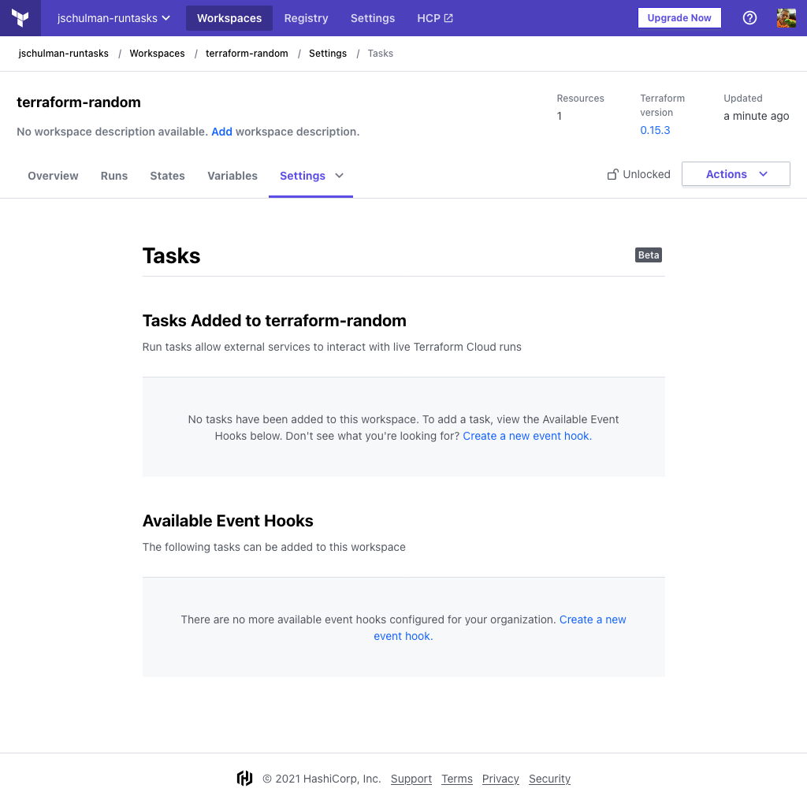
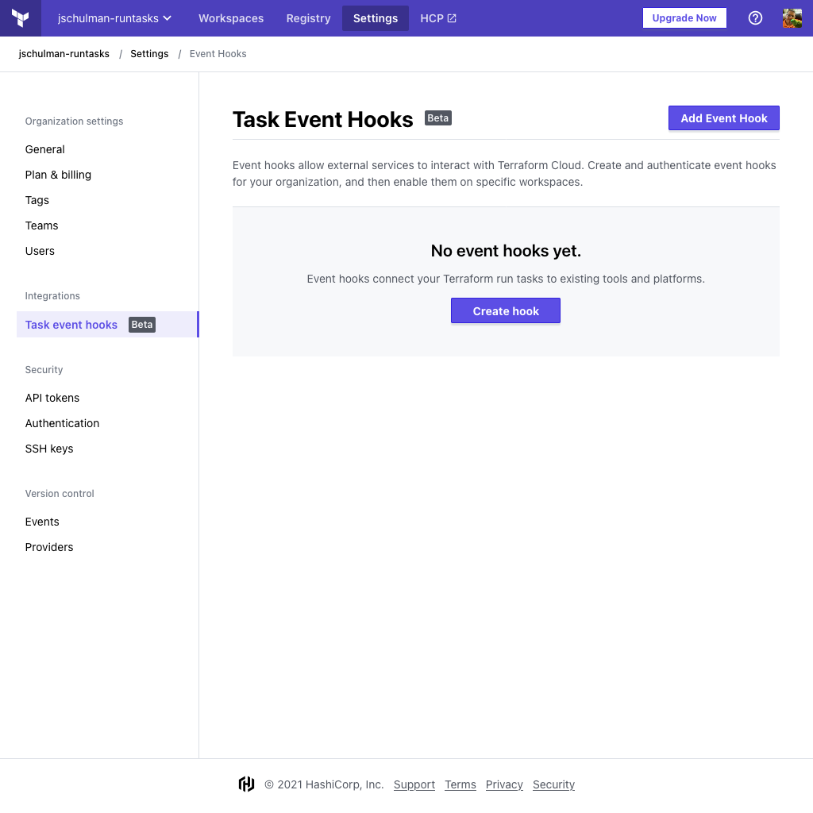
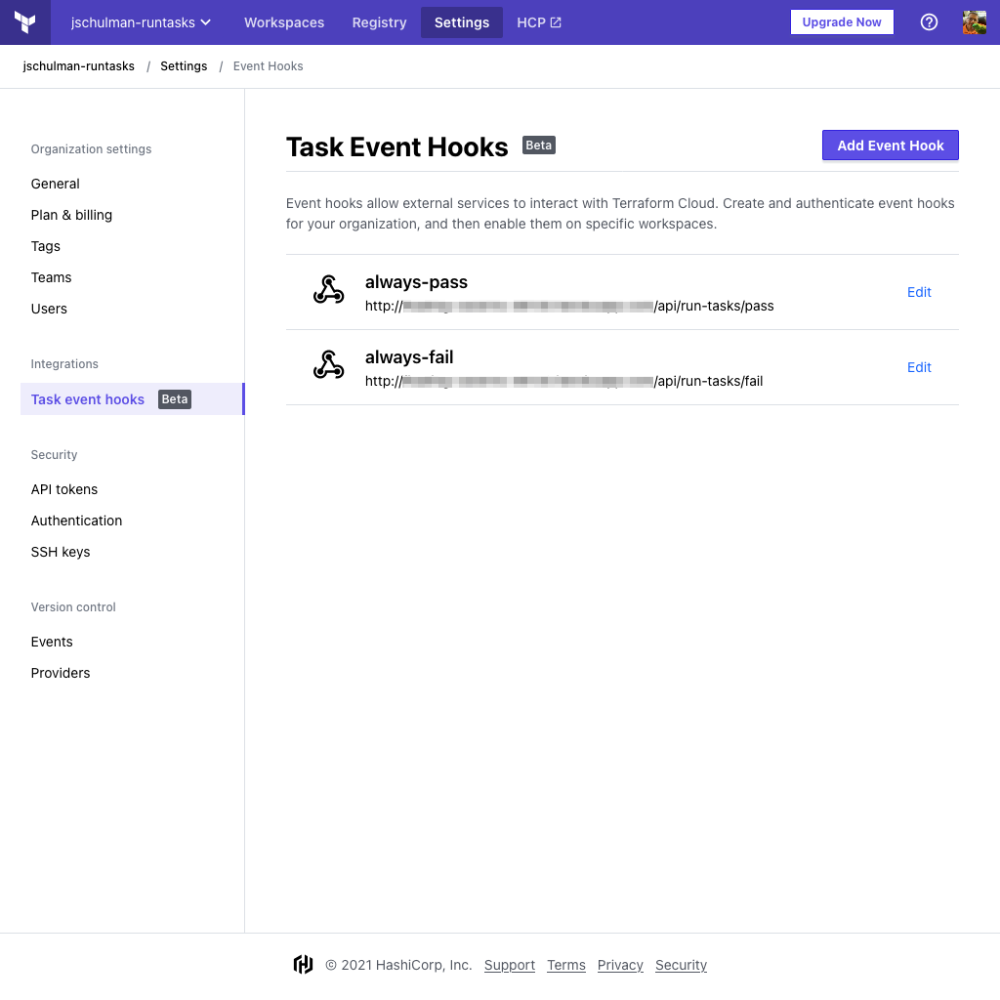
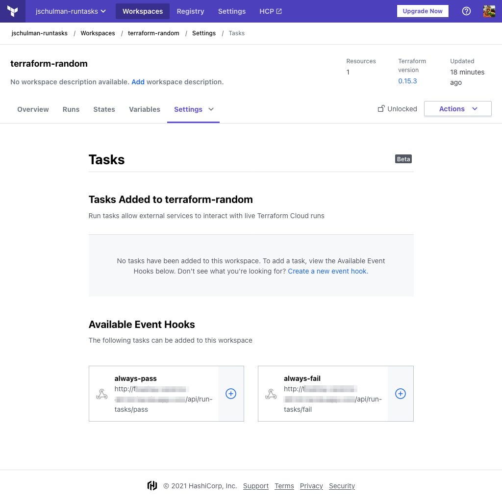
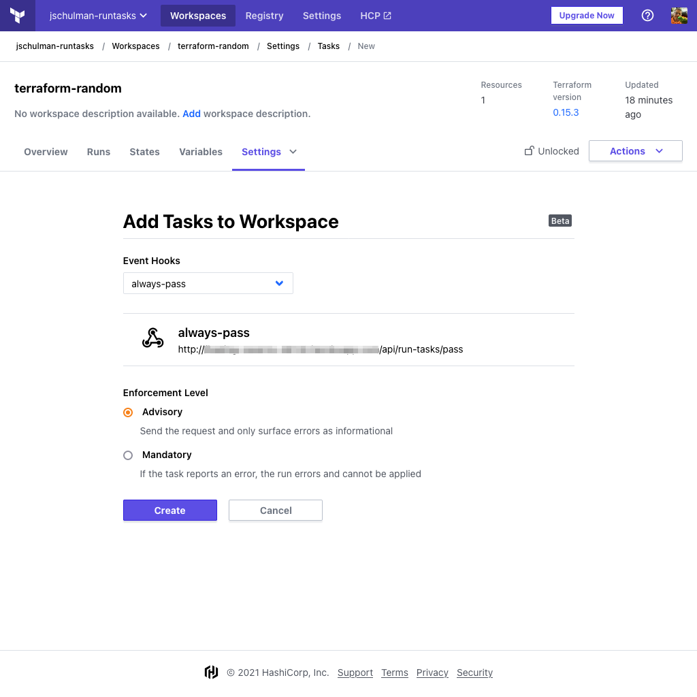
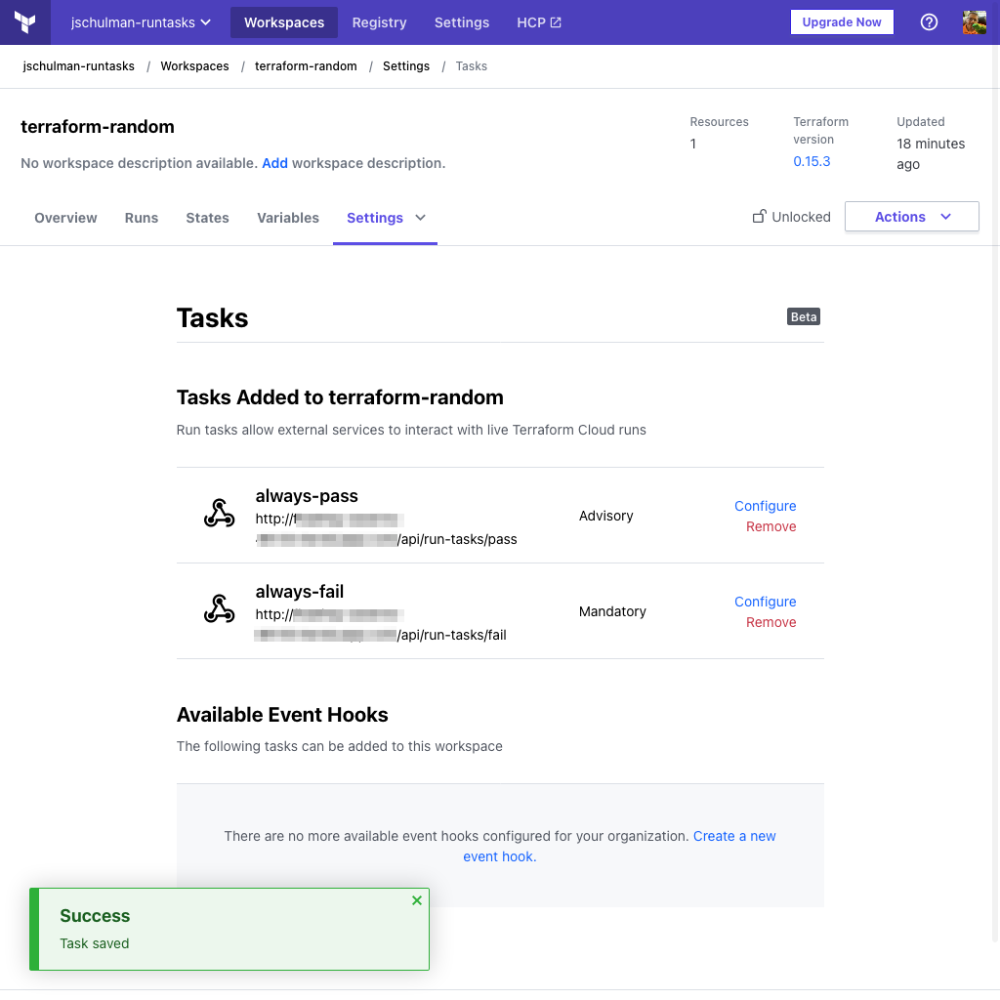
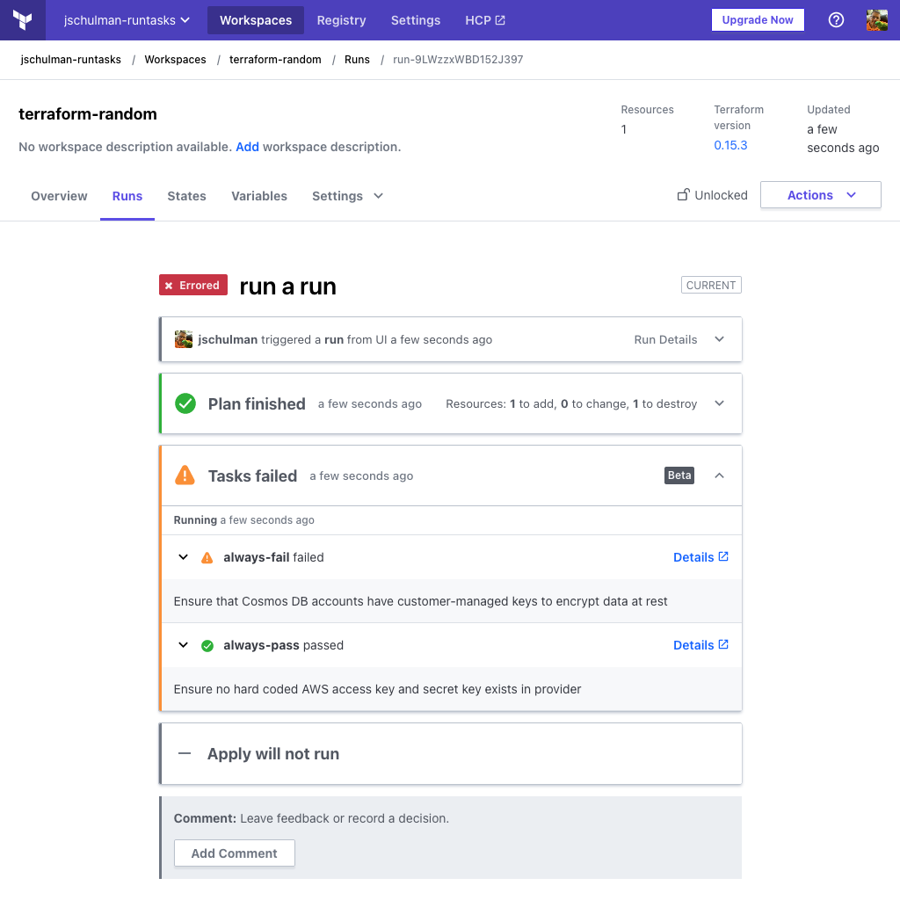
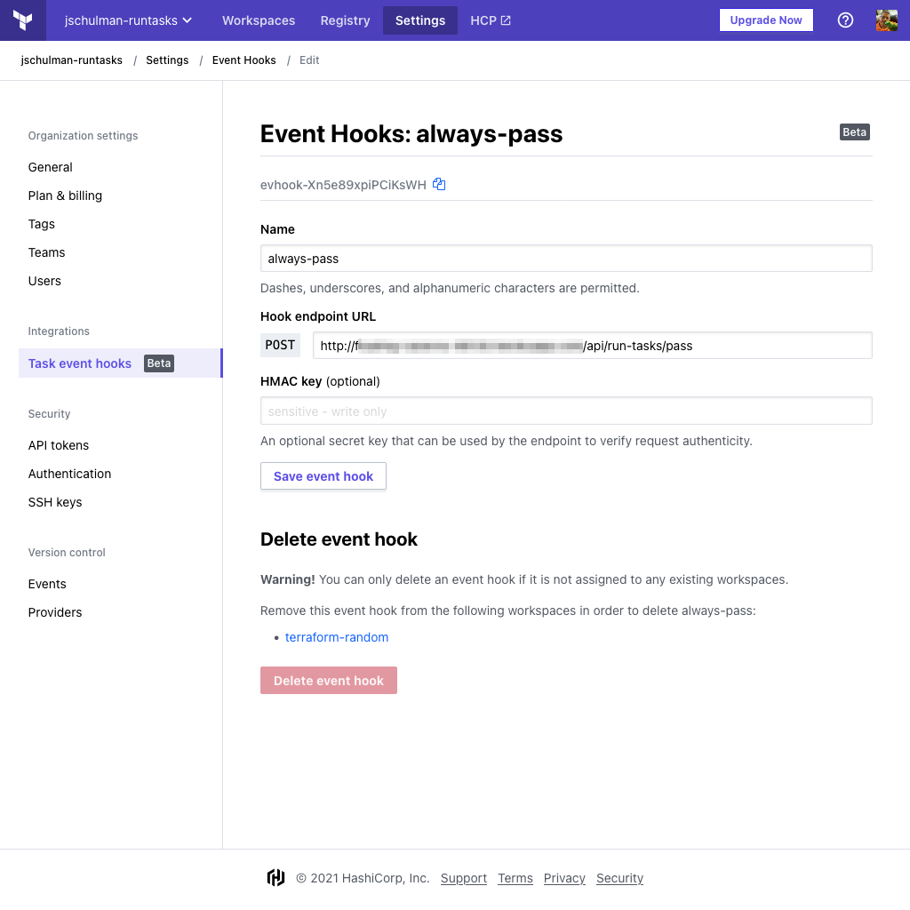

# Run Tasks

-> **Note:** As of September 2021, Run Tasks are available only as a beta feature, and not all customers will see this functionality in their Terraform Cloud organization.

> **Hands-on:** Try the [Cost Estimation with Infracost and Run Tasks](https://learn.hashicorp.com/tutorials/terraform/INSERTURLHERELOLOLOL) tutorial on HashiCorp Learn.

Run Tasks allow Terraform Cloud to execute tasks in external systems at specific points in the Terraform Cloud run lifecycle. The beta release of this feature allows users to add and execute these tasks during the new pre-apply stage which exists in between the plan and apply stages. Tasks are executed by sending an API payload to the external system. This payload contains a collection of run-related information and a callback URL which the external system can use to send updates back to Terraform Cloud.

The external system can then use this run information and respond back to Terraform Cloud with a passed or failed status. Terraform Cloud uses this status response to determine if a run should proceed, based on the task's enforcement settings within a workspace.

-> **API:** See the [Run Tasks APIs](../api/run-tasks.html).

## Requirements

Run tasks can only be created on workspaces using a Terraform version <0.12. Downgrading a workspace with existing run tasks to use a Terraform version >=0.12 will not result in an error, but the configured tasks will not execute.

You must be an organization owner to create a new task event hook. You must be at least a workspace administrator in order to connect a task event hook to a given workspace.

## Configuring a Run Task

1. Navigate to the desired workspace, then select "Tasks" from the "Settings" menu. A page appears where you can either create a new event hook or select an existing one that is not connected to the workspace.

2. Click "Create a new event hook." The "Task event hooks" page appears. 

3. Click "Create hook."

4. Enter the information about the event hook to be configured:

- **Name** (required): A human-readable name for the event hook. This will be displayed in workspace configuration pages and can contain alphanumeric characters, dashes, and underscores.
- **Hook endpoint URL** (required): The URL where your external service is listening for a [run tasks payload](../api/run-tasks.html).
- **HMAC key** (optional): A key that your remote endpoint can use to verify that requests are originating from Terraform Cloud.

Once you have entered the necessary information, click "Create event hook"

You can now see the list of configured event hooks. Return to your desired workspace by clicking on "Workspaces" in the top nav bar, then selecting your workspace from the grid. Return to the "Tasks" item in the "Settings" menu. You can now see any event hooks you created in the prior step. In this example, two are available, one which will `always-pass`, and one which will `always fail`. Click the "+" sign next to the task(s) you wish to add to this workspace.

8. Choose an enforcement level and click "Create."

     - **Advisory** tasks can not block a run from completing. If the task fails, a warning will be displayed on the run but it will proceed.
     - **Mandatory** tasks can block a run from completing. If the task fails (including a timeout or unexpected remote error condition), a warning will be displayed on the run and the run will transition to an Errored state.

Your run tasks are now configured. You can return to this page to configure or remove tasks in your workspace.

## Understanding Run Tasks Within a Run

Workspaces with run tasks configured have an additional run stage called [Pre-Apply](../run/states.html). This stage is where your run tasks will execute during a run, after the plan stage and also the cost estimation and policy check stages, if applicable.

The Pre-Apply stage will always end with the most restrictive status of the tasks configured to run. For example, if a mandatory task fails and an advisory task succeeds, the stage will fail and the run will error. If an advisory task fails but a mandatory task succeeds, the stage will succeed and the run will proceed to the apply stage.

Regardless of the exit status of a task, the status and any related message will be displayed in the UI.

Here is an example of a run that failed due to a mandatory task.

And here is an example of a run that succeeded.

## Deleting a Task Event Hook

You can not delete task event hooks that are still attached to workspaces. If you attempt this, you will see a warning in the UI containing a list of any workspaces that are consuming the event hook. You must remove the task from the impacted workspaces before proceeding with the deletion.

