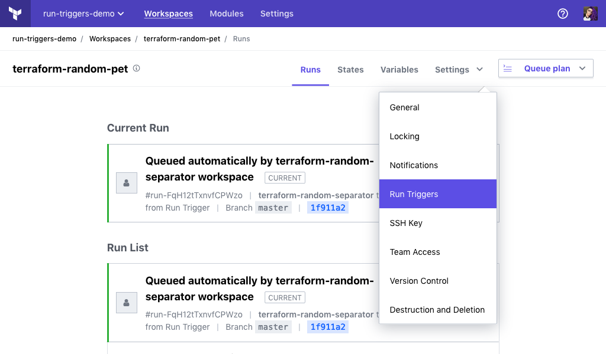
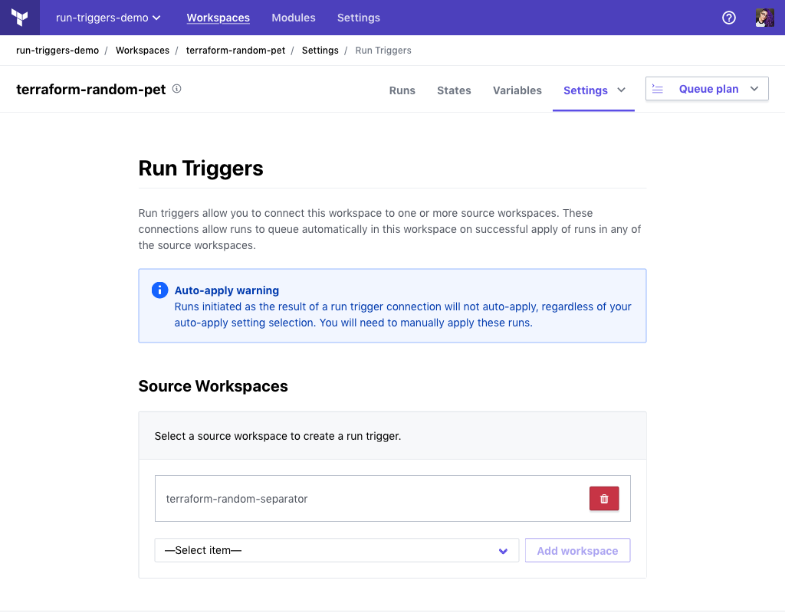
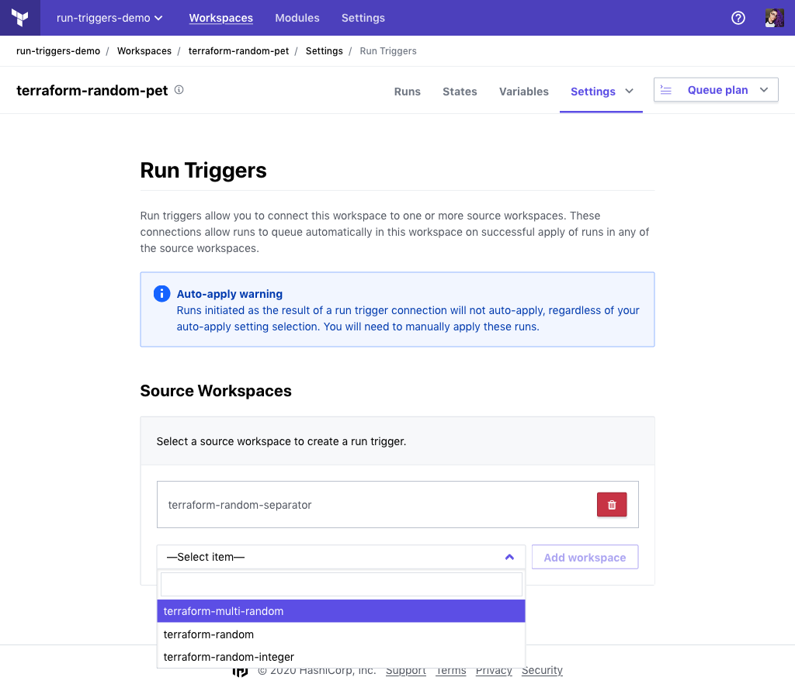
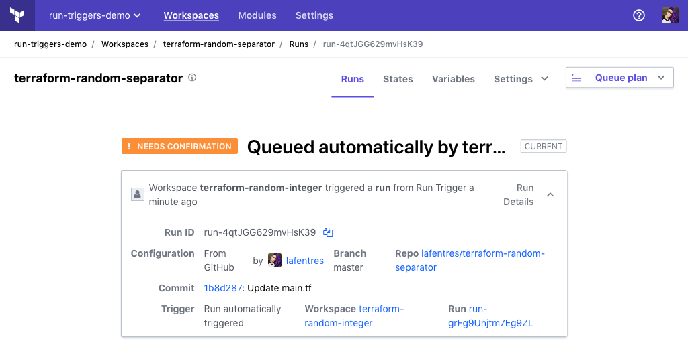
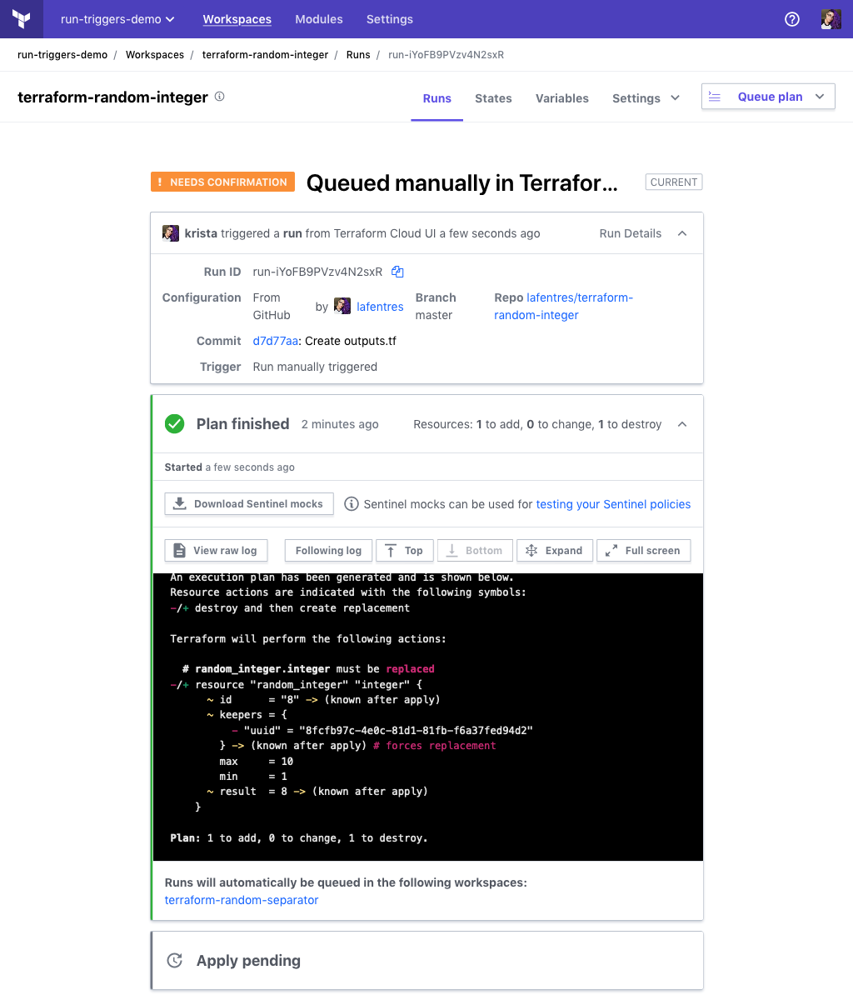

# Run Triggers

~> **Important:** This feature is currently in beta and not suggested for production use. 

Terraform Cloud provides a way to connect your workspace to one or more workspaces within your organization, known as "source workspaces". These connections, called run triggers, allow runs to queue automatically in your workspace on successful apply of runs in any of the source workspaces. You can connect your workspace to up to 20 source workspaces.

When used in conjunction with [`terraform_remote_state` data sources](/docs/providers/terraform/d/remote_state.html), run triggers provide the ability to manage updates to your configurations more seamlessly.

-> **API:** See the [Run Triggers APIs](../api/run-triggers.html).

## Viewing and Managing Run Triggers

To add or delete a run trigger, navigate to the desired workspace and choose "Run Triggers" from the "Settings" menu:

This takes you to the run triggers settings page, which shows any existing run triggers. This, and all workspace setting pages, require the current user to have [admin privileges](../users-teams-organizations/permissions.html) on that workspace. Admins are able to delete any of their workspace’s run triggers from this page.

## Creating a Run Trigger

To create a run trigger you must first have [admin privileges](../users-teams-organizations/permissions.html) on the workspace, allowing you access to the workspace's settings pages. You must also have at least [read privileges](../users-teams-organizations/permissions.html) on the source workspace you wish to connect to.

Under the "Source Workspaces" section, select the workspace you would like to connect as your source and click "Add workspace". You now have a run trigger established with your source workspace. Any run from that source workspace which applies successfully will now cause a new run to be queued in your workspace.

-> **Note:** Runs initiated in your workspace as the result of a run trigger connection to a source workspace will not auto-apply, regardless of your [auto-apply](/docs/cloud/workspaces/settings.html#auto-apply-and-manual-apply) setting selection. You will need to manually apply these runs. 

## Interacting with Run Triggers

Runs which are queued in your workspace through a run trigger will include extra information in their run details section. This includes links to the source workspace and the successfully applied run that activated the run trigger.

Additionally, operators of your source workspaces are informed of the connection to your workspace during the [plan](/docs/glossary.html#plan-noun-1-) phase of their run.

## Using a Remote State Data Source

Run triggers are designed for workspaces that rely on information produced by other workspaces. 

The primary way to share information between workspaces is the [`terraform_remote_state` data source](/docs/providers/terraform/d/remote_state.html), which allows a Terraform configuration to access a source workspace's root-level [outputs](/docs/configuration/outputs.html). 

For more information about cross-workspace state access in Terraform Cloud, see [Terraform State in Terraform Cloud](./state.html). 
