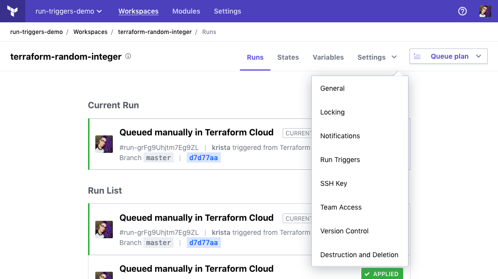

# Workspace Settings

Terraform Cloud workspaces can be reconfigured after creation.

Workspace settings are separated into several pages, which are listed in the drop-down "Settings" menu in each workspace's header. The following groups of settings are available:

- "General", for basic configuration.
- "Locking", for temporarily preventing new plans and applies.
- "Notifications", for configuring run notifications.
- "Run Triggers", for configuring run triggers.
- "SSH Key", for configurations that use Git-based module sources.
- "Team Access," for managing workspace permissions.
- "Version Control", for managing the workspace's VCS integration.
- "Destruction and Deletion", for removing a workspace and the infrastructure it manages.

Changing settings requires admin access to the relevant workspace. ([More about permissions.](/docs/cloud/users-teams-organizations/permissions.html))

[permissions-citation]: #intentionally-unused---keep-for-maintainers

-> **API:** See the [Update a Workspace endpoint](../api/workspaces.html#update-a-workspace) (`PATCH /organizations/:organization_name/workspaces/:name`).

## General

The "General Settings" page configures a workspace's name, plus some details about how Terraform runs behave.

After changing any of these settings, you must click the "Save settings" button at the bottom of the page.

### ID

Every workspace has a unique ID that cannot be changed. Workspace IDs are sometimes necessary when working with [Terraform Cloud's API](../api/index.html).

Click the icon beside the ID to copy it to the clipboard.

### Name

The display name of the workspace.

~> **Important:** Since some API calls refer to a workspace by its name, changing the name can sometimes break existing integrations.

### Execution Mode

[remote backend]: /docs/language/settings/backends/remote.html

Whether to use Terraform Cloud as the Terraform execution platform for this workspace.

The default value is "Remote", which instructs Terraform Cloud to perform Terraform runs on its own disposable virtual machines. This provides a consistent and reliable run environment, and enables advanced features like Sentinel policy enforcement, cost estimation, notifications, version control integration, and more.

To disable remote execution for a workspace, change its execution mode to "Local". The workspace will store state, which Terraform can access using the [remote backend][].

If you instead need to allow Terraform Cloud to communicate with isolated, private, or on-premises infrastructure, consider using [Terraform Cloud Agents](../agents/index.html). By deploying a lightweight agent, you can establish a simple connection between your environment and Terraform Cloud.

Changing your workspace's execution mode after a run has already been planned will cause the run to error when it is applied.

To minimize the number runs that error when changing your workspace's execution mode, you should:

1. Disable [auto-apply](/docs/cloud/workspaces/settings.html#auto-apply-and-manual-apply) if you have it enabled.
1. Complete any runs that are no longer in the [pending stage](/docs/cloud/run/states.html#1-the-pending-stage).
1. [Lock](/docs/cloud/workspaces/settings.html#locking) your workspace to prevent any new runs.
1. Change the execution mode.
1. Enable [auto-apply](/docs/cloud/workspaces/settings.html#auto-apply-and-manual-apply), if you had it enabled before changing your execution mode.
1. [Unlock](/docs/cloud/workspaces/settings.html#locking) your workspace.

### Auto Apply and Manual Apply

Whether or not Terraform Cloud should automatically apply a successful Terraform plan. If you choose manual apply, an operator must confirm a successful plan and choose to apply it.

Auto-apply has the following exception:

- Plans queued by users without permission to apply runs for the workspace must be approved by a user who does have permission. ([More about permissions.](/docs/cloud/users-teams-organizations/permissions.html))
- Plans queued due to [run triggers](../workspaces/run-triggers.html) from another workspace must always be manually applied.

[permissions-citation]: #intentionally-unused---keep-for-maintainers

### Terraform Version

The Terraform version to use for all operations in the workspace. The default value is whichever release was current when the workspace was created.

-> **API:** You can specify a Terraform version when [creating a workspace](../api/workspaces.html#create-a-workspace) via the API. The API also supports setting a valid [version constraint](/docs/language/expressions/version-constraints.html) as the Terraform version.

### Terraform Working Directory

The directory where Terraform will execute, specified as a relative path from the root of the configuration directory. Defaults to the root of the configuration directory.

Terraform Cloud will change to this directory before starting a Terraform run, and will report an error if the directory does not exist.

Setting a working directory creates a default filter for automatic run triggering, and  sometimes causes CLI-driven runs to upload additional configuration content.

#### Default Run Trigger Filtering

In VCS-backed workspaces that specify a working directory, Terraform Cloud assumes that only changes within that working directory should trigger a run. You can override this behavior with the [Automatic Run Triggering](./vcs.html#automatic-run-triggering) settings.

#### Parent Directory Uploads

If a working directory is configured, Terraform Cloud always expects the complete shared configuration directory to be available, since the configuration might use local modules from outside its working directory.

In [runs triggered by VCS commits](../run/ui.html), this is automatic. In [CLI-driven runs](../run/cli.html), Terraform's CLI sometimes uploads additional content:

- When the local working directory _does not match_ the name of the configured working directory, Terraform assumes it is the root of the configuration directory, and uploads only the local working directory.
- When the local working directory _matches_ the name of the configured working directory, Terraform uploads one or more parents of the local working directory, according to the depth of the configured working directory. (For example, a working directory of `production` is only one level deep, so Terraform would upload the immediate parent directory. `consul/production` is two levels deep, so Terraform would upload the parent and grandparent directories.)

If you use the working directory setting, always run Terraform from a complete copy of the configuration directory. Moving one subdirectory to a new location can result in unexpected content uploads.

### Remote State Sharing

Which other workspaces within the organization can access the state of the workspace during [runs managed by Terraform Cloud](/docs/cloud/run/index.html#remote-operations). The [`terraform_remote_state` data source](/docs/language/state/remote-state-data.html) relies on state sharing to access workspace outputs.

- If "Share state globally" is enabled, all other workspaces within the organization can access this workspace's state during runs.
- If global sharing is turned off, you can specify a list of workspaces within the organization that can access this workspace's state; no other workspaces will be allowed.

    The workspace selector is searchable; if you don't initially see a workspace you're looking for, type part of its name.

By default, new workspaces in Terraform Cloud do not allow other workspaces to access their state. We recommend that you follow the principle of least privilege and only enable state access between workspaces that specifically need information from each other.

-> **Note:** The default access permissions for new workspaces in Terraform Cloud changed in April 2021. Workspaces created before this change defaulted to allowing global access within their organization. These workspaces can be changed to more restrictive access at any time. Terraform Enterprise administrators can choose whether new workspaces on their instances default to global access or selective access.

### User Interface

Select the user experience for displaying plan and apply details.

The default experience is *Structured Run Output*, which displays your plan and apply results in a human-readable format. This includes nodes that you can expand to view details about each resource and any configured output.

The Console UI experience is the traditional Terraform experience, where live text logging is streamed in real time to the UI. This experience most closely emulates the CLI output.

~> **Note:** Your workspace must be configured to use a Terraform version of 1.0.5 or higher for the Structured Run Output experience to be fully supported. Workspaces running versions from 0.15.2 may see partial functionality. Workspaces running versions below 0.15.2 will default to the "Console UI" experience regardless of the User Interface setting.  

## Locking

~> **Important:** Unlike other settings, locks can also be managed by users with permission to lock and unlock the workspace. ([More about permissions.](/docs/cloud/users-teams-organizations/permissions.html))

[permissions-citation]: #intentionally-unused---keep-for-maintainers

If you need to prevent Terraform runs for any reason, you can lock a workspace. This prevents users with permission to queue plans from manually queueing runs, prevents automatic runs due to changes to the backing VCS repo, and prevents the creation of runs via the API. To enable runs again, a user must unlock the workspace.

Locking a workspace also restricts state uploads. In order to upload state, the workspace must be locked by the user who is uploading state.

Users with permission to lock and unlock a workspace can't unlock a workspace which was locked by another user. Users with admin access to a workspace can force unlock a workspace even if another user has locked it.

[permissions-citation]: #intentionally-unused---keep-for-maintainers

Locks are managed with a single "Lock/Unlock/Force unlock `<WORKSPACE NAME>`" button. Terraform Cloud asks for confirmation when unlocking.

You can also use the "Actions" menu in a workspace's header to manage the workspace's lock.

## Notifications

The "Notifications" page allows Terraform Cloud to send webhooks to external services whenever specific run events occur in a workspace.

See [Run Notifications](./notifications.html) for detailed information about configuring notifications.

## Run Triggers

The "Run Triggers" page configures connections between a workspace and one or more source workspaces. These connections, called "run triggers", allow runs to queue automatically in a workspace on successful apply of runs in any of the source workspaces.

See [Run Triggers](./run-triggers.html) for detailed information about configuring run triggers.

## SSH Key

If a workspace's configuration uses [Git-based module sources](/docs/language/modules/sources.html) to reference Terraform modules in private Git repositories, Terraform needs an SSH key to clone those repositories. The "SSH Key" page lets you choose which key it should use.

See [Using SSH Keys for Cloning Modules](./ssh-keys.html) for detailed information about this page.

## Team Access

The "Team Access" page configures which teams can perform which actions on a workspace.

See [Managing Access to Workspaces](./access.html) for detailed information.

## Version Control

The "Version Control" page configures an optional VCS repository that contains the workspace's Terraform configuration. Version control integration is only relevant for workspaces with [remote execution](#execution-mode) enabled.

See [VCS Connections](./vcs.html) for detailed information about this page.

## Destruction and Deletion

This page includes two sections:

- "Destroy Infrastructure"
- "Delete Workspace"

In almost all cases, you should perform both actions in that order when destroying a workspace.

Queueing a destroy plan destroys the infrastructure managed by a workspace. If you don't do this, the infrastructure resources will continue to exist but will become unmanaged; you'll need to go into your infrastructure providers to delete the resources manually.

Before queueing a destroy plan, you must enable the 'Allow destroy plans' setting and click the "Save settings" button.
