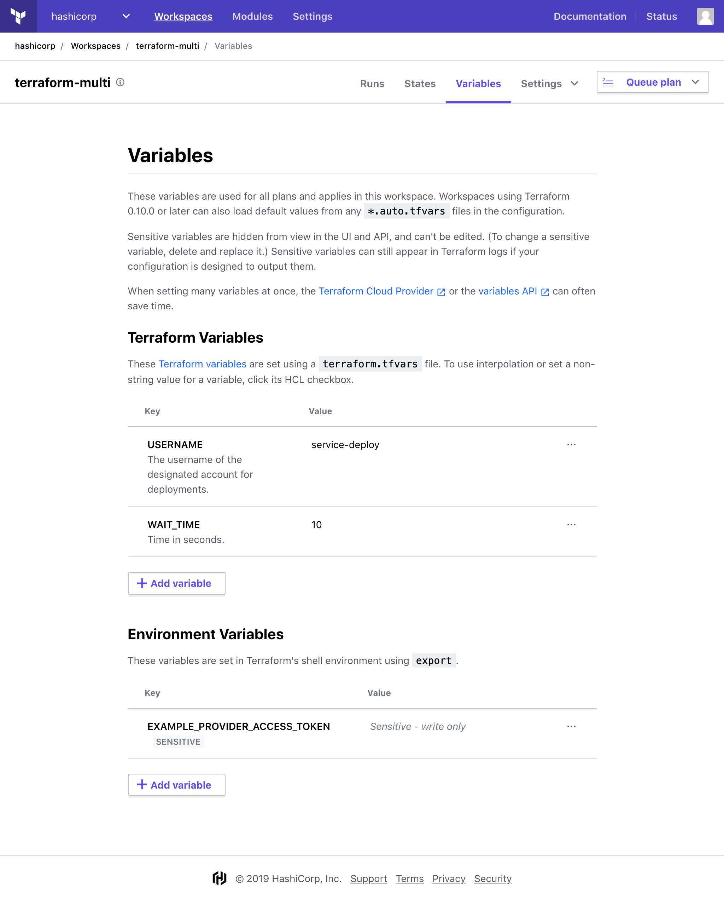
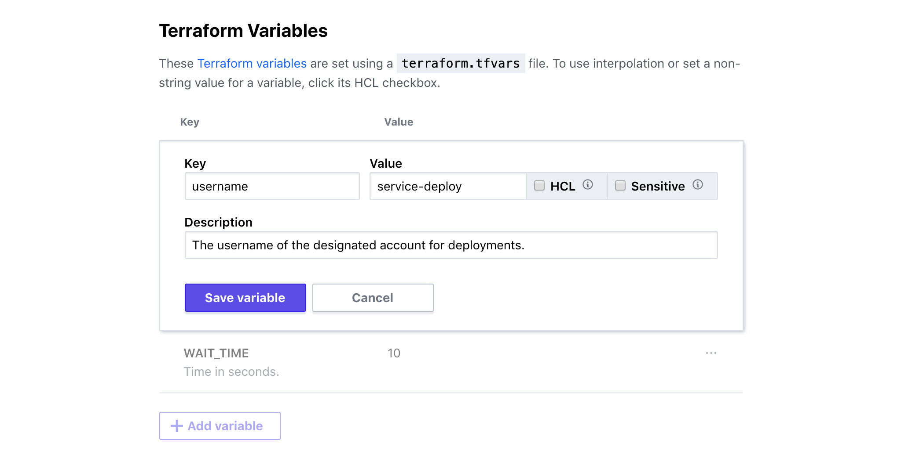

[variables]: /docs/configuration/variables.html

# Variables

Terraform Enterprise (TFE) workspaces can set values for two kinds of variables:

- [Terraform input variables][variables], which define the parameters of a Terraform configuration.
- Shell environment variables, which many providers can use for credentials and other data. You can also set [environment variables that affect Terraform's behavior](/docs/commands/environment-variables.html), like `TF_LOG`.

You can edit a workspace's variables via the UI or the API. All runs in a workspace use its variables.

-> **API:** See the [Variables API](../api/variables.html). <br/>
**Terraform:** See the `tfe` provider's [`tfe_variable` resource](/docs/providers/tfe/r/variable.html).

## Loading Variables from Files

If a workspace is configured to use Terraform 0.10.0 or later, you can commit any number of [`*.auto.tfvars` files](/docs/configuration/variables.html#variable-files) to provide default variable values. Terraform will automatically load variables from those files.

If any automatically loaded variables have the same names as variables specified in the TFE workspace, TFE's values will override the automatic values (except for map values, [which are merged](/docs/configuration/variables.html#variable-merging)).

You can also use the optional [Terraform Enterprise Provider](/docs/providers/tfe/r/variable.html) to update a workspace's variables. This has the same effect as managing workspace variables manually or via the API, but can be more convenient for large numbers of complex variables.

## Managing Variables in the UI

To view and manage a workspace's variables, navigate to that workspace and click the "Variables" navigation link at the top.

The variables page has separate lists of Terraform variables and environment variables:



To edit a variable, click one of its text fields or its pencil (edit) icon to reveal the editing controls. Make any desired changes to the variable's name, value, and settings, then click the "Save Variable" button.

To add a variable, click the "+ Add Variable" button, enter a name and value, and save.

To delete a variable, click its "🗑" (trash can) icon, then confirm your decision in the dialog box that appears.

You can edit one variable at a time, and must save or cancel your current edits before editing other variables in the list.



### Multi-line Values

The text fields for variable values can handle multi-line text (typed or pasted) without any special effort.

### HCL Values

Variable values are strings by default. To enter list or map values, click the variable's "HCL" checkbox (visible when editing) and enter the value with the same HCL syntax you would use when writing Terraform code. For example:

```hcl
{
    us-east-1 = "image-1234"
    us-west-2 = "image-4567"
}
```

HCL can be used for Terraform variables, but not for environment variables. The HCL code you enter for values is interpreted by the same Terraform version that performs runs in the workspace. (See [How TFE Uses Variables](#how-tfe-uses-variables) below.)

### Sensitive Values

Terraform often needs cloud provider credentials and other sensitive information that shouldn't be widely available within your organization.

To protect these secrets, you can mark any any Terraform or environment variable as sensitive data by clicking its "Sensitive" checkbox (visible when editing).

Marking a variable as sensitive prevents anybody (including you) from viewing its value in TFE's UI or API.

Users with edit permissions can set new values for sensitive variables. No other attribute of a sensitive variable can be modified. To update other attributes, delete the variable and create a new variable to replace it.

~> **Important:** Terraform runs will receive the full text of sensitive variables, and might print the value in logs if the configuration pipes the value through to an output or a resource parameter. Take care when writing your configurations to avoid unnecessary credential disclosure.

### Looking Up Variable Names

Terraform Enterprise can't automatically discover variable names from a workspace's Terraform code. You must discover the necessary variable names by reading code or documentation, then enter them manually.

If a required input variable is missing, Terraform plans in the workspace will fail and print an explanation in the log.

## How TFE Uses Variables

### Terraform Variables

TFE passes variables to Terraform by writing a `terraform.tfvars` file and passing the `-var-file=terraform.tfvars` option to the Terraform command.

Do not commit a file named `terraform.tfvars` to version control, since TFE will overwrite it. (Note that you shouldn't check in `terraform.tfvars` even when running Terraform solely on the command line.)

### Environment Variables

TFE performs Terraform runs on disposable Linux worker VMs using a POSIX-compatible shell. Before running Terraform, TFE populates the shell with environment variables using the `export` command.

### Special Environment Variables

TFE uses some special environment variables to control dangerous or rarely used run behaviors.

- `CONFIRM_DESTROY` — If this environment variable is set to `1` in a workspace, an admin user can destroy all of the infrastructure managed by the workspace using the "Queue destroy plan" button in the settings page. The UI text for the destroy plan button includes a reminder about this safety measure.
- `TFE_PARALLELISM` — If present, TFE uses this to set `terraform apply`'s `-parallelism=<N>` flag ([more info](/docs/internals/graph.html#walking-the-graph)). Valid values are between 1 and 256, inclusive; the default is `10`. This is rarely necessary, but can fix problems with infrastructure providers that error on concurrent operations or use non-standard rate limiting. We recommend talking to HashiCorp support before using this.

### Secure Storage of Variables

TFE encrypts all variable values securely using [Vault's transit backend](https://www.vaultproject.io/docs/secrets/transit/index.html) prior to saving them. This ensures that no out-of-band party can read these values without proper authorization.
