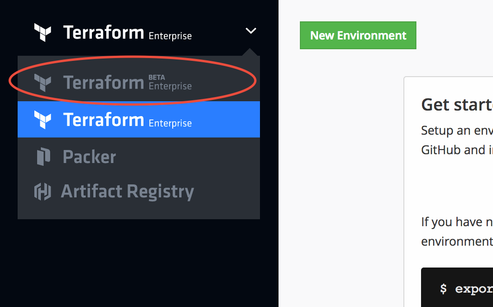
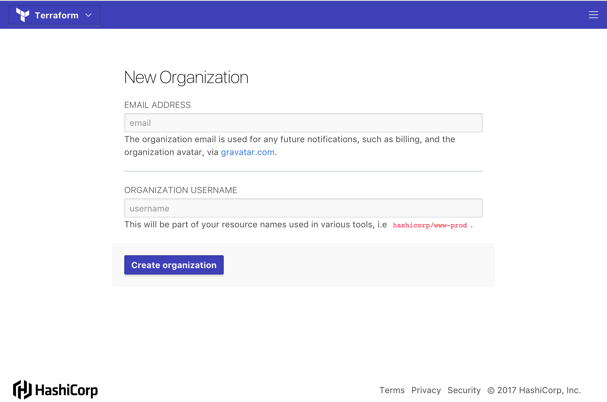
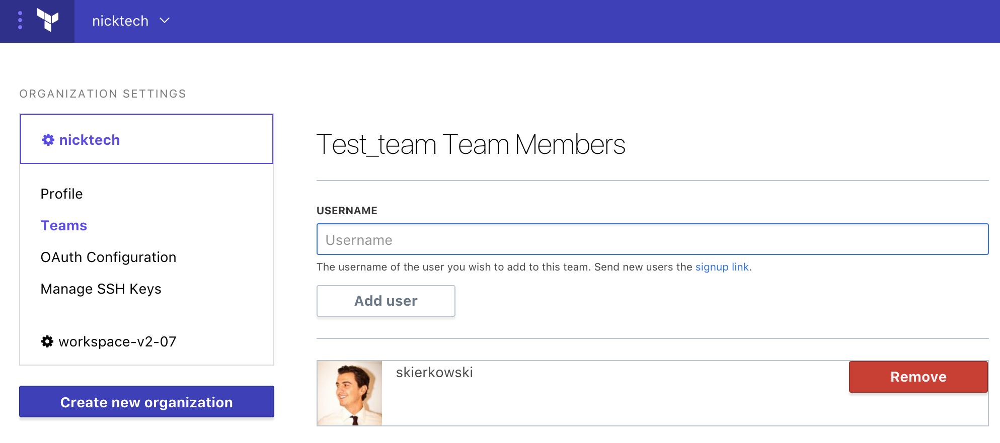

# Accessing Terraform Enterprise Beta

Terraform Enterprise (TFE) beta is a rewritten version of TFE, and you can't currently use it with your existing TFE data and configurations. To start testing TFE beta, you must:

- Make sure you have a TFE account.
- [Contact HashiCorp sales](https://www.hashicorp.com/products/terraform/) to request access to the TFE beta.
- [Navigate to TFE beta](https://atlas.hashicorp.com/beta).
- [Create a new organization](https://atlas.hashicorp.com/beta/organizations/new) for working with TFE beta. Ensure
 you do not have an organization created already under this name in the Classic version.
 
## Creating a TFE Account

If you don't already have a TFE account, you must create one. You can use the same user account to access TFE classic and TFE beta, although you'll use separate organizations.

[Click here to request a free trial of TFE][signup], or contact HashiCorp sales to purchase a TFE subscription.

[signup]: https://www.hashicorp.com/products/terraform/?utm_source=oss&utm_medium=header-nav&utm_campaign=terraform&_ga=2.40850658.1512399790.1504740058-931972891.1498668200#terraform-contact-form

## Getting Accepted into the Beta Program

This beta program is currently by invitation only. User accounts that aren't on the beta list cannot view or use TFE beta.

To join the beta program, please sign up at [app.terraform.io](https://app.terraform.io).

Once you're accepted into the beta program, HashiCorp support will enable TFE beta for all of the users on your billing account.

## Navigating to TFE Beta

To access TFE beta, log into TFE at [atlas.hashicorp.com](https://atlas.hashicorp.com) and use the main navigation drop-down in the upper left:

If TFE beta isn't available in the menu, it means your user account hasn't been added to the beta program yet.

## Creating an Organization

~> **Note:** If someone else has already created a TFE beta organization and added you to it, you can skip this process. You'll be taken to the organization's front page when you first navigate to TFE beta.

After you've navigated to TFE beta, it will prompt you to create a new organization. Enter a name (distinct from your main TFE organization) and an admin email address at the prompt:

TFE beta cannot currently import settings and workspaces from an existing TFE classic organization. We will enable migration from TFE classic at a later date.

## Adding Other Users to an Organization

To collaborate with your colleagues in TFE beta, you'll all need access to the same TFE organization. You can add users to an organization by creating a _team_ and adding users to it.

First, navigate to the settings page for your organization — you can reach it from the organization dropdown menu at the top of every page. Once there, click the "Teams" link in the sidebar navigation.

The list of teams starts with just one team, named "owners." Don't add users to this team yet; instead, enter a new team name (like "beta-testers") in the text field and click the "Create team" button.

Once the team is created, click its name. This will navigate to the team page:

Add as many users as you'd like by typing their TFE username in the text field and clicking "Add user." Added users won't receive a notification, but your organization will be available the next time they access TFE beta.

~> **Important:** Currently, TFE beta does not have access controls for workspaces; these are coming soon in a future update. Users you add to your organization have full permissions for every workspace in it.

## Next Steps

After you've created a TFE beta organization, you should [configure version control access.](./vcs.html)

