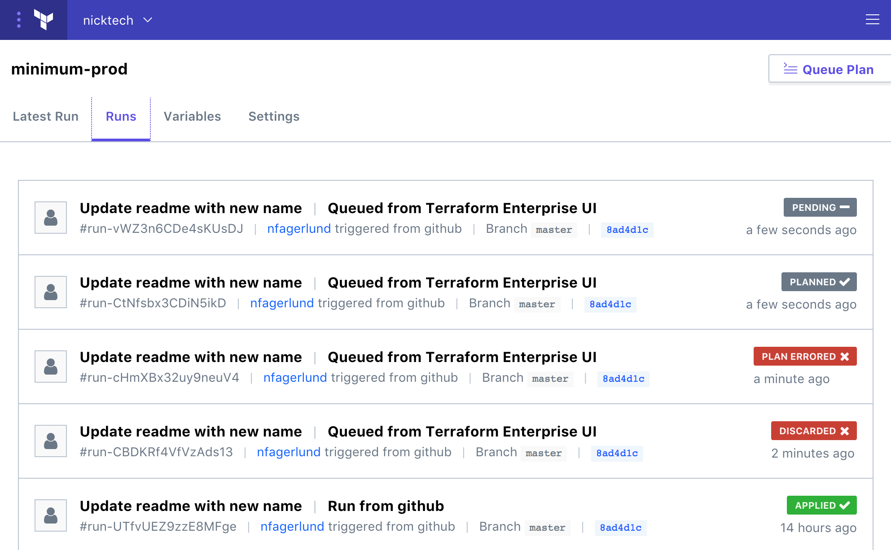
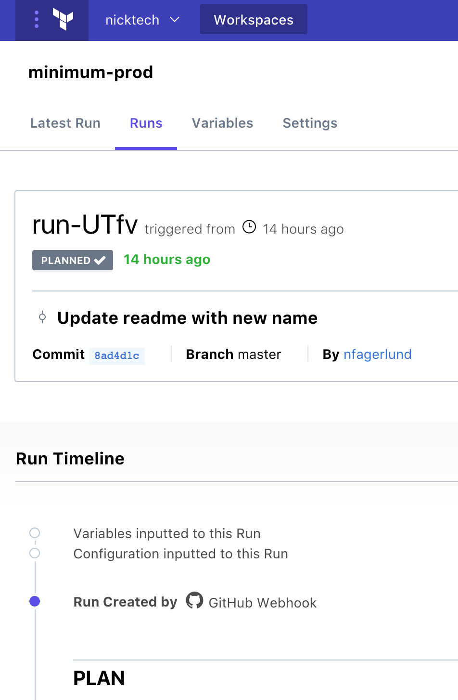
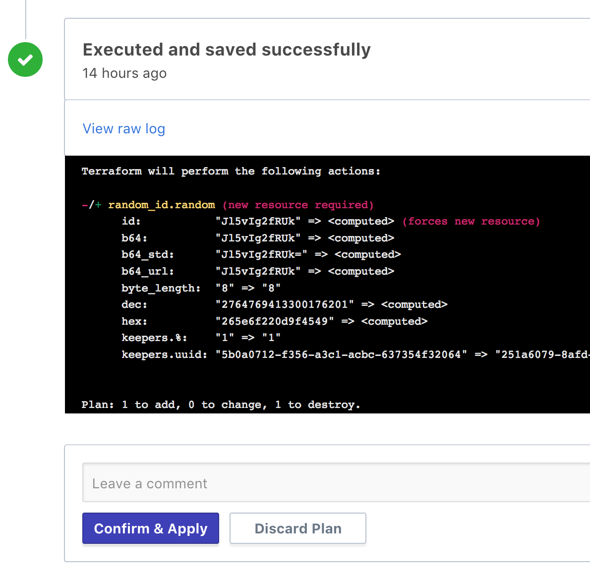

# Running Terraform in TFE Beta

**Prerequisites:** Before starting this guide, make sure you've [created and configured at least one workspace](./workspaces.html).

Once you've created and configured a workspace, you can manage infrastructure resources by doing Terraform runs in that workspace.

## About Terraform Runs in TFE

### Plans and Applies

TFE enforces Terraform's division between _plan_ and _apply_ operations. It always plans first, saves the plan's output, and uses that output for the apply. In the default configuration, it waits for user approval before running an apply, but you can change that in a workspace's settings.

### Starting Runs

There are two ways to start a run in a workspace:

- Manually queuing a plan, by clicking the "Queue Plan" button in the upper right of a workspace. This is useful when you've edited some variables and need to update your infrastructure accordingly.
- Automatically queuing a plan by committing to version control. (TFE always registers a VCS webhook when you create a new workspace, although you can later delete the webhook to prevent automatic runs.)

### Per-Workspace Queues

Each workspace in TFE maintains its own queue of runs, and processes those runs in order.

Whenever you request a new run, it's added to the end of the queue. If there's already a run in progress, your new run won't start until the current one has completely finished — TFE won't even plan the run yet, because the current run might change the work your run needs to do. Runs that are waiting for other runs to finish are in a _pending_ state, and a workspace might have any number of pending runs.

When you request a run, TFE locks the run to the current Terraform code (usually associated with a specific VCS commit) and variable values. If you change variables or commit new code before the run finishes, it will only affect future runs, not ones that are already pending, planning, or awaiting apply.

### Run States

A given Terraform run can be in the following states:

- **Pending:** A pending run hasn't been planned or applied. It's waiting for other runs to finish.
- **Planning:** TFE is currently running `terraform plan`.
- **Planned:** TFE has run `terraform plan`, and is waiting for a user to approve a `terraform apply`.
- **Applying:** TFE is currently running `terraform apply`.
- **Applied:** TFE has finished applying. The next run can now proceed.
- **Plan Errored:** The `terraform plan` command failed, and you won't be able to apply this run. This usually means you need to fix variables or code. The next run can now proceed.
- **Discarded:** The `terraform plan` command succeeded, but a user chose not to apply it. The next run can now proceed.

In the list of workspaces on TFE's main page, each workspace shows the state of its most recently queued run. So if any runs are pending, the workspace is in "pending," regardless of what it's currently running or waiting for.

## Interacting with Runs

Each workspace has three always-visible tools for working with runs:

- A "Queue Plan" button, in the upper right.
- A "Runs" link, which goes to the full list of runs.
- A "Latest Run" link, which goes to the most recent _completed_ run. (Completed runs are in an "applied," "discarded," or "plan errored" state.)

From the list of runs, you can click to view or interact with an individual run.

### The Run Page

An individual run page shows the progress and outcomes of each stage of the run.

Most importantly, it shows:

- The current status of the run.
- The code commit associated with the run.
- How the run was triggered, when, and which user requested it (if applicable).
- A timeline of events related to the run.
- The output from both the `terraform plan` and `terraform apply` commands, if applicable. You can hide or reveal these as needed; they default to visible if the command is currently running, and hidden if the command has finished.

### Confirming or Discarding Plans

The most common operation on a run page is confirming and applying a plan.

When you visit the page for a run that has finished planning, you'll see the following controls at the bottom of the page:

When you've finished reviewing the output of a plan, use one of these buttons to apply or discard it. Optionally, you can leave a comment for your colleagues if you think there's something unusual involved in the run.

Note that until you apply or discard a plan, TFE can't start another run in that workspace.

## Preventing Runs

If you need to temporarily stop runs from being queued, you can lock the workspace.

You can find the lock button in the workspace settings page.

