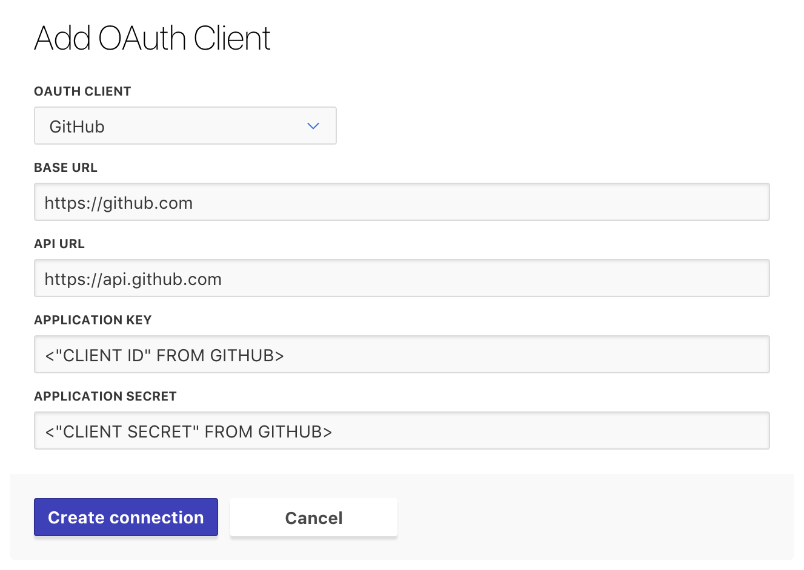

# Configuring Version Control Access

**Prerequisites:** At this point, you should have [gotten access to Terraform Enterprise beta](./access.html), and created an organization if necessary.

Before you can use TFE, it needs access to the version control system (VCS) you use for Terraform code.

## About VCS Access

Every workspace in TFE is associated with a VCS repository, which provides the Terraform code for that workspace. To find out which repos are available, and to access their contents, TFE needs access to your VCS service.

### Supported VCS Services

TFE supports the following VCS services:

- GitHub
- GitHub Enterprise
- GitLab
- Bitbucket Cloud

<!-- - Bitbucket Server -->

Currently, TFE cannot use other VCS services (including generic Git servers).

## Configuring VCS Access

TFE uses OAuth to interact with VCS services.

**Important:** Even if you've used OAuth before, you should follow these instructions carefully. Since TFE treats each _organization_ as a separate OAuth application (for security reasons), you're going to authenticate using OAuth's developer workflow, which has more steps than the more common user workflow.

In general, the developer OAuth workflow follows these steps:

1. Tell your VCS service that you have a new application that might request access. The VCS service will give you a unique ID and secret key for configuring that application.
1. Tell TFE how to reach your VCS service, and provide the ID and key you just received. (In TFE's UI, this step is called "adding an OAuth client.") TFE will give you a unique callback URL.
1. Go back to your VCS service and provide TFE's callback URL.
1. Go back to TFE and click the button to request VCS access. You'll be taken to your VCS service's site.
1. Approve the access request.

The section below covers these steps in detail.

### Configuring GitHub Access

These instructions are for organizations that use GitHub as their VCS service. Documentation for connecting other VCS services is coming soon.

#### Step 1: On GitHub, Create a New "OAuth Application"

1. Go to [github.com](https://github.com) and log in as _whichever GitHub user account owns your organization's most important configuration._

    For most organizations this should be a service user, whose credentials are shared among an operations team. If you don't have a shared account like that, you can use any normal account — the app configuration you'll create here can be transferred to another user later.

2. Navigate to GitHub's [Register a New OAuth Application](https://github.com/settings/applications/new) page, which is located at <https://github.com/settings/applications/new>.

    If you need to find this page later, you can also reach it through GitHub's menus: Click your profile picture in the upper right corner and choose "Settings," then look in the navigation sidebar for "OAuth Apps" (under the "Developer settings" section). Click that link, then click the "Register a new application" button in the upper right corner.

3. On this page, you'll see four text fields.

    

    Fill them in as follows:

    Field name                 | Value
    ---------------------------|--------------------------------------------------
    Application Name           | Terraform Enterprise (`<YOUR ORGANIZATION NAME>`)
    Homepage URL               | `https://atlas.hashicorp.com`
    Application Description    | Terraform Enterprise (`<YOUR ORGANIZATION NAME>`)
    Authorization callback URL | `https://example.com/replace-this-later`

    You can enter anything for the first three fields, but we suggest including the organization name, since you might need to use multiple TFE organizations someday.

    The authorization callback URL is the only really important field, but the correct value for it _doesn't exist until the next step._ Enter a temporary value for now.

4. Click the "Register application" button. This will take you to the application page.

5. Leave the application page open in a browser tab, and take note of two items: the **Client ID** and the **Client Secret.** These are both long hexidecimal numbers, which you'll copy and paste in the next step.

    

#### Step 2: On TFE, Add an "OAuth Client"

1. Navigate to the "OAuth Configuration" settings for your organization, and click the "Add an OAuth Client" button.

    If you just created your organization a few minutes ago, TFE might have automatically taken you to this page. Otherwise:

    1. Click the upper-left organization menu, making sure it currently shows your beta organization.
    1. Click the "`<ORGANIZATION>` Settings" link at the bottom of the menu.
    1. On the next page, click "OAuth Configuration" in the left sidebar.
    1. Click the "Add an OAuth Client" button.

2. On the next page, you'll see a drop-down and four text fields.

    

    Fill them in as follows:

    Field name         | Value
    -------------------|-------------------------------------
    OAuth Client       | GitHub (drop-down)
    Base URL           | `https://github.com`
    API URL            | `https://api.github.com`
    Application Key    | `<CLIENT ID FROM PREVIOUS STEP>`
    Application Secret | `<CLIENT SECRET FROM PREVIOUS STEP>`

3. Click the "Create connection" button. This will take you back to the OAuth Configuration page, which now includes your new GitHub client.

4. Locate your new client's "Callback URL," and copy it to your clipboard; you'll paste it in the next step. Leave the OAuth Configuration page open in a browser tab.

    

#### Step 3: On GitHub, Update the Callback URL

1. Go back to your GitHub browser tab. (If you accidentally closed it, you can reach your OAuth app page through the menus: use the upper right menu > Settings > OAuth Apps > "Terraform Enterprise (`<YOUR ORG NAME>`)".)

2. In the "Authorization Callback URL" field, near the bottom of the page, paste the callback URL from TFE's OAuth Configuration page, replacing the "example.com" placeholder you entered earlier.

3. Click the "Update application" button. You'll remain on the same page, but a banner at the top will tell you the update succeeded.

#### Step 4: On TFE, Click "Connect Organization"

1. Go back to the TFE browser tab (displaying the OAuth Configuration page), and click the "Connect organization `<NAME>`" button.

    

    This will take you to a page on github.com, asking whether you want to authorize the application.

2. The GitHub authorization page includes a list of the organizations the current user is a member of. Locate the organization that owns your Terraform code repositories, and click the "Request" button next to it.

    

3. Click the green "Authorize `<GITHUB USER>`" button at the bottom of the authorization page. GitHub might request your password to confirm the operation.

#### Step 5: Contact Your GitHub Organization Admins

When you requested organization access for TFE, GitHub sent an automated email to the administrators of your GitHub organization. An administrator must approve the request before TFE can access your organization's shared repositories.

If you're a GitHub administrator, check your email now and respond to the request; otherwise, contact whoever is responsible for GitHub accounts in your organization, and wait for confirmation that they've approved your request.

#### Finished

At this point, GitHub access for TFE is fully configured, and you can create Terraform workspaces based on your organization's shared GitHub repositories.

## Next Steps

After you've configured VCS access, you should [start creating workspaces](./workspaces.html).
