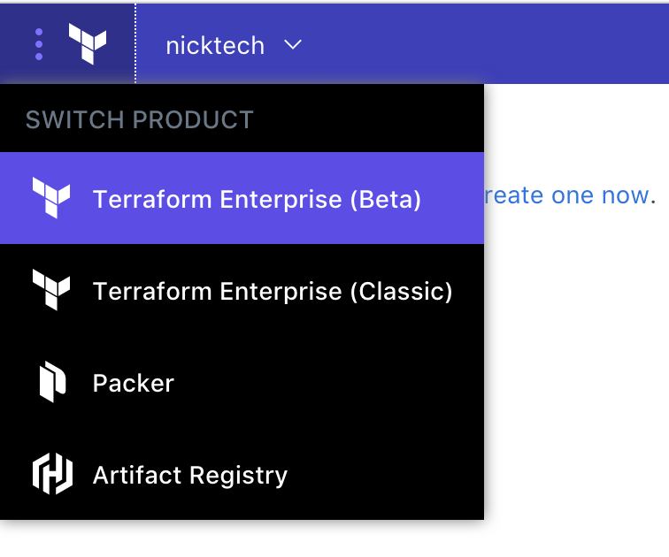
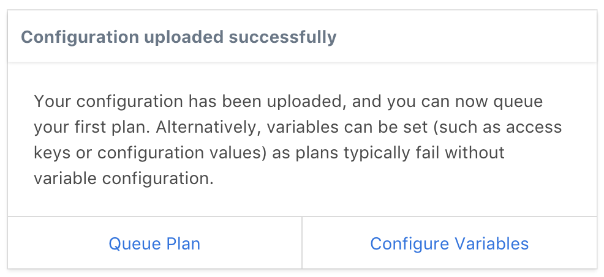
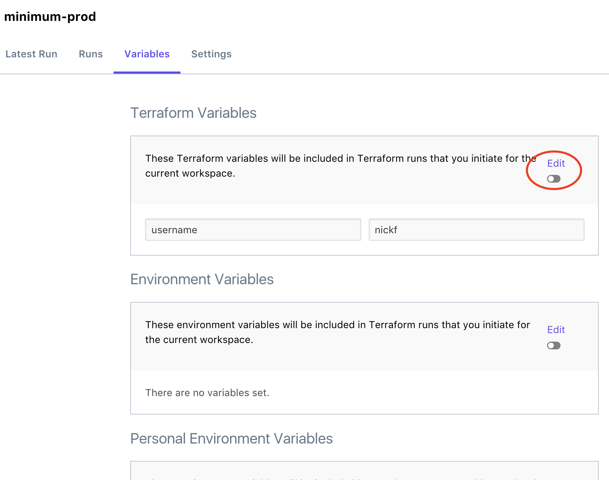
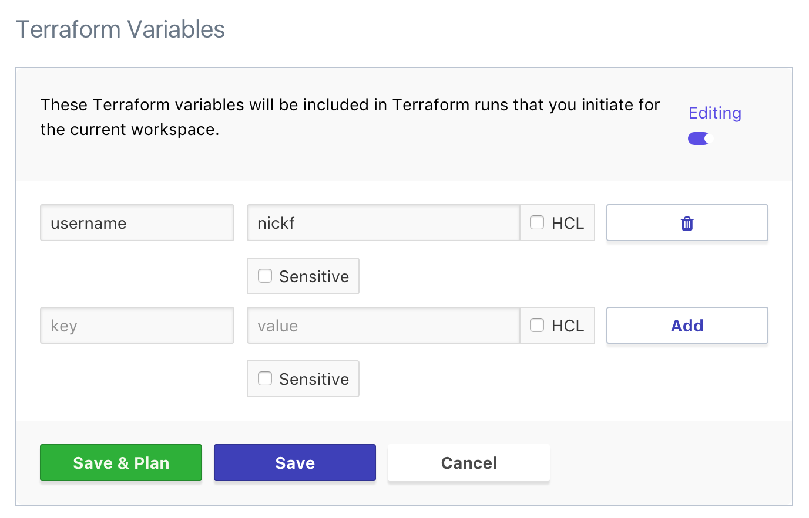
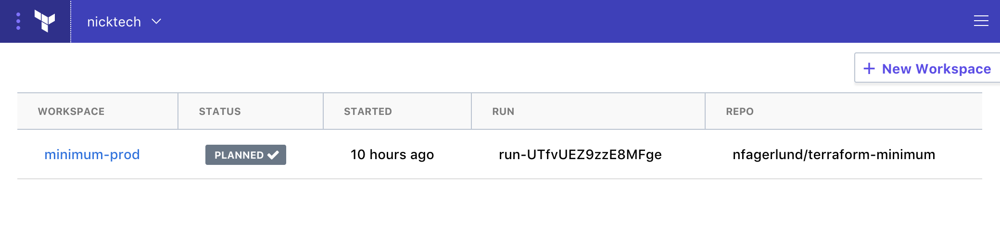

# Creating and Managing Terraform Workspaces

**Prerequisites:** Before starting this guide, you should [get access to Terraform Enterprise](./access.html) and [configure VCS access](./vcs.html).

At this point, you've done all the setup TFE needs, and can start using it for real work. Your first task should be to set up some Workspaces.

## About Workspaces

_Workspaces_ are how TFE organizes infrastructure. (If you've used previous versions of TFE, workspaces used to be called environments.)

A workspace consists of:

* A collection of Terraform configurations (retrieved from a VCS repo).
* Values for any variables those configurations require.
* Persistent stored state for the resources it manages.

A well-designed Terraform workflow uses multiple codebases, so you can manage each logical grouping of infrastructure with its own set of Terraform configurations. Additionally, it's common to use the same group of configurations multiple times (with different values for variables) to manage different environments.

## Creating a Workspace

First, make sure you're on TFE's front page. If you're still on the VCS settings (or any other page), click the Terraform logo button in the upper left and choose "Terraform Enterprise (Beta)".

TFE's front page is a list of the workspaces you have access to; if you haven't created any, it's empty.

To create your first workspace, click the "+ New Workspace" button in the upper right.

On the "Create a new Workspace" page, you need to enter at least two items: a workspace name, and a VCS repository. When you've finished, click the "Create Workspace" button.

### Workspace Name

A workspace name should tell your colleagues what the workspace is for. Most workspaces are _a particular environment_ of _a particular codebase,_ so the name should include both the name of the codebase and the name of the environment.

In this example, we're using a codebase named "minimal" and we're deploying it in a production environment, so we named it `minimal-prod`.

### Repository

The "repository" field is linked to data from your VCS service. You can start typing the name of a repo, then select the correct repo from the resulting list.

In this example, we're using the `nfagerlund/terraform-minimum` repo.

### Other Settings

Optionally, you can set three other settings for a new workspace:

- **Terraform Working Directory:** The directory in this repo where TFE will execute Terraform commands. If the Terraform configuration files you want aren't in the root of the repository, use this to specify where they are.
- **VCS Root Path:** Similar to "Terraform Working Directory," but deletes other directories before running any Terraform command. Most users should use "Terraform Working Directory" instead.
- **VCS Branch:** Which branch to use. Defaults to the repo's default branch, which is usually `master`.

## What Happens in a New Workspace

When you create a new workspace, a few things happen:

- TFE _doesn't_ immediately queue a plan for the workspace. Instead, it presents you with a dialog, with shortcut links to either queue a plan or edit variables.
- TFE automatically registers a webhook with your VCS service. The next time new commits appear in the selected branch of that repo, TFE will automatically queue a Terraform plan for the workspace.

    **Note:** If you don't want to automatically queue Terraform plans for new commits, you must delete the workspace's webhook manually, via your VCS service's interface or API.

## Editing Variables

For almost any Terraform codebase, you'll want to edit the Terraform variables and environment variables used by the code.

You can edit variables as soon as you've created a workspace, by clicking the workspace's "Variables" tab.

The variables page has three sections: Terraform variables (as declared in your Terraform configurations), shared environment variables, and per-user environment variables. (Note that environment variables can be used to set Terraform variables, with the standard `TF_VAR_*` format.)

To edit one of these sections, click the "Edit" control. You can then add, modify, or delete variables. Make sure to click "Save" or "Save & Plan" once you've finished editing.

Terraform variables default to being basic string values, but you can also enter array or map values if you click the "HCL" checkbox for that variable. You can write these values with the syntax you'd use in a Terraform configuration.

## Configuring a Workspace

Each workspace has a "Settings" page (available from the top links when viewing that workspace), where you can change the behavior of the workspace. Currently, this page has the following settings:

- **Auto apply vs. manual apply:** By default, TFE only performs a Terraform plan when you start a run (either manually or by adding new commits to the repo). You can then view the outcome of the plan and decide whether to go forward with applying it.

    This is called "manual apply." If you'd rather have TFE automatically apply successful plans, you can switch to "auto apply."
- **Terraform version:** TFE can use any released version of Terraform to manage a workspace. Different workspaces can use different versions, and TFE won't automatically upgrade a workspace.

    To stay up to date, you should visit workspace settings periodically and update the Terraform version.
- **Workspace lock:** A user with admin privileges on a workspace can _lock_ the workspace, which prevents plans and applies from running. Use this when recovering from a bad commit or performing other maintenance.
- **Workspace delete:** When deleting a workspace, you usually also want to de-provision any infrastructure it's managing. This section of the settings has a button for queueing a destroy plan (to de-provision), and a button for deleting the workspace data. Note that destroy plans require an extra environment variable for confirmation; see the settings page for more details.

## Navigating Workspaces

Most of your time in TFE is spent in two views:

* The main page, which is a list of workspaces and their statuses. Use this to get an overview of the workspaces you're responsible for, and to navigate between workspaces.

    To get back to the main page at any time, click the Terraform logo button in the upper left and choose "Terraform Enterprise (Beta)".
* The individual workspace pages, which provide more detail about a workspace's status, and let you manage runs, variables, and settings.

    To reach a workspace page, click that workspace's entry on the main page.

## Next Steps

Now that you've created and configured at least one workspace, you're ready to [start performing Terraform runs](./runs.html).
