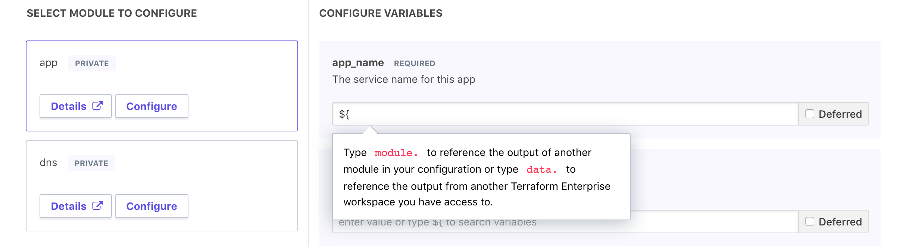

# Using the Configuration Designer

Terraform Enterprise (TFE)'s private module registry includes a configuration designer.

The configuration designer isn't a drag-and-drop Terraform workflow or a restrictive "wizard" interface. Instead, it's a shortcut to reduce the amount of boilerplate code you write in a module-centric Terraform workflow.

What it most resembles is interactive documentation for your private modules, or advanced autocompletion like you might see in an IDE. It results in the same Terraform code you would have written in your text editor, but saves time by automatically discovering the variables you need and searching module and workspace outputs for reusable values.

## Workflow Summary

The configuration designer lets you outline a new workspace by choosing any number of private modules. It then lists those modules' variables as a fillable HTML form, with a helper interface for finding interpolatable values.

Once you finish, the designer returns the text of a `main.tf` configuration, which you must copy and paste to create a new VCS repo for workspaces. The designer does not automatically create any repos or workspaces; it's only a shortcut for writing Terraform code faster.

## Accessing the Configuration Designer

Navigate to the modules list with the top-level "Modules" button, then click the "+ Design Configuration" button in the upper right.

This brings you to the "Select Modules" page.

## Adding Modules

The left side of the "Select Modules" page has a filterable and searchable list of your organization's private modules. Choose any number of modules you want to add to your configuration.

When you click a module's "Add Module" button, it appears in the "Selected Modules" list on the right side of the page.

### Setting Versions

By default, selecting a module adds it most recent version to the configuration. You can specify a different version by clicking the module's version number in the "Selected Modules" list on the right, which reveals a drop-down menu of available versions.

## Setting Variables

When you finish selecting modules, click the "Next »" button in the upper right to go to the "Set Variables" page.

The left side of this page lists your chosen modules, and the right side lists all variables for the currently selected module. You can freely switch between modules without losing your work; click a module's "Configure" button to switch to its variable list.

Each variable is labeled as required or optional. Once you've set a value for all of a module's required variables, its "Configure" button changes to a green "Configured ✔️" button; when all modules are configured, you can use the "Next" button in the upper right to display the finished configuration.

### Interpolation Searching

Variable values can be literal strings, or can interpolate other values. When you start typing an interpolation token (`${`), the designer displays a help message. As you continue typing, it searches the available outputs in your other selected modules, as well as workspace-level outputs from other workspaces. You can select one of these search results, or type a full name if you need to reference a value TFE doesn't know about.

### Deferring Variables

The "Set Variables" page is primarily for hardcoding or interpolating values that will stay the same across workspaces. If you want to delegate a value to the users of a configuration, you can check the variable's "Deferred" checkbox. This adds a Terraform variable with no default value to the configuration, which workspace users will have to provide a value for.

## The Output Configuration

When you've finished setting variables, click the "Next" button to view the completed output of the configuration designer.

This page has a large textarea that contains a Terraform configuration. You must copy and paste this code into your text editor, save it as the `main.tf` file in a new directory, and commit it to version control to enable creating TFE workspaces with the configuration. You can also make arbitrary changes to the code, like adding non-module resources or public Terraform Registry modules.

After you click "Next" again and click "Done," TFE will discard the configuration you've created. Text from previous configuration designer runs is not preserved within TFE.
