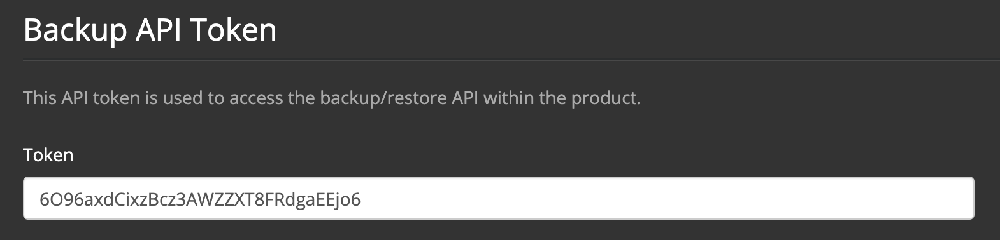

# Terraform Enterprise Backups and Restores

This guide explains how to create a backup of your Terraform Enterprise installation (either stand alone or clustered) and how to use that backup to restore your data into a new installation of Terraform Enterprise - allowing you to migrate between various installation types - stand alone to clustered, external vault to internal vault, etc.

This guide will walk through both running a backup and initiating a restore.

## Creating a Backup

This utility will allow you to backup all of the data stored inside your Terraform Enterprise application. It will not, however, backup the installation configuration. This will allow you to move away from your current configuration and into a new one. If you are wanting learn how to restore the installation configuration of a stand alone installation, please refer to [Terraform Enterprise Automated Recovery](./automated-recovery.html). If you are on the clustered installation, you can simply re-run the terraform module at any time to recover your configuration.

The backup is initiated via an API call against a running system. This will allow you to trigger a backup from a remote system. 

An example curl command to trigger a backup:
```
curl -XPOST -H "Authorization: Bearer <TOKEN>" https://<tfe-hostname>/_backup/api/v1/backup -d @request.json
```

* `<TOKEN>` - The bearer token can be found on the install dashboard (https://<tfe-hostname>:8800) on the settings page, towards the bottom:
	
* `<tfe-hostname>` - This is your Terraform Enterprise URL followed by `/_backup/api/v1/backup`
* `request.json` - This is a file that you will create that contains the password which is used to secure the backup file. 

An example request.json file:
```
{ "password": "foo" }
```

Once you run this command it will trigger a full backup of all of the application data stored in the database and all of the blob storage (S3/S3-compatible storage). The utility will make use of vault to decrypt the data in the database, and will re-secure it using the password provided. When you restore the data into a new system, the data will be re-encrypted using vault. If you will be storing the backup, we recommend treating it as sensitive data and ensuring it's stored securely.

## Restore a backup in a new Terraform Enterprise installation

As stated above, you will need to first either build a new stand alone Terraform Enterprise server, or run the terraform module to build a new cluster. Once the application is up an running on the new system(s), you can then trigger a restore. The restore is also initiated via an API call. 

An example curl command to trigger a restore:
```
curl -XPOST -F config=@request.json -F snapshot=@backup.blob -H "Authorization: Bearer <TOKEN>" https://<tfe-hostname>/_backup/api/v1/restore
```

* `request.json` - You'll need to provide the same file that was used to create the backup, containing the password. 
* `backup.blob` - Provide the name of the snapshot file you wish to restore
* `<TOKEN>` - The bearer token will need to be retrieved from the new, target system by going to the settings page on the install dashboard (https://<tfe-hostname>:8800).
* `<tfe-hostname>` - The url of the system to restore the data into.

Once the restore is complete, you'll need to **restart the application**. The application will not restart automatically. You will need to log into the install dashboard and stop, then start the application, or, from the CLI, `replicatedctl app stop` then `replicatedctl app start`. 
