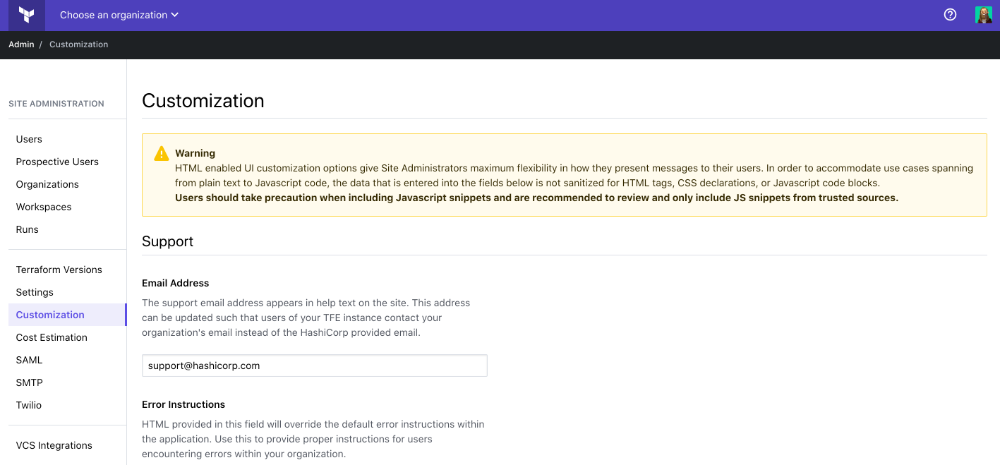

# Administration: Customization

Customization allow you to modify different parts of the user interface to accommodate the specific needs of your organization.

To access the customization settings, visit the site admin area and click **Customization** in the left menu. To save the settings, click **Save Customization Settings** at the bottom of the page.

-> **API:** See the [Customization API](/docs/cloud/api/admin/settings.html#list-customization-settings).

## Support Email

The support email address is used in system emails, error pages, and all other situations the user would be prompted to contact support. It defaults to support@hashicorp.com. If you'd like  users of your instance to reach out to a specific person or team when they have issues, it can be changed to a local email address.
