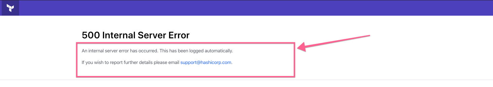
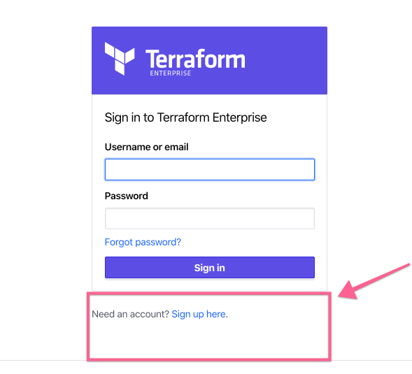
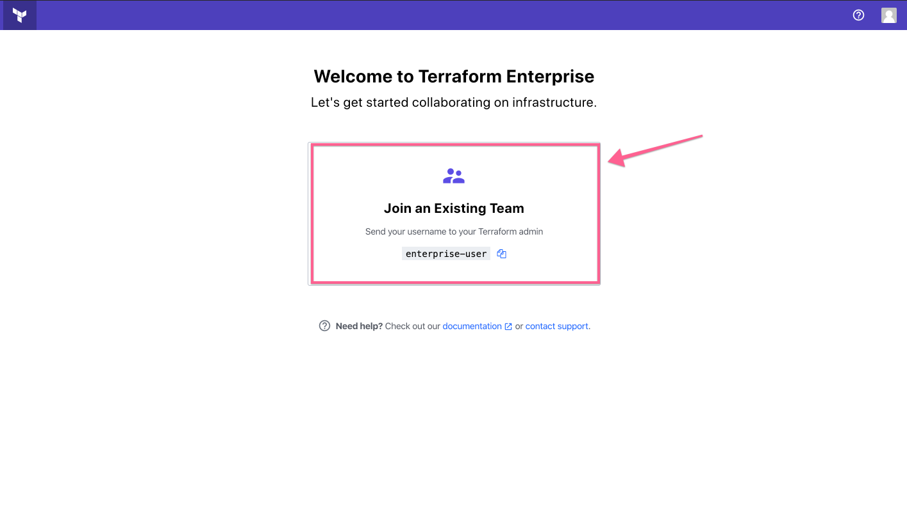
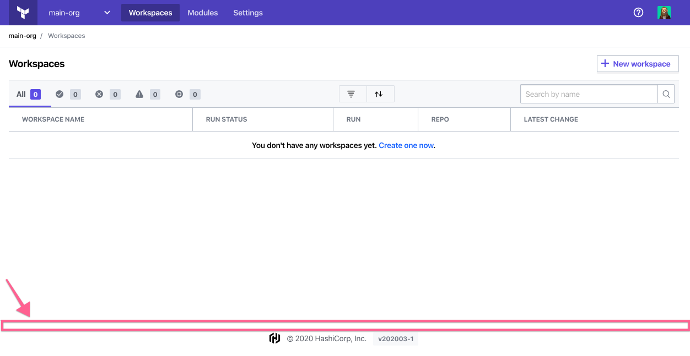

# Administration: Customization

Customization allow you to modify different parts of the user interface to accommodate the specific needs of your organization.

To access the customization settings, visit the site admin area and click **Customization** in the left menu. To save the settings, click **Save Customization Settings** at the bottom of the page.

~> **Note:** Terraform Enterprise sanitizes customization content before displaying it, and might remove HTML elements or attributes that pose a possible security risk.

-> **API:** See the [Customization API](/docs/cloud/api/admin/settings.html#list-customization-settings).

## Support

### Email Address

The support email address is used in system emails, error pages, and all other situations the user would be prompted to contact support. It defaults to support@hashicorp.com. If you'd like  users of your instance to reach out to a specific person or team when they have issues, it can be changed to a local email address.

### Error Instructions

-> Supports HTML

Instructions to display when users encounter unexpected errors.  You can use this space to provide links to your support triage process or other ticketing systems.

## Application

### Login Help

-> Supports HTML

The content provided in this field replaces the "Need an Account? Sign up here." prompt.  This is an opportunity to provide system usage disclaimers, or any custom new user processes you may have.

### New User Instructions

-> Supports HTML

Instructions shown to new users who aren't yet members of an organization. If you have a custom provisioning process for granting organization access, you can explain it here. (By default, new users are prompted to contact the system administrator for organization membership.)

### Footer Content

-> Supports HTML

Content to display in the footer of every application page. Useful for disclaimers and other site-wide communication.

