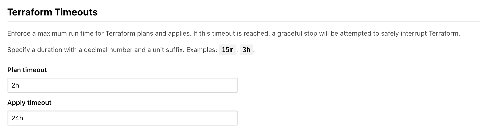
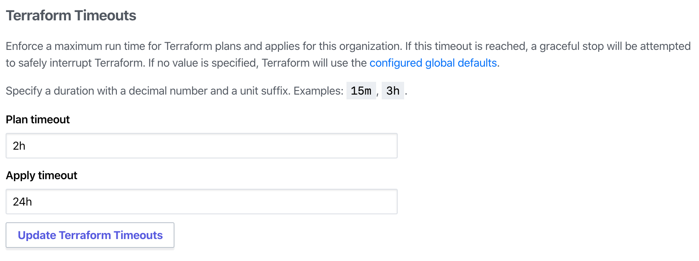

[speculative plans]: /docs/cloud/run/index.html#speculative-plans

# Administration: General Settings

General settings control global behavior in Terraform Enterprise. To access general settings, visit the site admin area and click **Settings** in the left menu. To save the settings, click **Save Settings** at the bottom of the page.

-> **API:** See the [Admin Settings API](/docs/cloud/api/admin/settings.html).

## Contact Info

The support email address is used in system emails and other contact details. It defaults to support@hashicorp.com. If you'd like  users of your instance to reach out to a specific person or team when they have issues, it can be changed to a local email address.

## Organization Creation

Organization creation can be limited to site administrators or allowed for all users. Limiting organization creation to administrators means that the need for new organizations can be audited and their creation easily monitored.

When new user accounts are created, if they cannot create their own organizations, they will be unable to access any Terraform Cloud resources until they are added to a team.

## API Rate Limiting

By default, requests to the Terraform Cloud API from a single user or IP address are [limited to 30 requests per second](/docs/cloud/api/index.html#rate-limiting) to prevent abuse or hogging of resources. Since usage patterns may vary for a given instance, this can be updated to match local needs.

## Terraform Run Timeout Settings

The default time-out setting for Terraform runs are 2h for plans, and 24h for applies.

These are configurable on a global level:

or in the Admin settings at an organization level:

## Commit Statuses for Untriggered Speculative Plans

This setting affects Terraform Enterprise's behavior with shared VCS repositories that contain multiple Terraform configurations.

Workspaces that use part of a shared repository typically don't run plans for changes that don't affect their files; this includes [speculative plans][] on pull requests. Since "pending" status checks can block pull requests, a workspace will automatically send passing commit statuses for any PRs that don't affect its files.

However, if this results in sending too many status checks to your VCS provider due to a large number of workspaces sharing one VCS repository, you can disable this behavior and ignore the pending status checks for unaffected workspaces.

## Allow Speculative Plans on Pull Requests from Forks

~> **Note:** This setting is available in Terraform Enterprise versions v202005-1 or later. It is currently supported for the following VCS providers: GitHub.com, GitHub.com (OAuth), GitHub Enterprise, Bitbucket Cloud, Azure DevOps Server, Azure DevOps Services.

By default, this setting is disabled because Terraform Enterprise assumes that forks of a trusted repository are not necessarily themselves trusted. Enabling this setting may allow Terraform Enterprise to execute malicious code or expose sensitive information through [speculative plans][] on pull requests that originated from a repository fork.