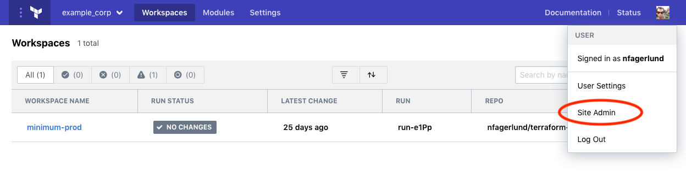

# Administering Private Terraform Enterprise

Private Terraform Enterprise (PTFE) is software provided to customers that allows full use of Terraform Cloud in a private, isolated environment.

Administration of a PTFE instance has two main domains:

- Installation, upgrades, and operational tasks like backups and monitoring, which take place outside the Terraform Cloud application.
- Administrative tasks and configuration within the application itself.

This section is about in-application administration, including general settings, systemwide integration settings, and management of accounts and resources. Administration functions can be managed via user interface (the focus of this guide) or via the [Admin API](/docs/cloud/api/admin/index.html).

## Accessing the Admin Interface

Only Private Terraform Enterprise users with the site-admin permission can access the administrative functions.

The initial user account for a PTFE instance is the first site admin. Site admins can grant admin permissions to other users in the "Users" section of the admin pages. See [Promoting a User to Administrator](./resources.html#promoting-a-user-to-administrator) for details.

To navigate to the site admin section of the UI, click your user icon in the upper right, then click **Site Admin**:

This will take you to the admin area. Currently, it defaults to showing the user management page; use the navigation on the left to access the other administrative functions.

## Administration Tasks

* [General settings](./general.html)
* [Service Integrations](./integration.html)
* [Managing Accounts and Resources](./resources.html)
