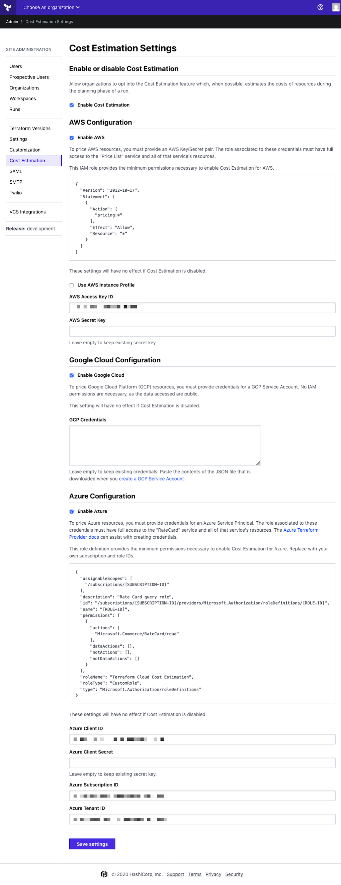
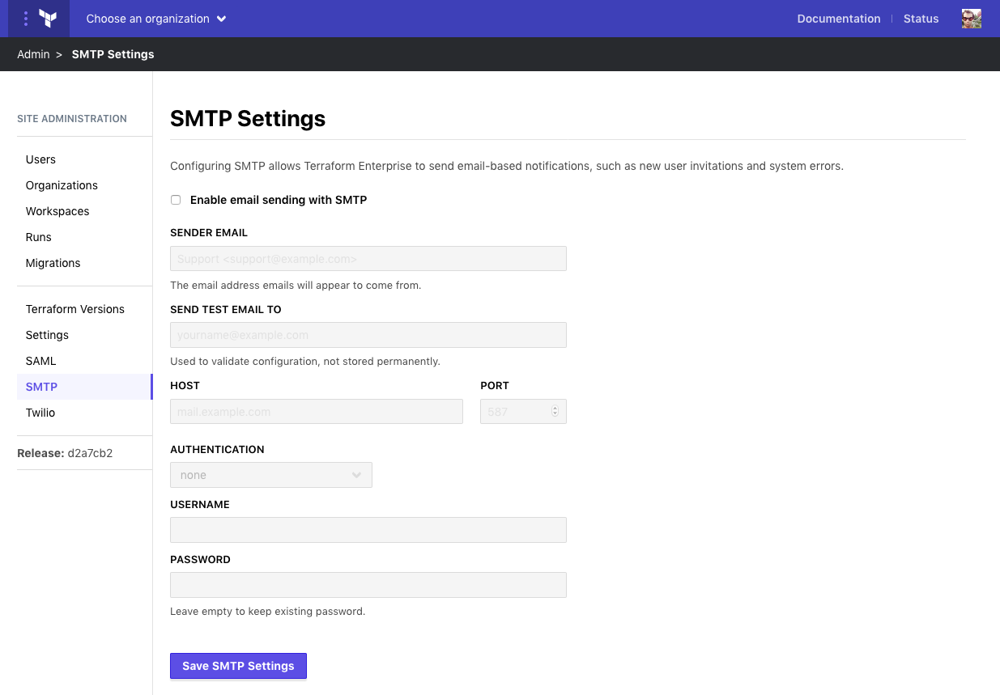
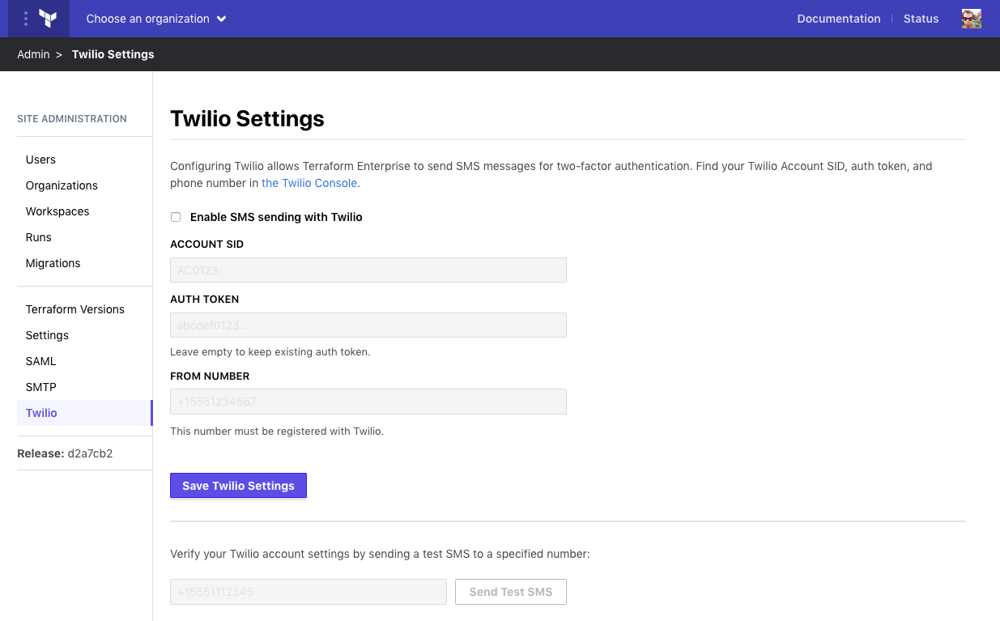

# Administration: Service Integrations

Terraform Enterprise can integrate with several external services to send communications and authenticate users. Each of these integrations has a separate page in the site admin section.

At this time, the available site-wide integrations are:

- Cost Estimation
- SAML Single Sign-On
- SMTP
- Twilio

-> **API:** See the [Admin Settings API](/docs/cloud/api/admin/settings.html).

## Cost Estimation Integration

Cost Estimation integration allows Terraform Enterprise to estimate costs for resources during a run. Usage instructions are in the [Getting Started Guide](/docs/cloud/getting-started/cost-estimation.html).

To access the Cost Estimation settings, click **Cost Estimation** in the left menu. To enable Cost Estimation, check the **Enable Cost Estimation** box on the settings page, configure the settings, and click "Save settings." At least one provider needs to be configured in order to save.

* **AWS Access Key ID**: The AWS Access Key ID for a given IAM user. The role associated to these credentials must have full access to the "Price List" service and all of that service's resources.
* **AWS Secret Key**: The AWS Secret Key pair for the same Access Key ID.
* **GCP Credentials**: The contents of the JSON that is downloaded when you create a GCP Service Account.
* **Azure Client ID**: The Azure Client ID for a given Service Account. The role associated to these credentials must have full access to the `RateCard` service and all of that service's resources.
* **Azure Client Secret**: The Azure Client Secret pair for the same Client ID.
* **Azure Subscription ID**: The Azure Subscription ID for your account.
* **Azure Tenant ID**: The Azure Subscription ID for your account.

## SAML Integration

The SAML integration settings allow configuration of a SAML Single Sign-On integration for Terraform Enterprise. To access the SAML settings, click **SAML** in the left menu.

-> **Note:** Since enabling SAML is an involved process, there is a [separate SAML section of the documentation](../saml/index.html). Consult those pages for detailed requirements and configuration instructions for both Terraform Enterprise and your IdP.

To enable SAML, click **Enable SAML single sign-on** under "SAML Settings". Configure the fields below, then click **Save SAML settings**. To update the settings, update the field values, and save.

The **Enable SAML debugging** option can be used if sign-on is failing. It provides additional debugging information during login tests. It should not be left on during normal operations.

## SMTP Integration

SMTP integration allows Terraform Enterprise to send email-based notifications, such as new user invitations, password resets, and system errors. We strongly recommend configuring SMTP.

To access the SMTP settings, click **SMTP** in the left menu. To enable SMTP, check the **Enable email sending with SMTP** box on the settings page, configure the settings, and click "Save SMTP settings."

* **Sender Email**: The address that system mails should come from. A plain email address; do not include a display name.
* **Send test email to**: A sample address to send a test email to. Used to validate the settings when configuring SMTP; not stored.
* **Host** and **Port**: The host and port details for the SMTP server that will be used.
* **Authentication**: The type of authentication used by the server. Options are `none`, `login`, and `plain`.
* **Username**: Username used to authenticate to the server. Not required if the authentication setting is `none`.
* **Password**: Password to authenticate to the server. Not required if the authentication setting is `none`.

-> **Note**: The SMTP server used with Terraform Enterprise must support connection via SSL with a valid certificate and `STARTTLS` secure communication; `SMTPS` is not supported in Terraform Enterprise.

## Twilio Integration

Twilio integration is used to send SMS messages for two-factor authentication. It is optional; application-based 2FA is also supported.

To access the Twilio settings, click **Twilio** in the left menu. To enable Twilio, check the **Enable SMS sending with Twilio** box on the settings page and configure the relevant settings:

* **Account SID**: The unique identifier for your Twilio [application](https://www.twilio.com/docs/usage/api/applications).
* **Auth Token**: The token that allows [authentication](https://support.twilio.com/hc/en-us/articles/223136027-Auth-Tokens-and-How-to-Change-Them) with your Account SID.
* **From Number**: The number the message should come from. Must be registered with Twilio.

You can also verify the Twilio settings by sending a test message. Enter a number in the bottom box and click **Send Test SMS**.
