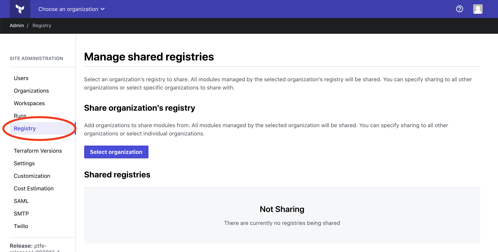
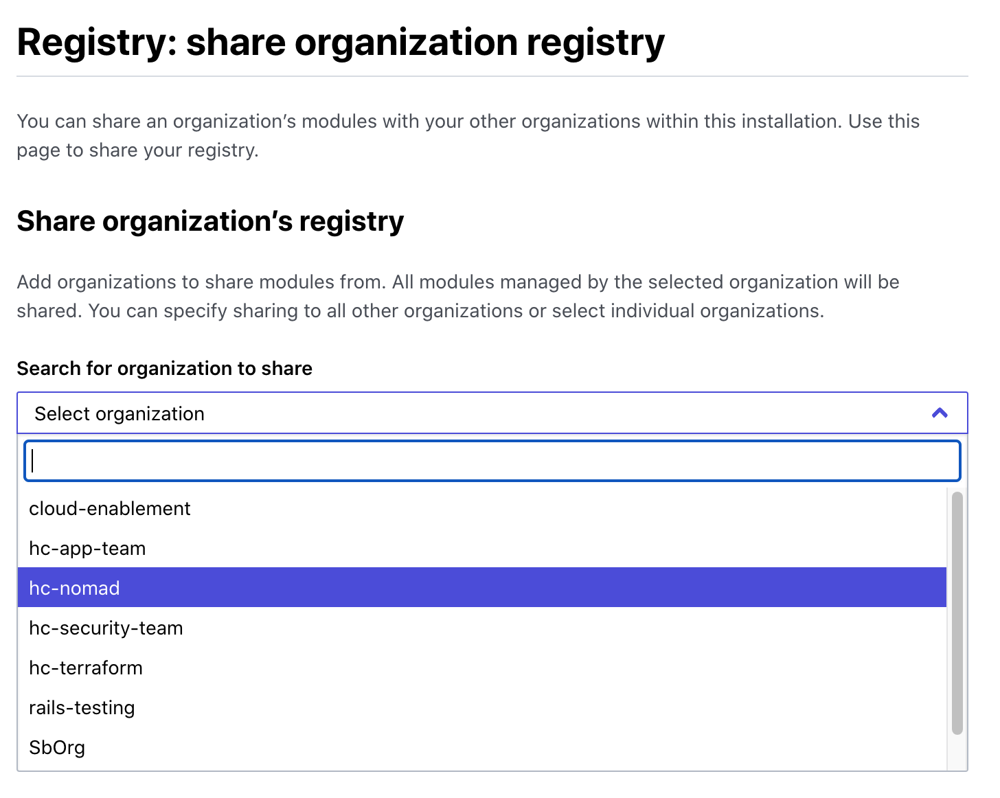
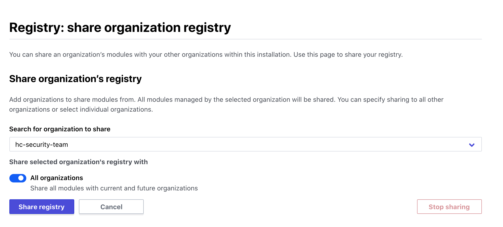
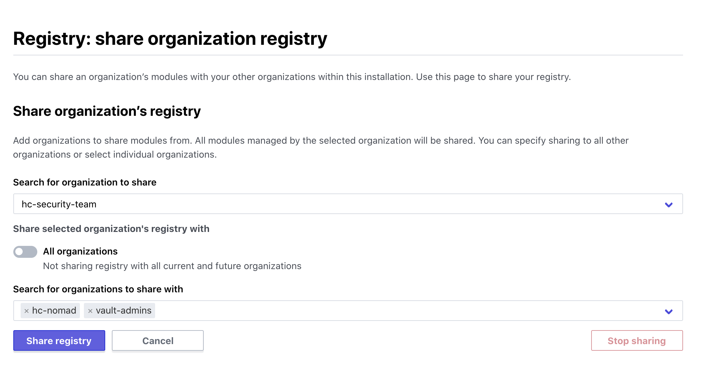
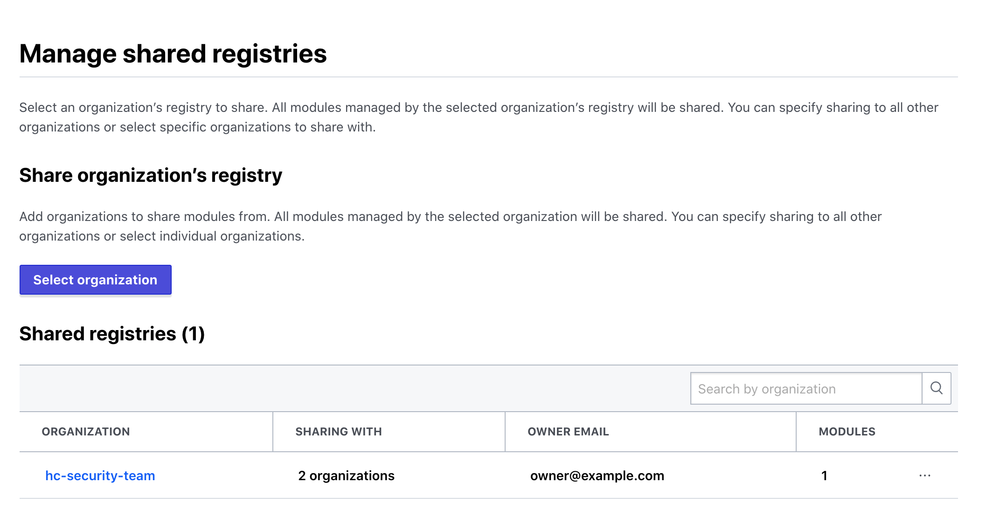
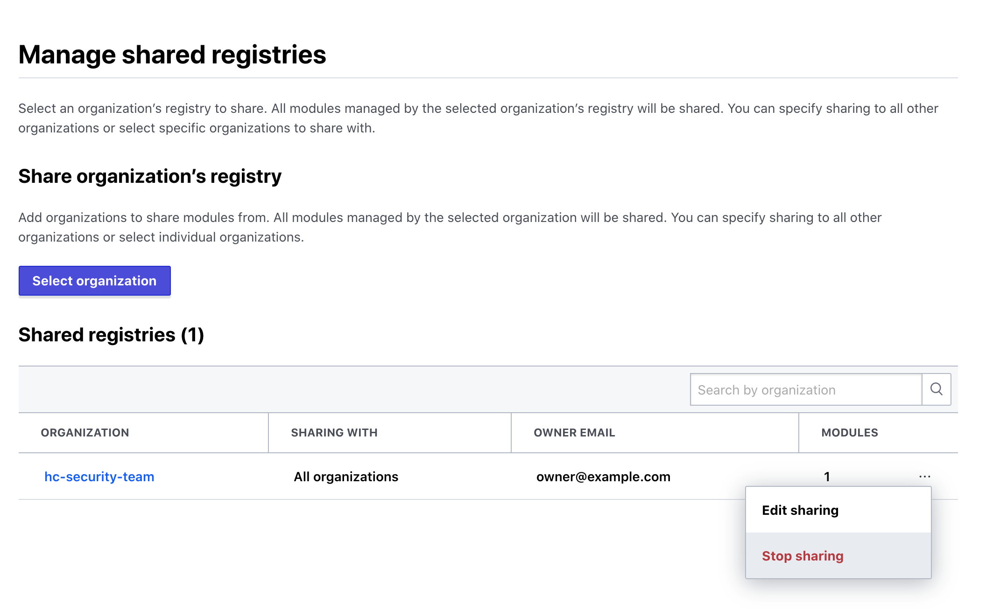
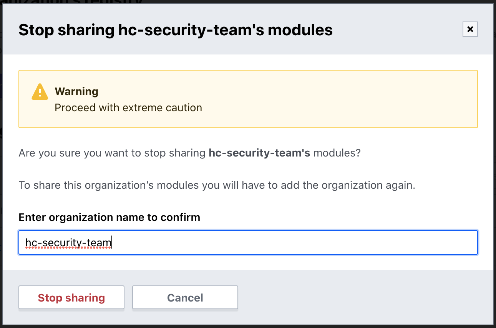

# Administration: Module Sharing

Site administrators can share modules from an organization's private registry with other organizations in the same Terraform Enterprise instance. This allows other organizations to use these modules in their Terraform configuration without needing to ingress or maintain the modules themselves.
  
There are two ways to share modules between organizations:

1. [Global module sharing](#global-module-sharing): modules from an organization are available to all other organizations in that Terraform Enterprise instance
1. [Module partnership sharing](#module-partnership-sharing): modules from an organization are available to a specific set of organizations in that Terraform Enterprise instance

**Note:** The two sharing options are mutually exclusive, so turning one on will turn the other one off. This means that if you have configured a set of module partnerships for an organization, they will be lost if you switch that organization to use global module sharing.

-> **API:** See the [Admin Organizations API](/docs/cloud/api/admin/organizations.html), and [Admin Module Sharing API](/docs/cloud/api/admin/module-sharing.html).

## Managing Shared Registries

To access the list of shared registries in the Terraform Enterprise instance, click **Registry** in the left menu.

Click on **Select organization** to choose the organization that contains the modules to share. Type the name of the sharing organization or select it from the drop-down.

Once you select the sharing organization, you can configure the sharing type.

### Global Module Sharing

To share the organization's modules with all other organizations in the Terraform Enterprise instance, click the toggle switch next to **All organizations**.

Click **Share registry** to save the sharing settings. You will be redirected to the initial registry sharing page, which now shows the organization sharing its registry with "All organizations".

### Module Partnership Sharing

To share the organization's modules with a limited group of organizations, the **All organizations** toggle should be turned off. Add a list of consuming organizations by clicking on the dropdown below and selecting the name(s) of the organizations who will be able to access modules from the sharing organization. If you have many organizations in the dropdown, you can start typing the name to filter the list.

Once you have selected a list of organizations to share with, click **Share registry** to save the sharing settings. You will be redirected to the initial registry sharing page, which now shows how many organizations the organization is sharing its registry with.

## Stop Sharing a Registry

~> **Important**: Removing or changing existing sharing settings can break Terraform workspaces for organizations that are using shared modules. Proceed with caution!

To stop sharing modules from the **Registry** page, click on the three dots to the right of any organization that's currently sharing modules.

Click **Stop sharing**. You will be prompted to confirm the action by typing in the name of the organization.

## Edit Registry Sharing Settings

If you wish to change sharing settings for an organization, from the **Registry** page, click on the three dots to the right of any organization that's currently sharing modules. Click **Edit sharing** and you will be able to modify the sharing settings for that organization. For example, you may wish to:

- Share modules with an additional organization (add a module consumer)
- Stop sharing modules with an organization (remove a module consumer)
- Change an organization from module partnership sharing to global sharing
