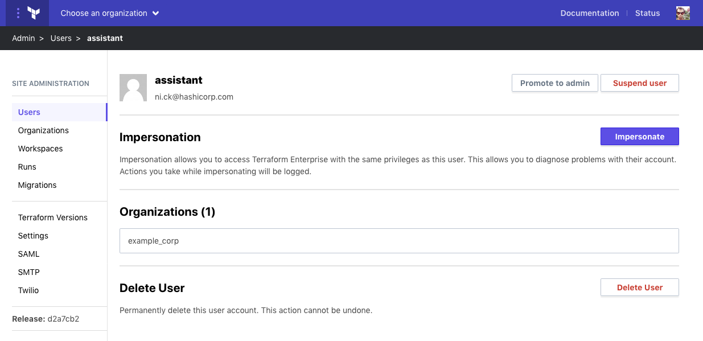
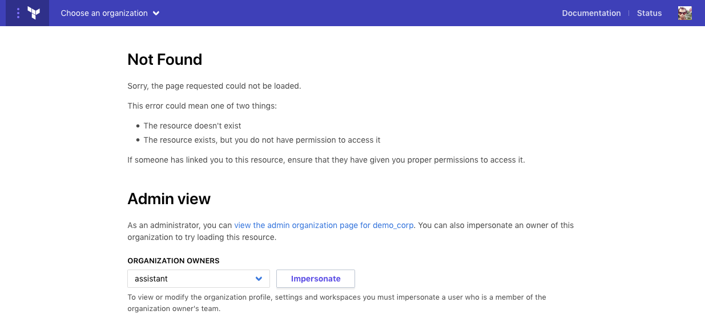
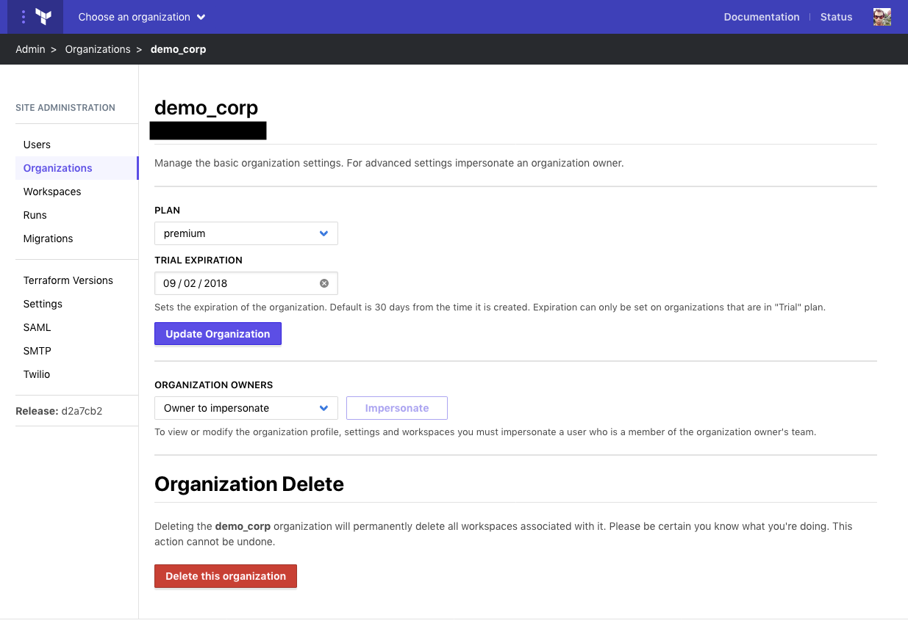
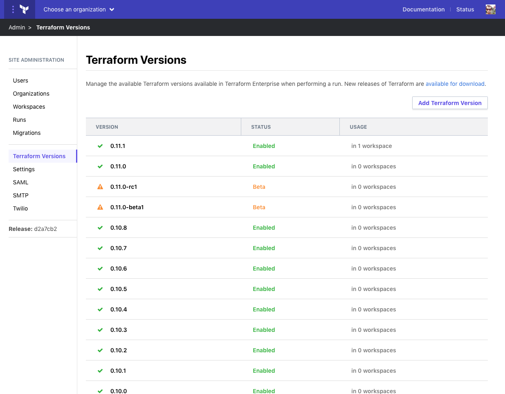
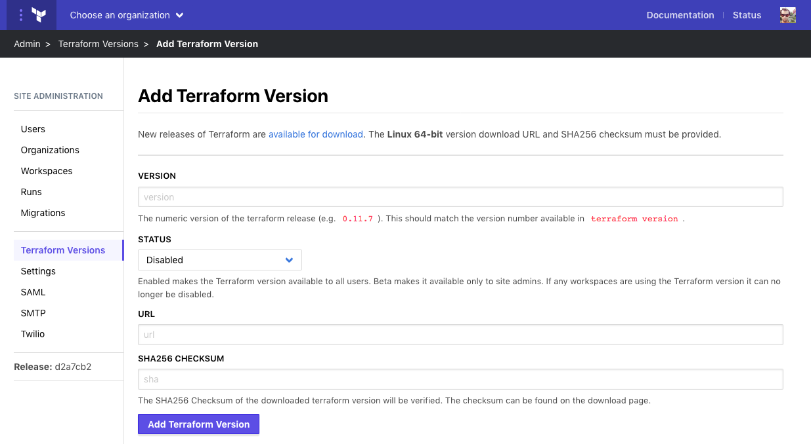

# Administration: Managing Accounts and Resources

Site administrators have access to all organizations, users, runs, and workspaces. This visibility is intended to provide access to management actions such as adding administrators, updating Terraform versions or adding custom Terraform bundles, suspending or deleting users, and creating or deleting organizations. It also allows for "impersonation" to aid in assisting regular users with issues in the Terraform Cloud application.

## Viewing, Searching, and Filtering Lists

Each type of account or resource is initially presented as a searchable list, accessed by clicking the name of the resource on the left. In addition to searching or filtering (typically by email, name, or other relevant attribute), there are pre-existing filters to show useful sets, such as site administrators (users) or "Needs Attention" (workspaces, runs).

## Managing Users

-> **API:** See the [Admin Users API](/docs/cloud/api/admin/users.html).

To access the list of all users in the Terraform Enterprise instance, click **Users** in the left menu.

Selecting a user from the list shows their detail page, which includes their status and any organizations they belong to. The detail page offers four actions: promoting to administrator, suspending, deleting, and impersonating. For users with active [two-factor authentication (2FA)](/docs/cloud/users-teams-organizations/2fa.html), it also offers an administrative option to disable their 2FA in the event that a reset is needed.

### Promoting a User to Administrator

This adds the user to the list of site administrators, which grants them access to this administrative area. Because admins have a very wide purview, if SMTP is configured, it will also send an email to the other site administrators notifying them that a user was added.

To promote a user, click **Promote to admin** at the top right of the user detail page.

### Suspending or Deleting a User

Suspending a user retains their account, but does not allow them to access any Terraform Cloud resources. Deleting a user removes their account completely; they would have to create a new account in order to log in again.

Suspended users can be unsuspended at any time. Deleted users cannot be recovered.

To suspend a user, click **Suspend user** at the upper right. To delete them, click **Delete User** in the "Delete User" section.

### Impersonating a User

User impersonation allows Terraform Enterprise admins to access organization and workspace data and view runs. As an administrator, direct access to these resources only supports urgent interventions like deletion or force-canceling; to view and interact with resources, impersonation is required.

When impersonating a user, a reason is required and will be logged to the audit log. Any actions taken while impersonating will record both the impersonating admin and the impersonated user as the actor.

Impersonation can be performed from multiple places:

- From a user details admin page, by clicking the **Impersonate** button on the far right.
- From an organization, workspace, or run details admin page, all of which include a drop-down list of organization owners to impersonate.
- When a site admin encounters a 404 error for a resource that they do not have standard user access to.

### Resetting Two-Factor Authentication

If a user has lost access to their 2FA device, a site admin can disable the configured 2FA and allow the user to log in using only their username and password or perform a standard password reset. If the user has active 2FA, a button labeled **Disable 2FA** will appear to the left of the admin promotion button.

Be sure that the user's identity and the validity of their request have been verified according to appropriate security procedures before disabling their configured 2FA.

-> **Note:** If the user belongs to an organization that requires 2FA, upon login, they will be redirected to [set it up again](/docs/cloud/users-teams-organizations/2fa.html) before they can view any other part of TFE.

## Managing Organizations

-> **API:** See the [Admin Organizations API](/docs/cloud/api/admin/organizations.html).

If your institution uses multiple organizations in Terraform Enterprise, you can view the details of each organization by clicking it in the admin list of organizations. From the details page, you can impersonate an owner or delete an organization (using the red **Delete this organization** button at the bottom of the details page).

Typically, all organizations on a Terraform Enterprise instance are granted "Premium" plan status to ensure access to all available features. However, it's also possible to set other statuses. An organization whose trial period is expired will be unable to make use of features in the Terraform Cloud application.

## Managing Workspaces and Runs

-> **API:** See the [Admin Workspaces API](/docs/cloud/api/admin/workspaces.html) and [Admin Runs API](/docs/cloud/api/admin/runs.html).

The administrative view of workspaces and runs provides limited detail (name, status, and IDs) to avoid exposing sensitive data when it isn't needed. Site administrators can view and investigate workspaces and runs more deeply by impersonating a user with full access to the desired resource. (See [Impersonating a User](#impersonating-a-user) above.)

### Deleting Workspaces

A workspace can be administratively deleted, using the **Delete this Workspace** button at the bottom of its details page, if it should not have been created, or is presenting issues for the application.

### Force-Canceling Runs

A run can be administratively force-canceled if it becomes stuck or is presenting issues to the application. Runs can be force-canceled from the run list or the run details page. The run details page also offers the option to impersonate an organization owner for additional details on the run.

We recommend impersonating a user (if necessary) to view run details prior to force-canceling a run, to ensure that graceful cancellation was attempted, and that the run is no longer progressing.

## Managing Terraform Versions

-> **API:** See the [Admin Terraform Versions API](/docs/cloud/api/admin/terraform-versions.html).

Terraform Enterprise ships with a default list of Terraform versions. However, the addition of new versions after installation is the responsibility of site administrators.

To add a new version of Terraform, click **Terraform Versions** in the left menu and **Add Terraform Version** in the upper right, then provide the version number, Linux 64-bit download URL, and SHA256 checksum of the binary. Set the status to Beta to make the version available to site administrators, or Enabled to add it for everyone.

The versions you add may be recent standard Terraform releases from HashiCorp, or custom Terraform versions. One common use for custom versions is to add a Terraform bundle that includes [pre-installed providers](/docs/cloud/run/index.html#custom-and-community-providers) commonly needed by the instance.

Versions of Terraform can also be modified by clicking them in the list. They can be set to disabled (unavailable for use) if no workspaces are currently using them. The list indicates how many workspaces are currently using a given version.
