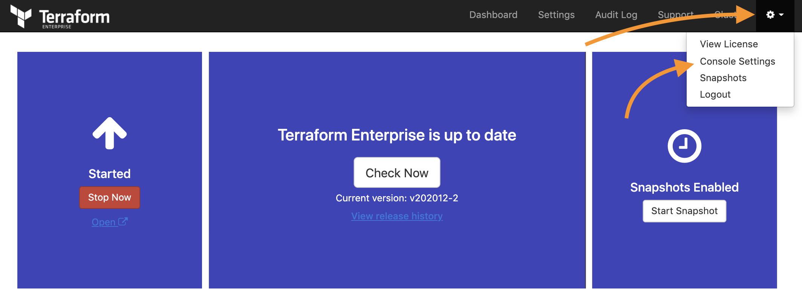
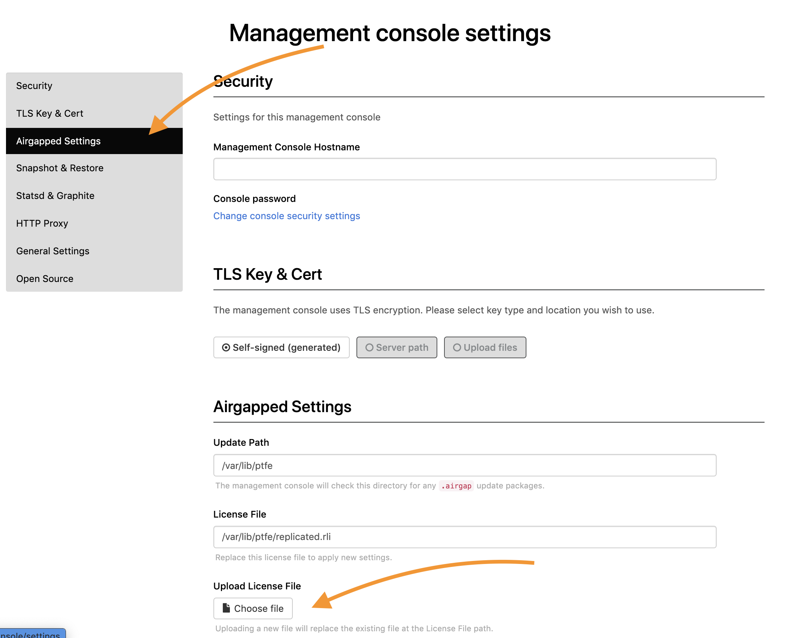

Terraform Enterprise requires an up-to-date license to maintain normal operations. These licenses have an expiration date, and must be updated once expired. This article provides the guidelines for updating licenses in Terraform Enterprise.

## Find the License Expiration Date

You can find the expiration date through either the Replicated console UI or the Replicated command line interface.

### Replicated Console

1.  Navigate to the Replicated console at `https://<<TFE_HOSTNAME>>:8800`, and click on the gear icon in the top-right corner.

    

2.  Select the **View License** menu to display the license details, including the expiration date.

    

### Replicated Command Line Interface

1.  Connect to the Terraform Enterprise host machine using SSH.

2.  Use the `replicatedctl license inspect` command to inspect the license information. The `ExpirationTime` value in the output indicates the expiration date/time in UTC.

    ```shell
        $ replicatedctl license inspect
        [
        {
           "ID": "670bd320b95245325d80be703330f9b3",
           "Assignee": "Test Customer Name",
           "LegacyChannelName": "Stable",
           "ChannelID": "",
           "Channels": [],
           "ExpirationTime": "2021-06-30T00:00:00Z",
           "ExpirationPolicy": "ignore",
           "IsExpired": false,
           "IsActivationRequired": false,
           "ActivationEmail": "",
           "Fields": [
               {
                   "FieldName": "max_hosts",
                   "FieldTitle": "Maximum Number of Hosts",
                   "FieldType": "Integer",
                   "Value": "9999"
               },
               {
                   "FieldName": "min_hosts",
                   "FieldTitle": "Minimum Number of Hosts",
                   "FieldType": "Integer",
                   "Value": "1"
               }
           ]
        }
        ]
    ```

## Update License - Online Installation Type

### Automatic Updates

With the online installation type, you can use the following steps to configure Terraform Enterprise to periodically check for the updated license.

1.  Navigate to the Replicated console at `https://<<TFE_HOSTNAME>>:8800`

2.  Click on the gear icon in the top-right corner select the **Console Settings** menu.

    

3.  Scroll down to the **License Sync** section and select how often Terraform Enterprise should check the license.

    

### Manual Updates

#### Replicated Console

1.  Navigate to the Replicated console at `https://<<TFE_HOSTNAME>>:8800`, click on the gear icon on the top-right corner, and select the **View License** menu.

    

2.  Click on **Sync License** to start the operation.

    

#### Replicated Command Line Interface

1.  Obtain the newly updated license file from HashiCorp and copy it to the Terraform Enterprise host machine.

2.  Connect to the Terraform Enterprise host machine using SSH.

3.  Use the following command to load the new license.

        $ replicatedctl license-load < /path/to/license.rli

## Update License - Airgap Installation Type

### Replicated Console

1.  Navigate to the Replicated console, which is located at `https://<<TFE_HOSTNAME>>:8800`.

2.  Click on the gear icon on the top-right corner and select the **Console Settings** menu.

    

3.  Select **Airgapped Settings** from the left-hand menu and upload the license.

    

### Replicated Command Line Interface

1.  Obtain the updated license and airgap package from HashiCorp and copy them to the Terraform Enterprise host.

2.  Connect to the Terraform Enterprise host machine using SSH.

3.  Execute the following command, updating the paths as needed.

        ```shell
        $ replicatedctl license-load \
            --airgap-package /path/to/bundle.airgap < /path/to/license.rli
        ```

## Troubleshooting Guides

### No error but the license is not updated

In the Airgap installation, the license update operation may finish without any error but the license detail displayed on the Replicated console or the Replicated command line output is still not updated. This symptom can be related to the incorrect license file being used. In order to further identify the symptom, please follow these steps:

1.  Connect to the Terraform Enterprise host machine using SSH.

2.  Examine the output of the command `docker logs replicated` and look for the warning message below.

         ```plaintext
         WARN 2021-02-22T01:40:00+00:00 tasks/app_tasksteps.go:113 Airgap license on disk does not match installed license
         ```

3.  If this warning message occurs, it indicates that the incorrect license file is being used. Please contact your Customer Success Manager if you have one assigned to your account, or contact [HashiCorp Support](https://www.hashicorp.com/technical-support-services-and-policies) for further assistance. When contacting support, please include the output from the `replicatedctl license inspect` command after running it on the existing Terraform Enterprise host machine.

### Unable to sync license: Error: Unsuccessful HTTP response

The error message below may occur due to several possible issues.

    ```plaintext
    Unable to sync license: Error: Unsuccessful HTTP response
    ```

*   Network communication to the Replicated servers

    This symptom can happen with the online installation type when the current network infrastructure has changed since the installation of Terraform Enterprise. Terraform Enterprise requires network communication to the Replicated endpoints, as noted in the [network requirements](https://www.terraform.io/docs/enterprise/before-installing/network-requirements.html) guideline. With the license sync operation, the Replicated installer will attempt to contact `api.replicated.com` in order to retrieve the license information. The specific IP addresses of Replicated services for the Terraform Enterprise can be found in [Replicated’s GitHub repository](https://github.com/replicatedhq/ips/blob/master/ip_addresses.json).

*   Mismatched customer name between the installed license and the new license.

    This symptom can happen with the Airgap installation type in some conditions, for example, when a trial license was issued with a customer name and the new paid license was issued on a different customer name. If you are on the Airgap installation and encountered this error, please contact [HashiCorp Support](https://www.hashicorp.com/technical-support-services-and-policies) together with the output from the command `replicatedctl license inspect` from the existing Terraform Enterprise host machine to request for further assistance.

### Incorrect version of airgap file

This error indicates that you are using the incorrect version of airgap file against the installed version of Terraform Enterprise.

    ```plaintext
    installed app release (325b33bf0ad539c994644423128cad5e:502) does not match the airgap package
    ```

The airgap download page displays the versions of Terraform Enterprise and their SHA256 checksum values. Check these against the version of the airgap package in your local environment.


## Get Support

If you continue to experience the issues, please contact [HashiCorp Support](https://www.hashicorp.com/technical-support-services-and-policies) for assistance.
