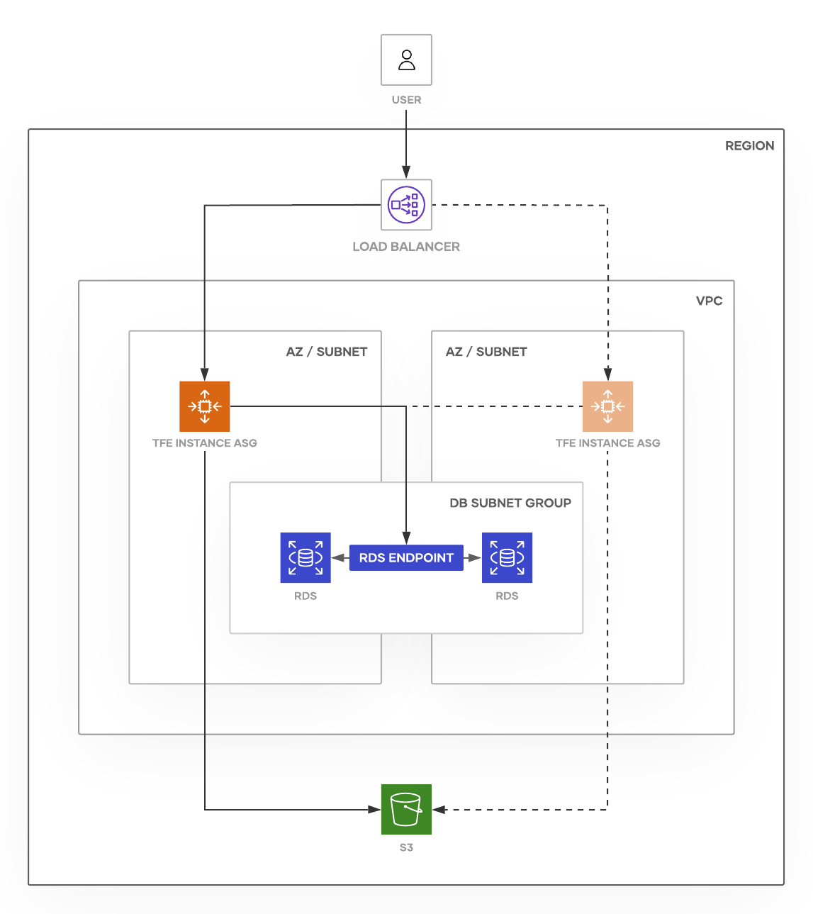
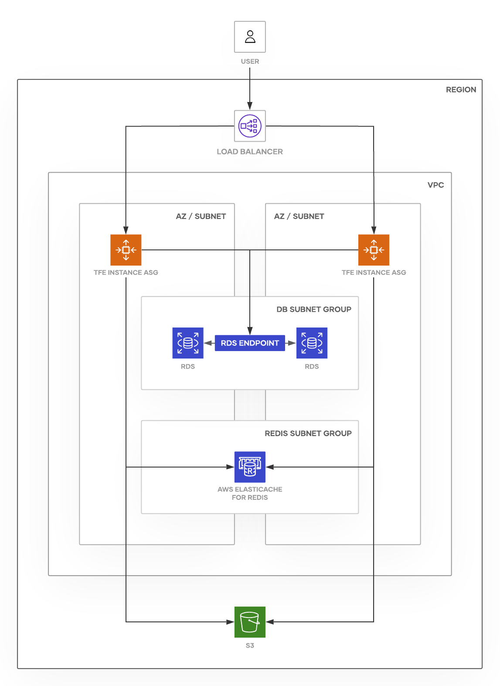

# Terraform Enterprise AWS Reference Architecture

## Introduction

This document provides recommended practices and a reference architecture for
HashiCorp Terraform Enterprise implementations on AWS.

## Implementation Modes

Terraform Enterprise can be installed and function in different implementation modes with increasing capability and complexity:

- _Standalone:_ The base architecture with a single application node that supports the standard implementation requirements for the platform.
- _Active/Active:_ This is an extension of _Standalone_ mode that adds multiple active node capability that can expand horizontally to support larger and increasing execution loads.

Since the architectures of the modes progresses logically, this guide will present the base _Standalone_ mode first and then discuss the differences that alter the implementation into the _Active/Active_ mode.

## Required Reading

Prior to making hardware sizing and architectural decisions, read through the
[pre-install checklist](../index.html)
to familiarize yourself with the application components and architecture.
Further, read the [reliability and availability
guidance](../../system-overview/reliability-availability.html)
as a primer to understanding the recommendations in this reference
architecture.

## Infrastructure Requirements

-> **Note:** This reference architecture focuses on the _External Services_ operational mode.

Depending on the chosen [operational
mode](../index.html#operational-mode-decision),
the infrastructure requirements for Terraform Enterprise range from a single AWS EC2 instance
for demo installations to multiple instances connected to RDS and S3 for a
stateless production installation.

The following table provides high-level server guidelines. Of particular
note is the strong recommendation to avoid non-fixed performance CPUs,
or “Burstable CPU” in AWS terms, such as T-series instances.

### Terraform Enterprise Server (EC2 via Auto Scaling Group)

| Type    | CPU    | Memory    | Disk | AWS Instance Types |
|---------|--------|-----------|------|--------------------|
| Minimum | 4 core | 16 GB RAM | 50GB | m5.xlarge          |
| Scaled  | 8 core | 32 GB RAM | 50GB | m5.2xlarge         |

#### Hardware Sizing Considerations

- The minimum size would be appropriate for most initial production
  deployments, or for development/testing environments.

- The scaled size is for production environments where there is a
  consistent high workload in the form of concurrent Terraform runs.

### PostgreSQL Database (RDS Multi-AZ)

| Type    | CPU    | Memory    | Storage | AWS Instance Types |
|---------|--------|-----------|---------|--------------------|
| Minimum | 4 core | 16 GB RAM | 50GB    | db.m4.xlarge       |
| Scaled  | 8 core | 32 GB RAM | 50GB    | db.m4.2xlarge      |

#### Hardware Sizing Considerations

- The minimum size would be appropriate for most initial production
  deployments, or for development/testing environments.

- The scaled size is for production environments where there is a
  consistent high workload in the form of concurrent Terraform runs.

### Object Storage (S3)

An [S3 Standard](https://aws.amazon.com/s3/storage-classes/) bucket must be
specified during the Terraform Enterprise installation for application data to be stored
securely and redundantly away from the EC2 servers running the Terraform Enterprise
application. This S3 bucket must be in the same region as the EC2 and RDS
instances. It is recommended the VPC containing the Terraform Enterprise servers be configured
with a [VPC endpoint for
S3](https://docs.aws.amazon.com/AmazonVPC/latest/UserGuide/vpc-endpoints.html).
Within the Terraform Enterprise application, Vault is used to encrypt all application data stored in the S3 bucket.  This
allows for further [server-side
encryption](https://docs.aws.amazon.com/AmazonS3/latest/dev/serv-side-encryption.html)
by S3 if required by your security policy.

### Other Considerations

#### Additional AWS Resources

In order to successfully provision this reference architecture you must
also be permitted to create the following AWS resources:

- VPC
- Subnet
- Route Table
- Route Table Association
- Security Group
- Load Balancer (Application, Network, or Classic Load Balancer)
- Launch Configuration
- Auto Scaling Group
- Target Group (if using Application or Network Load Balancer)
- CloudWatch Alarm
- IAM Instance Profile
- IAM Role
- IAM Role Policy
- Route 53 (optional)

#### Network

To deploy Terraform Enterprise in AWS you will need to create new or use existing
networking infrastructure. The below infrastructure diagram highlights
some of the key components (VPC, subnets, DB subnet group) and you will
also have security group, routing table and gateway requirements. These
elements are likely to be very unique to your environment and not
something this Reference Architecture can specify in detail. An [example Terraform
configuration](https://github.com/hashicorp/private-terraform-enterprise/blob/master/examples/aws/network/main.tf)
is provided to demonstrate how these resources can be provisioned and
how they interrelate.

#### DNS

DNS can be configured external to AWS or using [Route 53](https://aws.amazon.com/route53/). The
fully qualified domain name should resolve to the Load Balancer (if using one) or the Terraform Enterprise instance using a
CNAME if using external DNS or an [alias
record set](https://docs.aws.amazon.com/Route53/latest/DeveloperGuide/resource-record-sets-choosing-alias-non-alias.html)
if using Route 53. Creating the required DNS entry is outside the scope
of this guide.

Another approach would be to use an external registrar or DNS server to point to a Route 53 CNAME record using
a canonical, but not necessarily public, domain name, which then forwards to the ALIAS record for the ELB. This
pattern is required if using Route 53 Health Checks and failover pairs to automatically fail over to the standby
instance. This is documented further below.

#### SSL/TLS Certificates and Load Balancers

An SSL/TLS certificate signed by a public or private CA is required for secure communication between
clients, VCS systems, and the Terraform Enterprise application server. The certificate can be specified during the
UI-based installation or in a configuration file used for an unattended installation.

If a Classic or Application Load Balancer is used, SSL/TLS will be terminated on the load balancer.
In this configuration, the Terraform Enterprise instances should still be configured to listen
for incoming SSL/TLS connections. If a Network Load Balancer is used, SSL/TLS will be terminated on the Terraform Enterprise instance.

HashiCorp does not recommend the use of self-signed certificates on the Terraform Enterprise instance unless you use a
Classic or Application Load Balancer and place a public certificate (such as an AWS Certificate Manager certificate)
on the load balancer. Note that certificates cannot be placed on Network Load Balancers.

If you want to use a Network Load Balancer (NLB) with Terraform Enterprise, use either an internet-facing NLB or an internal NLB that targets by IP.
An internal NLB that targets by instance ID cannot be used with Terraform Enterprise since NLBs configured in this way do not support loopbacks.
Amazon provides [load balancer troubleshooting](https://docs.aws.amazon.com/elasticloadbalancing/latest/network/load-balancer-troubleshooting.html)
information for Network Load Balancers.

A public AWS Certificate Manager (ACM) certificate cannot be used with a Network Load Balancer and Terraform Enterprise since certificates cannot
be placed on NLBs and AWS does not support exporting the private key for public ACM certificates. This means you cannot load
the private key of a public ACM certificate on your Terraform Enterprise instance.

### Infrastructure Diagram - Standalone

### Application Layer

The Application Layer is composed of an Auto Scaling Group and a Launch Configuration
providing an auto-recovery mechanism in the event of an instance or Availability Zone failure.

### Storage Layer

The Storage Layer is composed of multiple service endpoints (RDS, S3) all
configured with or benefiting from inherent resiliency
provided by AWS.

#### Additional Information

- [RDS Multi-AZ deployments](https://aws.amazon.com/rds/details/multi-az/)

- [S3 Standard storage class](https://aws.amazon.com/s3/storage-classes/)

## Infrastructure Provisioning

The recommended way to deploy Terraform Enterprise is through use of a Terraform configuration
that defines the required resources, their references to other resources, and associated
dependencies.

## Normal Operation

### Component Interaction

The Load Balancer routes all traffic to the Terraform Enterprise instance, which is managed by
an Auto Scaling Group with maximum and minimum instance counts set to one.

The Terraform Enterprise application is connected to the PostgreSQL database via the RDS
Multi-AZ endpoint and all database requests are routed via the RDS
Multi-AZ endpoint to the *RDS-main* database instance.

The Terraform Enterprise application is connected to object storage via the S3 endpoint
for the defined bucket and all object storage requests are routed to the
highly available infrastructure supporting S3.

### Monitoring

There is not currently a full monitoring guide for Terraform Enterprise. The following pages include information relevant to monitoring:

- [Logging](../../admin/logging.html)
- [Diagnostics](../../support/index.html)
- [Reliability and Availability](../../system-overview/reliability-availability.html)

### Upgrades

See [the Upgrades section](../../admin/upgrades.html) of the documentation.

## High Availability - Failure Scenarios

AWS provides availability and reliability recommendations in the [Well-Architected
framework](https://aws.amazon.com/architecture/well-architected/).
Working in accordance with those recommendations, the Terraform Enterprise Reference
Architecture is designed to handle different failure scenarios with
different probabilities. As the architecture evolves it will provide a
higher level of service continuity.

### Terraform Enterprise Server

By utilizing an Auto Scaling Group, a Terraform Enterprise instance can automatically recover
in the event of any outage except for the loss of an entire region.

In the event of a Terraform Enterprise instance failing in a way that AWS can
observe, the health checks on the Auto Scaling Group trigger, causing
a replacement instance to be launched. Once launched,
it reinitializes the software, and on completion, processing on this EC2 instance will
resume as normal.

With *External Services* (PostgreSQL Database, Object Storage) in use,
there is still some application configuration data present on the Terraform Enterprise server
such as installation type, database connection settings, hostname. This data
rarely changes. If the configuration on Terraform Enterprise changes you should update the
Launch Configuration to include the updates so that any newly
launched EC2 instance uses them.

### Availability Zone Failure

In the event of the Availability Zone hosting the main instances (EC2
and RDS) failing, the Auto Scaling Group for the EC2 instance will automatically
begin booting a new one in an operational AZ.

- Multi-AZ RDS automatically fails over to the RDS Standby Replica
  (*RDS-standby*). The [AWS documentation provides more
  detail](https://docs.aws.amazon.com/AmazonRDS/latest/UserGuide/Concepts.MultiAZ.html)
  on the exact behavior and expected impact.

- S3 is resilient to Availability Zone failure based on its architecture.

See below for more detail on how each component handles Availability Zone failure.

### PostgreSQL Database

Using RDS Multi-AZ as an external database service leverages the highly
available infrastructure provided by AWS. From the AWS website:

> *In a Multi-AZ deployment, Amazon RDS automatically provisions and
> maintains a synchronous standby replica in a different Availability
> Zone. In the event of a planned or unplanned outage of your DB
> instance, Amazon RDS automatically switches to a standby replica in
> another Availability Zone. ([source](https://docs.aws.amazon.com/AmazonRDS/latest/UserGuide/Concepts.MultiAZ.html))*

### Object Storage

Using S3 as an external object store leverages the highly available
infrastructure provided by AWS. S3 buckets are replicated to all
Availability Zones within the region selected during bucket creation.
From the AWS website:

> *Amazon S3 runs on the world’s largest global cloud infrastructure,
> and was built from the ground up to deliver a customer promise of
> 99.999999999% of durability. Data is automatically distributed across
> a minimum of three physical facilities that are geographically
> separated within an AWS Region. ([source](https://aws.amazon.com/s3/))*

## Disaster Recovery - Failure Scenarios

AWS provides availability and reliability recommendations in the [Well-Architected
framework](https://aws.amazon.com/architecture/well-architected/). Working in accordance with those
recommendations the Terraform Enterprise Reference Architecture is designed to handle
different failure scenarios that have different probabilities. As the
architecture evolves it will provide a higher level of service
continuity.

### Data Corruption

The Terraform Enterprise application architecture relies on multiple service endpoints
(RDS, S3) all providing their own backup and recovery
functionality to support a low MTTR in the event of data corruption.

### PostgreSQL Database

Backup and recovery of PostgreSQL is managed by AWS and configured
through the AWS management console on CLI. More details of RDS for
PostgreSQL features are available [here](https://aws.amazon.com/rds/postgresql/)
and summarised below:

> *Automated Backups – The automated backup feature of Amazon RDS is
> turned on by default and enables point-in-time recovery for your DB
> Instance. Amazon RDS will backup your database and transaction logs
> and store both for a user-specified retention period.*
>
> *DB Snapshots – DB Snapshots are user-initiated backups of your DB
> Instance. These full database backups will be stored by Amazon RDS
> until you explicitly delete them.*

### Object Storage

There is no automatic backup/snapshot of S3 by AWS, so it is recommended
to script a bucket copy process from the bucket used by the Terraform Enterprise
application to a “backup bucket” in S3 that runs at regular intervals.
The [Amazon S3 Standard-Infrequent
Access](https://aws.amazon.com/s3/storage-classes/) storage class
is identified as a solution targeted more for DR backups than S3
Standard. From the AWS website:

> *Amazon S3 Standard-Infrequent Access (S3 Standard-IA) is an Amazon S3
> storage class for data that is accessed less frequently, but requires
> rapid access when needed. S3 Standard-IA offers the high durability,
> high throughput, and low latency of S3 Standard, with a low per GB
> storage price and per GB retrieval fee. This combination of low cost
> and high performance make S3 Standard-IA ideal for long-term storage,
> backups, and as a data store for disaster recovery. ([source](https://aws.amazon.com/s3/storage-classes/))*

## Multi-Region Deployment to Address Region Failure

Terraform Enterprise is currently architected to provide high availability within a
single AWS Region. Using multiple AWS Regions will give you greater
control over your recovery time in the event of a hard dependency
failure on a regional AWS service. In this section, implementation patterns to support this are discussed.

An identical infrastructure should be provisioned in a secondary AWS
Region. Depending on recovery time objectives and tolerances for
additional cost to support AWS Region failure, the infrastructure can be
running (Warm Standby) or stopped (Cold Standby). In the event of the
primary AWS Region hosting the Terraform Enterprise application failing, the secondary
AWS Region will require some configuration before traffic is directed to
it along with some global services such as DNS.

- [RDS cross-region read replicas](https://docs.aws.amazon.com/AmazonRDS/latest/UserGuide/USER_ReadRepl.html#USER_ReadRepl.XRgn) can be used in a warm standby architecture or [RDS database backups](https://docs.aws.amazon.com/AmazonRDS/latest/UserGuide/CHAP_CommonTasks.BackupRestore.html) can be used in a cold standby architecture.

- [S3 cross-region replication](https://docs.aws.amazon.com/AmazonS3/latest/dev/crr.html) must be configured so the object storage component of the Storage Layer is available in the secondary AWS Region.

- DNS must be redirected to the Load Balancer acting as the entry point for the infrastructure deployed in the secondary AWS Region.

## Active/Active Implementation Mode

### Overview

As stated previously, the _Active/Active_ implementation mode is an extension of the _Standalone_ implementation mode that increases the scalability and load capacity of the Terraform Enterprise platform. The same application runs on multiple Terraform Enterprise instances utilizing the same external services in a shared model. The primary architectural and implementation differences for _Active/Active_ are:

- It can only be run in the _External Services_ mode.
- The additional nodes are active and processing work at all times.
- In addition to the existing external services, there is a memory cache which is currently implemented with cloud native implementations of Redis. This is used for the processing queue for the application and has been moved from the individual instance to be a shared resource that manages distribution of work.
- There are additional configuration parameters to manage the operation of the node cluster and the memory cache.

The following sections will provide further detail on the infrastructure and implementation differences.

### Migration to Active/Active

If you are considering a migration from a _Standalone_ implementation to _Active/Active_, it is  straightforward and there is guidance available to assist with that effort. However, you should first make a determination if the move is necessary. The _Standalone_ mode is capable of handling significant load and the first paths to supporting higher load can be simply increasing the compute power in the existing implementation.  A discussion with your HashiCorp representatives may be warranted.

Also note that if your existing architecture does not already depict what is shown and discussed above, you will likely need to make adjustments to bring it into alignment. This could be either before or during the migration. Certain tenets of the reference architecture described here are highly recommended and potentially necessary to support _Active/Active_ mode such as load balancers and scaling groups.

### Infrastructure Diagram - Active/Active

The above diagram shows the infrastructure components of an _Active/Active_ implementation at a high-level.

### Infrastructure Requirements

#### Active Nodes

The diagram depicts two active nodes to be concise. Additional nodes can be added by altering your configuration to launch another instance that points to the same shared external services. The number and sizing of nodes should be based on load requirements and redundancy needs. Nodes should be deployed in alternate zones to accommodate zone failure.

The cluster is comprised of essentially independent nodes in a SaaS type model. There are no concerns of leader election or minimal or optimum node counts. When a new node enters the cluster it simply starts taking new work from the load balancer and from the memory cache queue and thus spreading the load horizontally.

#### Memory Cache

The AWS implementation of the memory cache is handled by [Amazon ElastiCache](https://aws.amazon.com/elasticache/). Specifically using [Amazon ElastiCache for Redis](https://aws.amazon.com/elasticache/redis/). [Getting Started with Amazon ElastiCache for Redis](https://docs.aws.amazon.com/AmazonElastiCache/latest/red-ug/GettingStarted.html) provides a high level walk-through of implementing the memory cache.

[Determine Your Requirements](https://docs.aws.amazon.com/AmazonElastiCache/latest/red-ug/cluster-create-determine-requirements.html) provides a high level description of the implementation options for the memory cache. Primary differentiators are Cluster Mode and Multi-AZ. The primary difference is how far high availability might extend. Cluster Mode extends the cluster to multiple Node Groups and will benefit larger scale, multi-client implementations. The only clients for Terraform Enterprise are the compute instances in a single region, so this is not required or suggested. Here is  additional information on [Managing Your ElastiCache Clusters](https://docs.aws.amazon.com/AmazonElastiCache/latest/red-ug/Clusters.html).

You should enable Multi-AZ with Redis Replication Groups where memory cache instances are replicated across availability zones as described in [Mitigating Failures](https://docs.aws.amazon.com/AmazonElastiCache/latest/red-ug/FaultTolerance.html). Note there will be a primary and read replicas across the AZs. This failover and promotion of primaries can be configured to happen automatically on an AZ failure. There should be a memory cache node in every AZ that has a Terraform Enterprise node is deployed. A lower testing or sandbox environment could use just a single node, however, a production level environment should always be configured for high availability to benefit from the HA features that coincide with the other external services in the Terraform Enterprise platform. Note there is also a rudimentary mechanism of transaction logs available called Redis Append Only Files (AOF) which is not recommended as an alternative.

The concept of Local Zone exists for Amazon ElasticCache. This is an extension of an AWS Region that is geographically close to your users. This is not required or recommended as the memory cache just needs to be close to TFE compute, limited locations are implemented so far, and it does not support Multi-AZ.

Sizing for Amazon ElasticCache is determined by cache ec2 instance sizes defined for the cluster. You can start the size off in a smaller range such as a "cache.m5.large" with some consideration of anticipated active load, and scale up or down as demand is understood by changing node size. with the aid of [Choosing Your Node Size](https://docs.aws.amazon.com/AmazonElastiCache/latest/red-ug/nodes-select-size.html#CacheNodes.SelectSize).

Enterprise-grade security is inherently covered in the Amazon ElasticCache implementation because Redis instances are protected from the internet using private IPs, and access to instances is controlled and limited to the account creating owning the cluster. Security Group(s) should be used to limit the access by port to the Redis cluster. Here is additional information on [Access Authorization](https://docs.aws.amazon.com/AmazonElastiCache/latest/red-ug/GettingStarted.AuthorizeAccess.html).

Terraform Enterprise supports Redis versions 4.0 and 5.0, but 5.0 is recommended unless there is strong reason to deviate. Amazon ElastiCache for Redis supports Redis versions from 2.x to 6.x down to the minor version, so do explicitly specify the version such as 5.0.6.

### Normal Operation

#### Component Interaction

The Load Balancer routes all traffic to the Terraform Enterprise instance, which is managed by
an Auto Scaling Group. This is a standard round-robin distribution for now, with no accounting for current load on the nodes. The instance counts on the Auto Scaling Group control the number of nodes in operation and can be used to increase or decrease the number of active nodes.

_Active/Active_ Terraform Enterprise is not currently architected to support dynamic scaling based on load or other factors. The maximum and minimum instance counts on the Auto Scaling Group should be set to the same value. Adding a node can be done at will bt setting these values. However, removing a node requires that the node be allowed to finish active work and stop accepting new work before being terminated. The operational documentation has the details on how to "drain" a node.

#### Replicated Console

The Replicated Console that allows access to certain information and realtime configuration for _Standalone_ is not available in _Active/Active_. This functionality, including generating support bundles, has been replaced with CLI commands to be executed on the nodes. The operational documentation has the details on how to utilize these commands.

#### Upgrades

Upgrading the Terraform Enterprise version still follows a similar pattern as with _Standalone_. However, there is not an online option with the Replicated Console. It is possible to upgrade a minor release with CLI commands in a rolling fashion. A "required" release or any change the potentially affects the shared external services will need to be done with a short outage. This involves scaling down to a single node, replacing that node, and then scaling back out. The operational documentation has the details on how these processes can operate.

### Failure Scenarios

#### Memory Cache

As mentioned, the Amazon ElasticCache service in Multi-AZ mode provides automatic replication and failover. In the event of a larger failure or any normal maintenance with proper draining, the memory cache will not be required to be restored. If it is damaged it can be re-paved, and if not it can be left to continue operation.

### Multi-Region Implementation to Address Region Failure

Similar to _Standalone_, _Active/Active_ Terraform Enterprise is currently architected to provide high availability within a
single region. You cannot deploy additional nodes associated to the primary cluster in different regions. It is possible to deploy to multiple regions to give you greater
control over your recovery time in the event of a hard dependency
failure on a regional service. An identical infrastructure will still need to be instantiated separately with a failover scenario resulting in control of processing being transferred to the second implementation, as described in the earlier section on this topic. In addition, this identical infrastructure will require its own Memory Cache external service instance.

