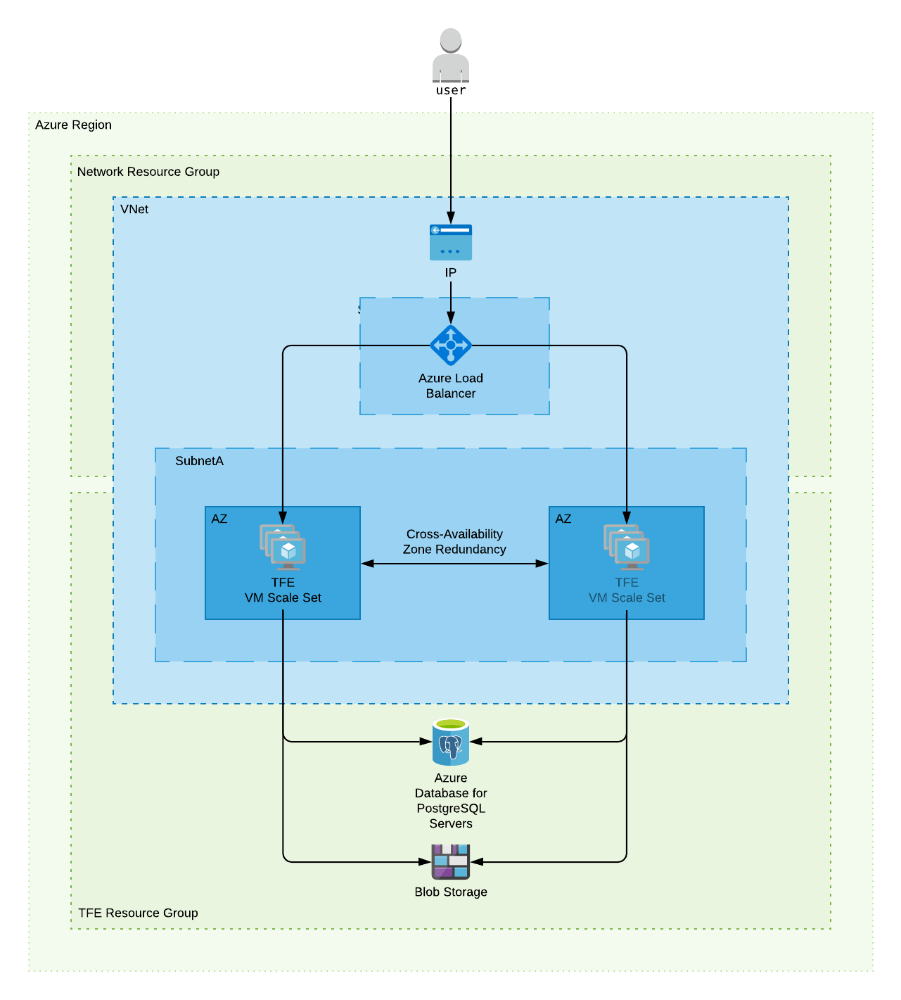

# Terraform Enterprise Azure Reference Architecture

## Introduction

This document provides recommended practices and a reference
architecture for HashiCorp Terraform Enterprise
implementations on Azure.

## Required Reading

Prior to making hardware sizing and architectural decisions, read through the
[pre-install checklist](../index.html)
to familiarize yourself with the application components and architecture.
Further, read the [reliability and availability
guidance](../../system-overview/reliability-availability.html)
as a primer to understanding the recommendations in this reference
architecture.

## Infrastructure Requirements

-> **Note:** This reference architecture focuses on the _Production - External Services_ operational mode.

Depending on the chosen [operational
mode](../index.html#operational-mode-decision),
the infrastructure requirements for Terraform Enterprise range from a single [Azure VM
instance](https://azure.microsoft.com/en-us/services/virtual-machines/) for
demo or proof of concept installations to multiple instances connected to
[Azure Database for PostgreSQL](https://azure.microsoft.com/en-us/services/postgresql/) and
[Azure Blob Storage](https://azure.microsoft.com/en-us/services/storage/blobs/) for a stateless production installation.

The following table provides high-level server recommendations and is meant as
a guideline. Of particular note is the strong recommendation to avoid non-fixed
performance CPUs, or “Burstable CPU” in Azure terms, such as B-series
instances.

### Terraform Enterprise Servers (Azure VMs)

| Type        | CPU      | Memory       | Disk | Azure VM Sizes                     |
| ----------- | -------- | ------------ | ---- | ---------------------------------- |
| Minimum     | 2 core   | 8 GB RAM     | 50GB | Standard\_D2\_v3                   |
| Recommended | 4-8 core | 16-32 GB RAM | 50GB | Standard\_D4\_v3, Standard\_D8\_v3 |

#### Hardware Sizing Considerations

- The default osDisk size for most Linux images on Azure is 30GB. When
  increasing the size of the osDisk partition, there may be additional
  steps required to fully utilize the disk space, such as using a tool
  like `fdisk`. This process is documented in the Azure knowledge base
  article ["How to: Resize Linux osDisk partition on Azure"](https://blogs.msdn.microsoft.com/linuxonazure/2017/04/03/how-to-resize-linux-osdisk-partition-on-azure/).

- The minimum size would be appropriate for most initial production
  deployments or for development/testing environments.

- The recommended size is for production environments where there is a
  consistently high workload in the form of concurrent Terraform runs.

### PostgreSQL Database (Azure Database for PostgreSQL)

| Type        | CPU      | Memory      | Storage | Azure DB Sizes                                     |
| ----------- | -------- | ----------- | ------- | -------------------------------------------------- |
| Minimum     | 2 core   | 4 GB RAM    | 50GB    | General Purpose 2 vCores                           |
| Recommended | 4-8 core | 8-16 GB RAM | 50GB    | General Purpose 4 vCores, General Purpose 8 vCores |

#### Hardware Sizing Considerations

- The minimum size would be appropriate for most initial production
  deployments or for development/testing environments.

- The recommended size is for production environments where there is
  a consistent high workload in the form of concurrent Terraform
  runs.

### Object Storage (Azure Blob Storage)

An Azure Blob Storage
[container](https://docs.microsoft.com/en-us/azure/storage/blobs/storage-blobs-introduction#container)
must be specified during the Terraform Enterprise installation for application data to
be stored securely and redundantly away from the Azure VMs running the
Terraform Enterprise application. This Azure Blob Storage container must be in the same
region as the VMs and Azure Database for PostgreSQL instance. It is recommended
the virtual network containing the Terraform Enterprise servers be configured with a
[Virtual Network (VNet) service
endpoint](https://docs.microsoft.com/en-us/azure/virtual-network/virtual-network-service-endpoints-overview)
for Azure Storage. Vault is used to encrypt all application data stored
in the Azure Blob Storage container. This allows for further
[server-side
encryption](https://docs.microsoft.com/en-us/azure/storage/common/storage-service-encryption)
by Azure Blob Storage if required by your security policy.

### Other Considerations

#### Additional Azure Resources

In order to successfully provision this reference architecture you must
also be permitted to create the following Azure resources:

  - [Resource Group(s)](https://docs.microsoft.com/en-us/azure/azure-resource-manager/resource-group-overview#resource-groups)

  - [Load Balancer](https://docs.microsoft.com/en-us/azure/load-balancer/load-balancer-overview)

  - [Virtual Network](https://azure.microsoft.com/en-us/services/virtual-network/)

  - [Subnet](https://docs.microsoft.com/en-us/azure/virtual-network/virtual-network-manage-subnet)

  - [Public IP](https://docs.microsoft.com/en-us/azure/virtual-network/virtual-network-ip-addresses-overview-arm#public-ip-addresses)

  - [Managed Disk](https://azure.microsoft.com/en-us/services/managed-disks/)

  - [Network Interface](https://docs.microsoft.com/en-us/azure/virtual-network/virtual-network-network-interface)

#### Network

To deploy Terraform Enterprise in Azure you will need to create new or use existing
networking infrastructure. The infrastructure diagram highlights some of
the key components. These elements are likely to be very unique to your
environment and not something this Reference Architecture can specify in
detail.

#### DNS

DNS can be configured outside of Azure or using
[Azure
DNS](https://azure.microsoft.com/en-gb/services/dns/). The fully
qualified domain name should resolve to the Load Balancer. Creating the
required DNS entry is outside the scope of this guide.

#### SSL/TLS

An SSL/TLS certificate is required for secure communication between
clients and the Terraform Enterprise application server. The certificate can be
specified during the UI-based installation or the path to the
certificate codified during an unattended installation.

## Infrastructure Diagram

The above diagram show the infrastructure components at a high-level.

### Application Layer

The Application Layer is composed of two Terraform Enterprise servers (Azure VMs)
running in different subnets and operating in an active/standby
configuration. Traffic is routed to the active Terraform Enterprise server via the Load Balancer
rules and health checks. In the event that the active Terraform Enterprise server becomes unavailable,
the traffic will then route to the standby server, making it the new active
server. Routing changes can also be managed by a human triggering a change in
the Load Balancer configuration to switch between the servers.

### Storage Layer

The Storage Layer is composed of multiple service endpoints (Azure Database for PostgreSQL and
Azure Blob Storage) all configured with or benefitting from
inherent resiliency provided by Azure.

#### Additional Information

- [Azure Database for PostgreSQL deployments](https://docs.microsoft.com/en-us/azure/postgresql/concepts-business-continuity)

- [Azure Blob Storage](https://docs.microsoft.com/en-us/azure/storage/blobs/storage-blobs-introduction)

## Infrastructure Provisioning

The recommended way to deploy Terraform Enterprise is through use of a Terraform
configuration that defines the required resources, their references to
other resources, and associated dependencies.

## Normal Operation

### Component Interaction

The Load Balancer routes all traffic to the active Terraform Enterprise instance, which
handles all requests to the Terraform Enterprise application.

The Terraform Enterprise application is connected to the PostgreSQL database via the
Azure provided database server name endpoint. All database requests are
routed to the highly available infrastructure supporting Azure Database for PostgreSQL.

The Terraform Enterprise application is connected to object storage via the Azure Blob
Storage endpoint for the defined container. All object storage requests
are routed to the highly available infrastructure supporting Azure Storage.

### Monitoring

While there is not currently a monitoring guide for Terraform Enterprise, information around
[logging](../../admin/logging.html),
[diagnostics](../../support/index.html)
as well as [reliability and
availability](../../system-overview/reliability-availability.html)
can be found on our website.

### Upgrades

See [the Upgrades
section](../../admin/upgrades.html)
of the documentation.

## High Availability

### Failure Scenarios

The Terraform Enterprise Reference Architecture is designed to handle different failure
scenarios that have different probabilities. The ability to provide better
service continuity will improve as the architecture evolves.

#### Component Failure

##### Single VM Failure

In the event of the active instance failing, the Load Balancer
should be reconfigured (manually or automatically) to route all traffic
to the standby instance.

~> **Important:** Active-active configuration is not supported due to a serialisation requirement in the core components of Terraform Enterprise; therefore, all traffic from the Load Balancer *MUST* be routed to a single instance.

When using the _Production - External Services_ deployment model (PostgreSQL Database and Object Storage), there is still some application configuration data present on the
Terraform Enterprise server such as installation type, database connection settings, and
hostname; however, this data rarely changes. If the application configuration has
not changed since installation, both TFE1 and TFE2 will
use the same configuration and no action is required.

If the
configuration on the active instance changes, you should [create a snapshot](../../admin/automated-recovery.html#1-configure-snapshots) via the
UI or CLI and recover this to the standby instance so that both instances use the
same configuration.

##### PostgreSQL Database

The Azure Database for PostgreSQL service provides a guaranteed high
level of availability. The financially backed service level agreement
(SLA) is 99.99% upon general availability. There is virtually no
application down time when using this service. More information on Azure
Database for PostgreSQL service redundancy is available in the
[Azure
documentation](https://docs.microsoft.com/en-us/azure/postgresql/concepts-high-availability).

##### Object Storage

Using Azure Blob Storage as an external object store leverages the
highly available infrastructure provided by Azure. More information on
Azure Storage redundancy is available in the
[Azure
documentation](https://docs.microsoft.com/en-us/azure/storage/common/storage-redundancy).

## Disaster Recovery

### Failure Scenarios

The Terraform Enterprise Reference Architecture is designed to handle different failure
scenarios that have different probabilities. The ability to provide better
service continuity will improve as the architecture evolves.

#### Region Failure

Terraform Enterprise is currently architected to provide high availability within a
single Azure Region. Using multiple Azure Regions will give you greater
control over your recovery time in the event of a hard dependency
failure on a regional Azure service. In this section, we’ll discuss
various implementation patterns and their typical availability.

An identical infrastructure should be provisioned in a secondary Azure
Region. In the event of the primary Azure Region hosting the Terraform Enterprise
application failing, the secondary Azure Region will require some
configuration before traffic is directed to it along with some global
services such as DNS.

  - [Azure Database for PostgreSQL's
    geo-restore
    feature](https://docs.microsoft.com/en-us/azure/postgresql/concepts-business-continuity)
    provides the ability to recover the database backup to the
    secondary Azure Region

  - [Geo-redundant storage (GRS) for Azure
    Storage](https://docs.microsoft.com/en-us/azure/storage/common/storage-redundancy-grs)
    must be configured so the object storage component of the Storage
    Layer is available in the secondary Azure Region.

  - DNS must be redirected to the Load Balancer acting as the entry
    point for the infrastructure deployed in the secondary Azure
    Region.

#### Data Corruption

The Terraform Enterprise application architecture relies on multiple service endpoints
(Azure DB and Azure Storage) all providing their own backup and
recovery functionality to support a low MTTR in the event of data
corruption.

##### Terraform Enterprise Servers

When using the _Production - External Services_ deployment model (PostgreSQL Database and Object Storage), there is still some application configuration data present on the
Terraform Enterprise server such as installation type, database connection settings, and
hostname; however, this data rarely changes. We recommend
[configuring automated
snapshots](../../admin/automated-recovery.html#1-configure-snapshots)
for this installation data so it can be recovered in the event of data
corruption.

##### PostgreSQL Database

Backup and recovery of PostgreSQL is managed by Azure and configured
through the Azure portal or CLI. More details of Azure DB for PostgreSQL
features are available
[here](https://docs.microsoft.com/en-us/azure/postgresql/concepts-backup)
and summarised below:

> *Automated Backups – Azure Database for PostgreSQL automatically
> creates server backups and stores them in user configured locally
> redundant or geo-redundant storage.*
>
> *Backup redundancy – Azure Database for PostgreSQL provides the
> flexibility to choose between locally redundant or geo-redundant
> backup storage.*

##### Object Storage

There is no automatic backup/snapshot of Azure Blob Storage by Azure, so it
is recommended to script a container copy process from the container
used by the Terraform Enterprise application to a “backup container” in Azure Blob Storage
that runs at regular intervals. It is important the copy process is not
so frequent that data corruption in the source content is copied to the
backup before it is identified.
