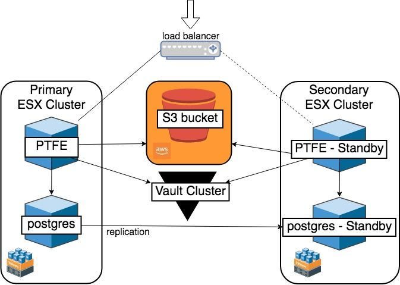
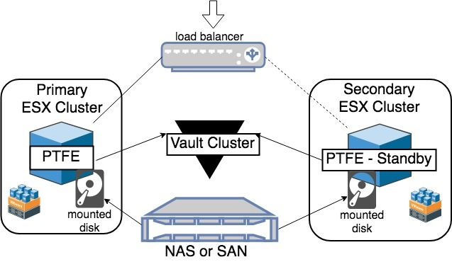

# Terraform Enterprise VMware Reference Architecture

This document provides recommended practices and a reference architecture for
HashiCorp Terraform Enterprise implementations on VMware.

## Required Reading

Prior to making hardware sizing and architectural decisions, read through the
[pre-install checklist](../index.html)
to familiarise yourself with the application components and architecture.
Further, read the [reliability and availability
guidance](../../system-overview/reliability-availability.html)
as a primer to understanding the recommendations in this reference
architecture.

## Infrastructure Requirements

Depending on the chosen [operational
mode](../index.html#operational-mode-decision),
the infrastructure requirements for Terraform Enterprise range from a single virtual machine
for demo or proof of concept installations, to multiple virtual machines
hosting the Terraform Cloud application, PostgreSQL, and external Vault servers for
a stateless production installation.

This reference architecture focuses on the “Production - External Services”
operational mode. If you require all of the Terraform Enterprise infrastructure to be on-prem,
you can either deploy S3-compatible storage [such as ceph](http://ceph.com/) or select the
“Production - Mounted Disk” option. This option will require you to specify the
local path for the storage where PostgreSQL data will be stored and where the
data typically written to S3 (blob) will be stored.  The assumption is this
local path is a mounted disk from either a SAN or NAS device (or some other
replicated storage), allowing for rapid recovery or failover. More information
about the Mounted Disk option can be found at the end of this document.

The following table provides high-level server recommendations as a guideline.
Please note, thick provision, lazy zeroed storage is preferred. Thin
provisioned is only recommended if you are using an external PostgreSQL database
as well as an external vault server. Using thin provisioned disks when using
the internal database or vault may result in serious performance issues.

### Terraform Enterprise Servers

| Type        | CPU Sockets | Total Cores\* | Memory       | Disk |
| ----------- | ----------- | ------------- | ------------ | ---- |
| Minimum     | 2           | 2             | 8 GB RAM     | 40GB |
| Recommended | 2           | 4             | 16-32 GB RAM | 40GB |

-> **Note:** Per VMWare’s recommendation, always allocate the least amount of CPU necessary. HashiCorp recommends starting with 2 CPUs and increasing if necessary.

#### Hardware Sizing Considerations

- The minimum size would be appropriate for most initial production
  deployments, or for development/testing environments.

- The recommended size is for production environments where there is
  a consistent high workload in the form of concurrent terraform
  runs.

- Please monitor the actual CPU utilization in vCenter before making
  the decision to increase the CPU allocation.

### PostgreSQL Database

| Type        | CPU Sockets | Total Cores | Memory       | Storage |
| ----------- | ----------- | ----------- | ------------ | ------- |
| Minimum     | 2           | 2 core      | 8 GB RAM     | 50GB    |
| Recommended | 2           | 4-8 core    | 16-32 GB RAM | 50GB    |

#### Hardware Sizing Considerations

- The minimum size would be appropriate for most initial production
  deployments, or for development/testing environments.

- The recommended size is for production environments where there is
  a consistent high workload in the form of concurrent terraform
  runs.

- Please monitor the actual CPU utilization in vCenter before making
  the decision to increase the CPU allocation.

### Object Storage (S3)

An [S3 Standard](https://aws.amazon.com/s3/storage-classes/) bucket, or compatible storage, must be
specified during the Terraform Enterprise installation for application data to be stored
securely and redundantly away from the virtual servers running the Terraform Enterprise
application. This object storage must be accessible via the network to the Terraform Enterprise virtual
machine. Vault is used to encrypt all
application data stored in this location. This allows for further [server-side
encryption](https://docs.aws.amazon.com/AmazonS3/latest/dev/serv-side-encryption.html)
by S3 if required by your security policy.

Recommended object storage solutions are AWS S3, Google Cloud storage, Azure blob storage. Other options for S3-compatible storage are [minio](https://www.minio.io/) and [ceph](https://ceph.com/), among many others. Please feel free to reach out to [support](https://www.hashicorp.com/support) with questions.

### Vault Servers

In order to provide a fully stateless application instance, Terraform Enterprise must be
configured to speak with an external Vault server/cluster. This reference
architecture assumes that a highly available Vault cluster is accessible at an
endpoint the Terraform Enterprise servers can reach.

### Other Considerations

#### Network

To deploy Terraform Enterprise on VMWare you will need to create new or use existing networking
infrastructure that has access to not only the S3 bucket, the PostgreSQL
instance, and the Vault server, but also any infrastructure you expect to
manage with the Terraform Enterprise server. If you plan to use your Terraform Enterprise server to manage or
deploy AWS, you will need to make sure the Terraform Enterprise server has unimpeded access to
AWS. The same goes for any other cloud or datacenter the server will need to
connect with.

#### DNS

The fully qualified domain name should resolve to the IP address of the virtual
machine using an A record. Creating the required DNS entry is outside the scope
of this guide.

#### SSL/TLS

A valid, signed SSL/TLS certificate is required for secure communication between clients and
the Terraform Enterprise application server. Requesting a certificate is outside the scope
of this guide. You will be prompted for the public and private certificates during installation.

## Infrastructure Diagram

The above diagram shows the infrastructure components at a high-level.

### Storage Layer

The Storage Layer is composed of multiple service endpoints (datastores,
object storage, Vault) all configured with or benefitting from inherent resiliency
provided by ESX and your storage provider, or assumed resiliency
provided by a well-architected deployment (in the case of Vault).

- [More information about S3 Standard](https://aws.amazon.com/s3/storage-classes/)
- [More information about highly available Vault deployments](https://www.vaultproject.io/guides/operations/vault-ha-consul.html)

## Infrastructure Provisioning

The recommended way to deploy Terraform Enterprise for production is through use of a Terraform configuration
that defines the required resources, their references to other resources and
dependencies. An [example Terraform
configuration](https://github.com/hashicorp/private-terraform-enterprise/tree/master/examples/vmware)
is provided to demonstrate how these resources can be provisioned and how they
interrelate. This Terraform configuration will require you to know several
pieces of information and have sufficient access to vCenter to deploy a VM from
template.

## Normal Operation

### Component Interaction

The Terraform Enterprise application is connect to the PostgreSQL database via the PostgreSQL URL.

The Terraform Enterprise application is connected to object storage via the API endpoint for the
defined storage location and all object storage requests are routed to the highly
available infrastructure supporting the storage location.

The Terraform Enterprise application is connected to the Vault cluster via the Vault cluster
endpoint URL.

### Monitoring

While there is not currently a monitoring guide for Terraform Enterprise, information around
[logging](../../admin/logging.html),
[diagnostics](../../support/index.html)
as well as [reliability and
availability](../../system-overview/reliability-availability.html)
can be found on our website.

### Upgrades

Please reference the [upgrade
instructions](../../admin/upgrades.html)
in the documentation.

## High Availability

### Failure Scenarios

VMWare hypervisor provides a high level of resilience in various cases
of failure (at the server hardware layer through vMotion, at the storage
layer through RDS, and at the network layer through virtual distributed
networking.) In addition, having ESX failover to a DR datacenter
provides recovery in the case of a total data center outage.

#### Single ESX Server Failure

In the event of a server outage ESX will vMotion the Terraform Enterprise virtual
machine to a functioning ESX host. This typically does not result in any
visible outage to the end-user.

### Failure by Application Tier

#### Terraform Enterprise Servers

Through deployment of two virtual machines in different ESX clusters,
the Terraform Enterprise Reference Architecture is designed to provide improved
availability and reliability. Should the *TFE-main* server fail, it can
be recovered, or traffic can be routed to the *TFE-standby* server to
resume service when the failure is limited to the Terraform Enterprise server layer. The
load balancer should be manually updated to point to the stand-by Terraform Enterprise
VM after services have been started on it in the event of a failure.

#### PostgreSQL Database

Using a PostgreSQL cluster will provide fault tolerance at the database layer.
Documentation on how to deploy a PostgreSQL cluster can be found on the [PostgreSQL
documentation
page](https://www.postgresql.org/docs/9.5/static/creating-cluster.html).

#### Object Storage

Using AWS S3 as an external object store leverages the highly available
infrastructure provided by AWS. S3 buckets are replicated to all
Availability Zones within the region selected during bucket creation.
From the AWS website:

> *Amazon S3 runs on the world’s largest global cloud infrastructure,
> and was built from the ground up to deliver a customer promise of
> 99.999999999% of durability. Data is automatically distributed across
> a minimum of three physical facilities that are geographically
> separated within an AWS Region.
> ([source](https://aws.amazon.com/s3/))*

Other cloud providers (Azure, GCP) also provide highly available storage. If you choose to utilize an on-premises storage solution, such as ceph, it will be your responsibility to configure HA as required by your implementation.

#### Vault Servers

For the purposes of this guide, the external Vault cluster is expected to be
deployed and configured in line with the [HashiCorp Vault Enterprise Reference
Architecture](https://www.vaultproject.io/guides/operations/reference-architecture.html).
This would provide high availability and disaster recovery support, minimising
downtime in the event of an outage.

## Disaster Recovery

### Terraform Enterprise Servers

The assumption of this architecture is that ESX replication to a DR site is
configured and validated. In the event of a DR the Primary Terraform Enterprise virtual machine
should be recovered and powered on. Services are configured to start on boot,
so the secondary virtual machine should only be powered on if there is an issue
with the primary. If the DR site will be active for an extended amount of time,
it’s recommended to power up the standby server first, then stop the services
via the console, then power up the primary server.

### PostgreSQL Database

Backup and recovery of PostgreSQL will vary based on your implementation.
Backup and recovery of PostgreSQL is not covered in this document. We do
recommend regular database snapshots.

### Object Storage

Recovery is made available via [object
versioning](https://docs.aws.amazon.com/AmazonS3/latest/dev/Versioning.html) on
AWS, as well as [Google Cloud Storage](https://cloud.google.com/storage/docs/object-versioning) and [Azure Storage Services](https://docs.microsoft.com/en-us/rest/api/storageservices/versioning-for-the-azure-storage-services). Ceph also supports [bucket versioning](http://docs.ceph.com/docs/master/radosgw/s3/bucketops/#enable-suspend-bucket-versioning).

### Vault Servers

The recommended Vault Reference Architecture uses Consul for storage.  Consul
provides the underlying [snapshot
functionality](https://www.consul.io/docs/commands/snapshot.html) to support
Vault backup and recovery.

## Production - Mounted Disk

### Normal Operation

The PostgreSQL database will be run in a local container and data will be
written to the specified path (which should be a mounted storage device,
replicated and/or backed up frequently.)

State and other data that would otherwise be written to S3 will be
written to the specified local path (which should be a mounted storage
device, replicated and/or backed up frequently.)

The Terraform Enterprise application is connected to the Vault cluster via the Vault
cluster endpoint URL.

### Infrastructure Diagram

### High Availability

### Failure Scenarios

VMWare hypervisor provides a high level of resilience in various cases
of failure (at the server hardware layer through vMotion, at the storage
layer through RDS, and at the network layer through virtual distributed
networking.) In addition, having ESX failover to a DR datacenter
provides recovery in the case of a total data center outage.

#### Single ESX Server Failure

In the event of a server outage ESX will vMotion the Terraform Enterprise virtual
machine to a functioning ESX host. This typically does not result in any
visible outage to the end-user.

### Failure by Application Tier

#### Terraform Enterprise Servers

Through deployment of two virtual machines in different ESX clusters,
the Terraform Enterprise Reference Architecture is designed to provide improved
availability and reliability. Should the *TFE-main* server fail, it can
be recovered, or traffic can be routed to the *TFE-standby* server to
resume service when the failure is limited to the Terraform Enterprise server layer. The
load balancer should be manually updated to point to the stand-by Terraform Enterprise
VM after services have been started on it in the event of a failure.

#### PostgreSQL Database

When running in mounted storage mode the PostgreSQL server runs inside a
Docker container. If the PostgreSQL service fails a new container should
be automatically created. However, if the service is hung, or otherwise
fails without triggering a new container deployment, the Terraform Enterprise server
should be stopped and the standby server started. All PostgreSQL data will
have been written to the mounted storage and will then be accessible on
the standby node.

#### Object Storage

The object storage will be stored on the mounted disk and the
expectation is that the NAS or SAN or other highly available mounted
storage is fault tolerant and replicated or has fast recovery available.
The configuration of the storage device is not covered in this document.
For more information about highly available storage please see your
storage vendor.

#### Vault Servers

For the purposes of this guide, the external Vault cluster is expected
to be deployed and configured in line with the
[HashiCorp Vault Enterprise Reference
Architecture](https://www.vaultproject.io/guides/operations/reference-architecture.html).
This would provide high availability and disaster recovery support,
minimising downtime in the event of an outage.

### Disaster Recovery

#### Terraform Enterprise Servers

The assumption of this architecture is that ESX replication to a DR site
is configured and validated. In the event of a DR the Primary Terraform Enterprise
virtual machine should be recovered and powered on. Services are
configured to start on boot, so the secondary virtual machine should
only be powered on if there is an issue with the primary. If the DR site
will be active for an extended amount of time, it’s recommended to power
up the standby server first, then stop the services via the console,
then power up the primary server.

#### PostgreSQL Database

The PostgreSQL data will be written to the mounted storage. The
expectation is that the storage server is replicated or backed up
offsite and will be made available to the server in the event of a DR.

#### Object Storage

Object storage will be written to the mounted storage. The expectation
is that the storage server is replicated or backed up offsite and will
be made available to the server in the event of a DR.

#### Vault Servers

The recommended Vault Reference Architecture uses Consul for storage.
Consul provides the underlying [snapshot
functionality](https://www.consul.io/docs/commands/snapshot.html)
to support Vault backup and recovery.
