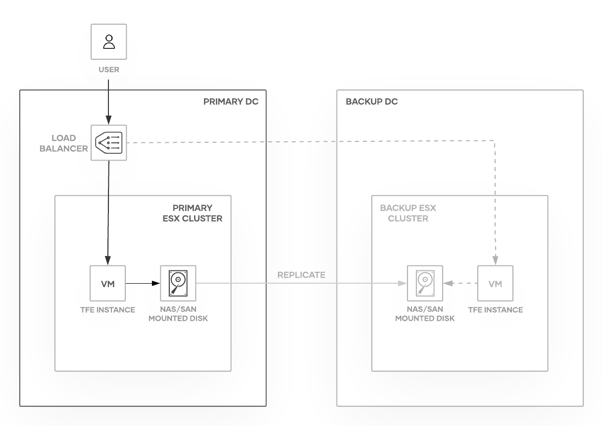

# Terraform Enterprise VMware Reference Architecture

This document provides recommended practices and a reference architecture for
HashiCorp Terraform Enterprise implementations on VMware.

## Required Reading

Prior to making hardware sizing and architectural decisions, read through the
[pre-install checklist](../index.html)
to familiarise yourself with the application components and architecture.
Further, read the [reliability and availability
guidance](../../system-overview/reliability-availability.html)
as a primer to understanding the recommendations in this reference
architecture.

## Infrastructure Requirements

Depending on the chosen [operational
mode](../index.html#operational-mode-decision),
the infrastructure requirements for Terraform Enterprise range from a single virtual machine
for demo or proof of concept installations, to multiple virtual machines
hosting the Terraform Cloud application, PostgreSQL, and external Vault servers for
a stateless production installation.

This reference architecture **recommends and focuses on** the *Mounted Disk* operational mode. This mode will require you to specify the local path for data storage. The assumption is this
local path is a mounted disk from either a SAN or NAS device (or some other
replicated storage), allowing for rapid recovery or failover.

If you need or want to define storage externally and independently, you can choose the *External Services*
operational mode. This is a more complicated implementation in VMware that requires you to independently manage other services which will not be detailed in this document. You will need to deploy S3-compatible storage either by connecting to a true AWS S3 bucket or by using a compatible alternative on-prem solution, such as [Ceph](https://ceph.com/). You will also need to deploy and separately manage an external PostgreSQL database on an additional server or servers.

Some additional information about the *External Services* option can be found at the end of this document.

Although it is possible for Terraform Enterprise to use an external Vault server instead of its internally managed one, we do not recommended it. External Vault usage is not addressed in this document.

The following table provides high-level server recommendations as a guideline.
Please note, thick provision, lazy zeroed storage is preferred. Thin
provisioned is only recommended if you are using an external PostgreSQL database and external Vault server. Using thin provisioned disks when using
the internal database or Vault may result in serious performance issues.

### Terraform Enterprise Servers

| Type    | CPU Sockets | Total Cores\* | Memory    | Disk |
|---------|-------------|---------------|-----------|------|
| Minimum | 2           | 4             | 16 GB RAM | 40GB |
| Scaled  | 2           | 8             | 32 GB RAM | 40GB |

-> **Note:** Per VMWare’s recommendation, always allocate the least amount of CPU necessary. HashiCorp recommends starting with 4 CPUs and increasing if necessary.

#### Hardware Sizing Considerations

- The minimum size would be appropriate for most initial production
  deployments, or for development/testing environments.

- The scaled size is for production environments where there is
  a consistent high workload in the form of concurrent terraform
  runs.

- Please monitor the actual CPU utilization in vCenter before making
  the decision to increase the CPU allocation.

### Other Considerations

#### Network

To deploy Terraform Enterprise on VMWare you will need to create new or use existing networking
infrastructure that has access to any infrastructure you expect to
manage with the Terraform Enterprise server. If you plan to use your Terraform Enterprise server to manage or
deploy infrastructure on external providers (eg Amazon Web Services, Microsoft Azure or Google Cloud), you will need to make sure the Terraform Enterprise server has unimpeded access to those providers. The same goes for any other public or private datacenter the server will need to
connect with.

#### DNS

The fully qualified domain name should resolve to the IP address of the virtual
machine using an A record. Creating the required DNS entry is outside the scope
of this guide.

#### SSL/TLS

A valid, signed SSL/TLS certificate is required for secure communication between clients and
the Terraform Enterprise application server. Requesting a certificate is outside the scope
of this guide. You will be prompted for the public and private certificates during installation.

## Infrastructure Diagram

### Application Layer

The Application Layer is a VMware virtual machine running on an ESXi cluster
providing an auto-recovery mechanism in the event of virtual machine or physical server failure.

### Storage Layer

The Storage Layer is provided in the form of attached disk space configured with or benefiting from inherent resiliency
provided by the NAS or SAN. The primary Terraform Enterprise VM will have 2 disks which must meet the requirements detailed [here](../disk-requirements.html). The first disk is independent to this VM and contains the OS and Terraform Enterprise components specific to this individual install, such as configuration information. The second disk will contain Terraform Enterprise's configuration information such as Workspaces and their resulting Terraform state files.  This second disk needs to be regularly backed up, for instance via replication or snapshotting inherent to your SAN or other software, at a rate that meets your desired RPO.
Similarly, the standby VM will have two disks. An OS disk that is independent to that VM and a disk which is simply a point in time copy of the primary instance's second disk.

-> **Note:** Terraform Enterprise's storage device or service must be highly reliable and high-speed in both I/O and connectivity to meet performance requirements. Device types in the supported list will usually meet these requirements, but many standard NAS and other device types will not perform at the level required. Only use a NAS or other device type not in the supported list if you are certain it can accommodate these requirements.

The specific selection and configuration of the storage device is not covered in this document.
For more information about high-speed and highly available storage, please see your storage vendor.
We recommend that each of these VM be deployed as immutable architecture to enable one to easily redeploy the secondary VM when the primary has been upgraded or changed. If this is not possible a snapshot methodology inherent to TFE along with examples of restoring those snapshots is available at [Terraform Enterprise Automated Recovery](../../admin/automated-recovery.html).

For more information about Terraform Enterprise's disk requirements, see [Before Installing: Disk Requirements](../disk-requirements.html).

## Infrastructure Provisioning

The recommended way to deploy Terraform Enterprise for production is through use of a Terraform configuration
that defines the required resources, their references to other resources and
dependencies.

## Normal Operation

### Component Interaction

The PostgreSQL database will be run in a local container and data will be
written to the specified path (which should be a mounted storage device,
replicated and/or backed up frequently.)

State and other data will be
written to the specified local path (which should be a mounted storage
device, replicated and/or backed up frequently.)

Vault will be run in a local container and used only for transit data encryption and decryption. This stateless use of Vault provides easy recovery in the event of a Vault service failure.

### Monitoring

While there is not currently a full monitoring guide for Terraform Enterprise, information around
[logging](../../admin/logging.html),
[diagnostics](../../support/index.html)
as well as [reliability and
availability](../../system-overview/reliability-availability.html)
can be found on our website.

### Upgrades

See [the Upgrades section](../../admin/upgrades.html) of the documentation.

## High Availability

### Failure Scenarios

VMWare hypervisor provides a high level of resilience in various cases
of failure (at the server hardware layer through vMotion and at the network layer through virtual distributed
networking.) In addition, having ESXi failover to a DR datacenter
provides recovery in the case of a total data center outage See the Disaster Recovery section.

#### Terraform Enterprise Servers (VMware Virtual Machine)

Should the *TFE-main* server fail, it can
be recovered, or traffic can be routed to the *TFE-standby* server to
resume service when the failure is limited to the Terraform Enterprise server layer. See the Disaster Recovery section.

#### Single ESXi Server Failure

In the event of a single ESXi server failure, ESXi will vMotion the Terraform Enterprise virtual
machine to a functioning ESXi host. This typically does not result in any
visible outage to the end-user if VM Fault Tolerance has been configured. As with all applications, you may see a small interruption while the VM boots on the new host if Fault Tolerance is not configured.

#### PostgreSQL Database

When running in *Mounted Disk* operational mode the PostgreSQL server runs inside a
Docker container. If the PostgreSQL service fails a new container should
be automatically created. However, if the service is hung, or otherwise
fails without triggering a new container deployment, the Terraform Enterprise server
should be stopped and the standby server started. All PostgreSQL data will
have been written to the mounted disk and will then be accessible on
the standby node.

#### Object Storage

The object storage will be stored on the mounted disk and the
expectation is that the NAS or SAN or other highly available mounted
storage is fault tolerant and replicated or has fast recovery available.

## Disaster Recovery

### Failure Scenarios

#### Terraform Enterprise Servers (VMware Virtual Machine)

Through deployment of two virtual machines in different ESXi clusters,
the Terraform Enterprise Reference Architecture is designed to provide improved
availability and reliability. Should the *TFE-main* server fail, it can
be recovered, or traffic can be routed to the *TFE-standby* server to
resume service when the failure is limited to the Terraform Enterprise server layer. The
load balancer should be manually updated to point to the stand-by Terraform Enterprise
VM after services have been started on it in the event of a failure.

#### Mounted Disk - PostgreSQL Database

The PostgreSQL data will be written to the mounted disk. The
expectation is that the storage server is replicated or backed up
offsite and will be made available to the server in the event of a DR.

#### Mounted Disk - Object Storage

Object storage will be written to the mounted disk. The expectation
is that the storage server is replicated or backed up offsite and will
be made available to the server in the event of a DR.

#### ESXi Cluster

In the event of a complete ESXi cluster failure or datacenter failure, load-balancing should be updated to route traffic to a different datacenter and ESXi cluster that is running a second stack of the Terraform Enterprise components. This second environment would be receiving storage layer replication from the primary.

## External Services Storage Options

This information is included if *External Services* operational mode is required.

### External Services - Object Storage Options

An [S3 Standard](https://aws.amazon.com/s3/storage-classes/) bucket, or compatible storage, must be
specified during the Terraform Enterprise installation for application data to be stored
securely and redundantly away from the virtual servers running the Terraform Enterprise
application. This object storage must be accessible via the network to the Terraform Enterprise virtual
machine. Vault is used to encrypt all
application data stored in this location. This allows for further [server-side
encryption](https://docs.aws.amazon.com/AmazonS3/latest/dev/serv-side-encryption.html)
by S3 if required by your security policy.

Recommended object storage solutions are AWS S3, Google Cloud storage, Azure blob storage. Other options for S3-compatible storage are [MinIO](https://www.minio.io/), and [Ceph](https://ceph.com/), and [ECS](https://www.delltechnologies.com/en-us/storage/ecs/index.html/), among many others. Please feel free to reach out to [support](https://www.hashicorp.com/support) with questions.

### External Services - PostgreSQL Database

#### External Services - PostgreSQL Database Management

Using a PostgreSQL cluster will provide fault tolerance at the database layer.
Documentation on how to deploy a PostgreSQL cluster can be found on the [PostgreSQL
documentation page](https://www.postgresql.org/docs/9.5/static/creating-cluster.html).

Backup and recovery of PostgreSQL will vary based on your implementation
and is not covered in this document. We do recommend regular database snapshots.

#### External Services - PostgreSQL Database Sizing

| Type        | CPU Sockets | Total Cores | Memory       | Storage |
| ----------- | ----------- | ----------- | ------------ | ------- |
| Demo        | 2           | 2 core      | 8 GB RAM     | 50GB    |
| Production  | 2           | 4-8 core    | 16-32 GB RAM | 50GB    |
